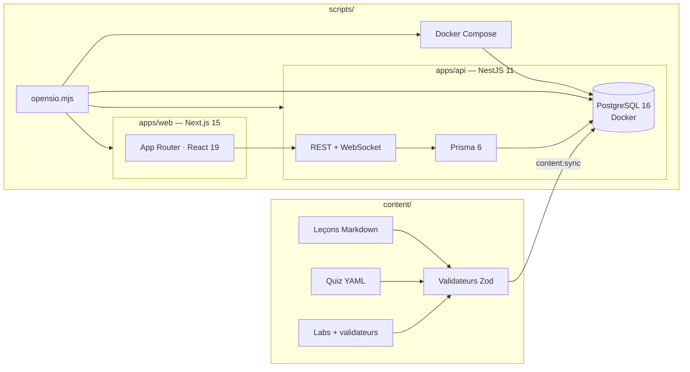

<!--

  NOTE MAINTENANCE
  - Les listes de modules ci-dessous reflètent l'état du catalogue à la clôture
    (20 modules). La source de vérité est docs/modules-map.md : si un module
    est renommé, mettre à jour les deux tableaux.
  - Captures d'écran : déposer les images dans docs/assets/ puis remplacer les
    placeholders de la section Aperçu.
    
-->

<p align="center">
  
</p>

<p align="center">
  <a href="https://git.io/typing-svg">
    
  </a>
</p>

<p align="center">
  <a href="https://github.com/Klemz-696/opensio/actions/workflows/ci.yml"></a>
  <a href="https://github.com/Klemz-696/opensio/actions/workflows/e2e.yml"></a>
  
  
  
  
  
  
  
  
  <a href="./LICENSE"></a>
</p>

---

## 🎯 Présentation

**OpenSIO** est une plateforme web d'apprentissage conçue pour les étudiants de
**BTS SIO option SISR** (Solutions d'Infrastructure, Systèmes et Réseaux).
Elle transforme le référentiel officiel en un parcours interactif complet :
cours structurés, quiz auto-corrigés et ateliers pratiques validés
automatiquement par des validateurs autonomes.

Le projet est né d'un constat simple : réviser l'administration systèmes et
réseaux exige de la pratique, pas seulement des PDF. OpenSIO fournit un
environnement où chaque notion est immédiatement mise en application.

## ✨ Fonctionnalités

| Fonctionnalité | Description |
| --- | --- |
| 📚 Catalogue structuré | 2 parcours (1ʳᵉ et 2ᵉ année), 20 modules, leçons numérotées avec prérequis explicites |
| ❓ Quiz corrigés | Choix simples et multiples, explication pédagogique pour chaque réponse, seuil de réussite à 80 % |
| 🧪 Labs auto-validés | Ateliers pratiques avec validateurs autonomes, solutions de référence, indices à pénalités |
| 📊 Suivi de progression | Dashboard personnel, avancement par module et par parcours |
| 🌗 Bi-thème natif | Thème clair et sombre vérifiés automatiquement en CI |
| 🔐 Authentification | Comptes par rôle (apprenant / administrateur), hashage Argon2id, JWT, refresh tokens |
| 🛠️ Back-office | Interface d'administration des utilisateurs et du contenu |
| 🤖 Assistant IA | Chat intégré (Ollama local, optionnel) pour aide contextuelle aux exercices |
| 🚀 Lanceur intelligent | `pnpm opensio` orchestre tout : Docker, DB, ports, seed, raccourcis, démarrage |


## 📚 Le catalogue SISR

Le catalogue complet — objectifs, fiches et statut de chaque module — est
détaillé dans [docs/modules-map.md](docs/modules-map.md).

### 1ʳᵉ année — Fondamentaux

| # | Module | Thèmes | Leçons | Labs |
| --- | --- | --- | :---: | :---: |
| 1 | Réseaux — Fondamentaux | Adressage IP, VLAN, OSI/TCP-IP, DNS, DHCP | 7 | 4 |
| 2 | Windows Server & Active Directory | AD DS, GPO, domaine, NTFS | 6 | 3 |
| 3 | Linux — Administration système | Permissions, systemd, APT, LVM, journaux | 6 | 3 |
| 4 | Services réseau Linux | DNS Bind9, DHCP ISC/Kea, NTP/Chrony | 5 | 2 |
| 5 | Virtualisation & Hyperviseurs | Proxmox VE, KVM, cloud-init, bridges | 5 | 2 |
| 6 | Sauvegardes & Stockage | RAID, stratégie 3-2-1, RTO/RPO, rsync | 5 | 2 |
| 7 | Support & Parc — GLPI | ITIL, tickets, SLA, inventaire SNMP | 5 | 2 |
| 8 | Anglais technique | Vocabulaire, RFCs, logs, tickets en anglais | 5 | 2 |

### 2ᵉ année — Spécialisation SISR

| # | Module | Thèmes | Leçons | Labs |
| --- | --- | --- | :---: | :---: |
| 9 | Routage & Interconnexion | OSPF, VRRP/HSRP, inter-VLAN | 5 | 2 |
| 10 | Sécurité périmétrique & Pare-feu | nftables, NAT/PAT, DMZ, pfSense | 6 | 3 |
| 11 | Serveurs web, PKI & TLS | Nginx, reverse proxy, certificats X.509, Let's Encrypt | 6 | 3 |
| 12 | VPN & Accès distants | WireGuard, OpenVPN, IPsec, MFA | 5 | 2 |
| 13 | Conteneurisation Docker | Images, Compose, volumes, durcissement | 6 | 3 |
| 14 | Scripting & Automatisation | Bash avancé, PowerShell, cron, AD | 6 | 2 |
| 15 | Supervision & Observabilité | SNMP, Prometheus, Grafana, alerting | 5 | 2 |
| 16 | Cybersécurité & Durcissement | ANSSI/CIS, Fail2ban, RGPD, audit | 6 | 3 |
| 17 | Automatisation Ansible | Inventaires, playbooks, Vault, rôles | 5 | 2 |
| 18 | Haute Disponibilité & Clustering | Keepalived, HAProxy, réplication SGBD | 5 | 2 |
| 19 | Cloud hybride & CI/CD | IaaS/PaaS, GitHub Actions, GitOps | 5 | 2 |

> **Total catalogue** : 100 leçons · 100 quiz · 512 questions · 43 labs pratiques

## 🧱 Architecture



## 🛠️ Stack technique

| Couche | Technologie |
| --- | --- |
| Frontend | Next.js 15 (App Router), React 19, Tailwind CSS v4 |
| Backend | NestJS 11, Prisma 6, WebSocket (labs terminal) |
| Base de données | PostgreSQL 16 (Docker en développement) |
| Contenu | Markdown / YAML / JSON validés par Zod (`@opensio/content-schema`) |
| Tests | Vitest, Testing Library, validateurs de contenu |
| Tooling | pnpm workspaces, Turborepo, ESLint 9, TypeScript 5 strict |
| CI | GitHub Actions — lint, types, D-13, bi-thème, tests, build |
| Sécurité | Argon2id, JWT + refresh tokens, rate-limiting, RBAC |

## 🚀 Démarrage rapide

### ⚡ Installation en une commande

> **Prérequis unique** : [Docker Desktop](https://www.docker.com/products/docker-desktop/) installé et démarré.
> Node.js, pnpm et Git sont vérifiés et configurés automatiquement si absents.

**Sous Windows (recommandé)**, ouvrez **PowerShell** et exécutez :

```powershell
iex (irm https://raw.githubusercontent.com/Klemz-696/opensio/main/scripts/install.ps1)
```

*Options disponibles : `-InstallDir <chemin>` (dossier personnalisé, défaut : `~\opensio`), `-DryRun` (diagnostic sans installation).*

**Sous macOS / Linux**, ouvrez votre terminal et exécutez :

```bash
bash <(curl -s https://raw.githubusercontent.com/Klemz-696/opensio/main/scripts/install.sh)
```

*Options disponibles : `--dir <chemin>` (dossier personnalisé, défaut : `~/opensio`), `--dry-run`.*

Le script configure l'environnement, clone le projet, installe les dépendances et lance OpenSIO.

À la fin de l'installation sous Windows, un raccourci **OpenSIO.bat** est créé sur votre Bureau.
Pour tous les systèmes, vous pourrez relancer le projet plus tard en tapant `pnpm opensio` dans le dossier du projet.

---

### 🔧 Installation manuelle (avancée)

Si vous préférez cloner et configurer vous-même l'application :

**Prérequis système obligatoires** :
- **Node.js LTS** (≥ 22.0.0) : [Télécharger Node.js](https://nodejs.org/)
- **pnpm** (activé via Corepack intégré à Node.js) :
  ```bash
  corepack enable
  corepack prepare pnpm@10 --activate
  ```
- **Git** : [Télécharger Git](https://git-scm.com/)
- **Docker Desktop** : installé et **démarré** ([Télécharger Docker](https://www.docker.com/products/docker-desktop/))

```bash
# 1. Cloner le dépôt
git clone https://github.com/Klemz-696/opensio.git
cd opensio

# 2. Installer les dépendances
pnpm install

# 3. Lancer (gère tout automatiquement)
pnpm opensio
```

Le lanceur interactif (`pnpm opensio`) s'occupe automatiquement de :
- ✅ Vérifier les versions Node.js/pnpm
- ✅ Démarrer Docker Desktop si nécessaire
- ✅ Lancer le conteneur PostgreSQL
- ✅ Déployer le schéma Prisma
- ✅ Injecter les comptes admin & démo (seed)
- ✅ Synchroniser le catalogue Markdown → base de données
- ✅ Créer un raccourci Bureau (Windows)
- ✅ Détecter les ports libres si 3000/4000 sont occupés
- ✅ Démarrer l'API (NestJS) et le frontend (Next.js)

**Frontend** : http://localhost:3000 · **API** : http://localhost:4000/api/v1

### 🔄 Commandes du lanceur

```bash
pnpm opensio                   # Vérifications + lancement dev (par défaut)
pnpm opensio --prod            # Build de production puis démarrage
pnpm opensio --reconfigure     # Rejouer l'assistant de premier démarrage
pnpm opensio --no-update-check # Ignorer la vérification Git ce coup-ci
pnpm opensio --help            # Afficher l'aide
```

## 📂 Structure du monorepo

```text
opensio/
├── apps/
│   ├── api/              # NestJS 11 · Prisma · REST · WebSocket · sync contenu
│   └── web/              # Next.js 15 · App Router · Tailwind · auth JWT
├── content/              # tracks/ → modules/ → leçons.md, quiz.yaml, labs/
├── packages/
│   ├── config/           # Config partagée TypeScript, ESLint, Tailwind
│   └── content-schema/   # Validateurs Zod du contenu pédagogique
├── scripts/
│   ├── install.ps1       # Installateur one-shot Windows (iex)
│   ├── opensio.mjs       # Lanceur principal (pnpm opensio)
│   ├── lib/              # Modules du lanceur (git, docker, env, ports…)
│   ├── check-file-size.mjs   # Règle D-13 : aucun fichier > 400 lignes
│   └── check-theme-classes.mjs  # Vérification couverture bi-thème
├── docs/                 # modules-map, content-guide, journal, roadmap
├── docker-compose.yml    # PostgreSQL dev (port 5432)
└── turbo.json            # Pipelines Turborepo
```

## ✅ Qualité & gouvernance de code

- **Règle D-13** : aucun fichier source de plus de 400 lignes (vérifié en CI par `scripts/check-file-size.mjs`)
- **Bi-thème** : `scripts/check-theme-classes.mjs` garantit la couverture clair/sombre sur chaque composant
- **Contenu** : `content/validate.mjs` exécute 100 % des validateurs de labs
- **Sécurité** : politique D-09 — mots de passe ≥ 12 caractères, 3 classes minimum (vérifiée côté serveur et au seed)
- **Chaîne complète** : lint → typecheck → tests → build, bloquante sur chaque PR

## 🧪 Tests E2E

### Exécuter localement

```bash
pnpm test:e2e
```

### Couverture actuelle

- ✅ `parcours.spec.ts` : Login → catalogue → leçon → quiz
- ✅ `inscription.spec.ts` : Inscription → première leçon
- ✅ `auth-forgot.spec.ts` : Reset mot de passe
- ✅ `progression.spec.ts` : Progression multi-leçons
- ✅ `quiz-retry.spec.ts` : Quiz échec → retry
- ✅ `labs.spec.ts` : Labs → session → validation

### CI/CD

Les tests sont exécutés automatiquement sur chaque push/PR via GitHub Actions.  
[](https://github.com/Klemz-696/opensio/actions/workflows/e2e.yml)

## 🗺️ Feuille de route

Le catalogue SISR (20/20 modules, 105 leçons, 45 labs) est **terminé**. La version v1.0.2 est publiée et inclut toutes ces fonctionnalités (fiabilisation du chargement .env, installateurs durcis, PasswordInput ergonomique, mode mono-utilisateur, durcissement accessibilité et tests).
L'évolution future (roadmap v1.1 avec responsive mobile, etc.) est détaillée dans
[docs/roadmap.md](docs/roadmap.md), et chaque étape est tracée dans le
[journal de bord](docs/journal.md).

## 📖 Documentation

| Document | Contenu |
| --- | --- |
| [docs/modules-map.md](docs/modules-map.md) | Cartographie complète des 20 modules, fiches détaillées, matrice de compétences |
| [docs/content-guide.md](docs/content-guide.md) | Guide d'écriture du contenu pédagogique (leçons, quiz, labs) |
| [docs/installation.md](docs/installation.md) | Installation pas à pas (Linux, macOS, Windows) |
| [docs/deployment.md](docs/deployment.md) | Mise en production (`docker-compose.prod.yml`) |
| [docs/journal.md](docs/journal.md) | Journal de bord décision par décision |
| [docs/roadmap.md](docs/roadmap.md) | Feuille de route vers la v1.0 |

## 🤝 Contribuer

Une contribution = une branche = une Pull Request. Le contenu pédagogique suit
[docs/content-guide.md](docs/content-guide.md) ; le code respecte la règle D-13
et la CI doit rester verte. Jamais de push direct sur `main`.

## 📄 Licence

Code distribué sous licence [MIT](LICENSE).

<p align="center">
  
</p>
