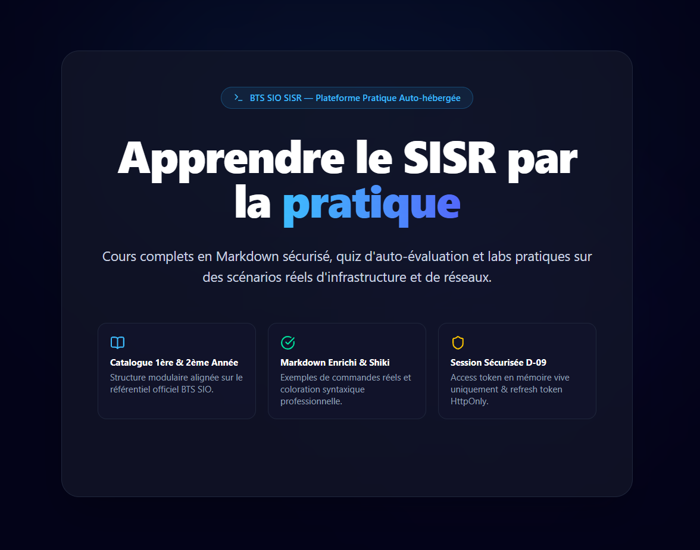
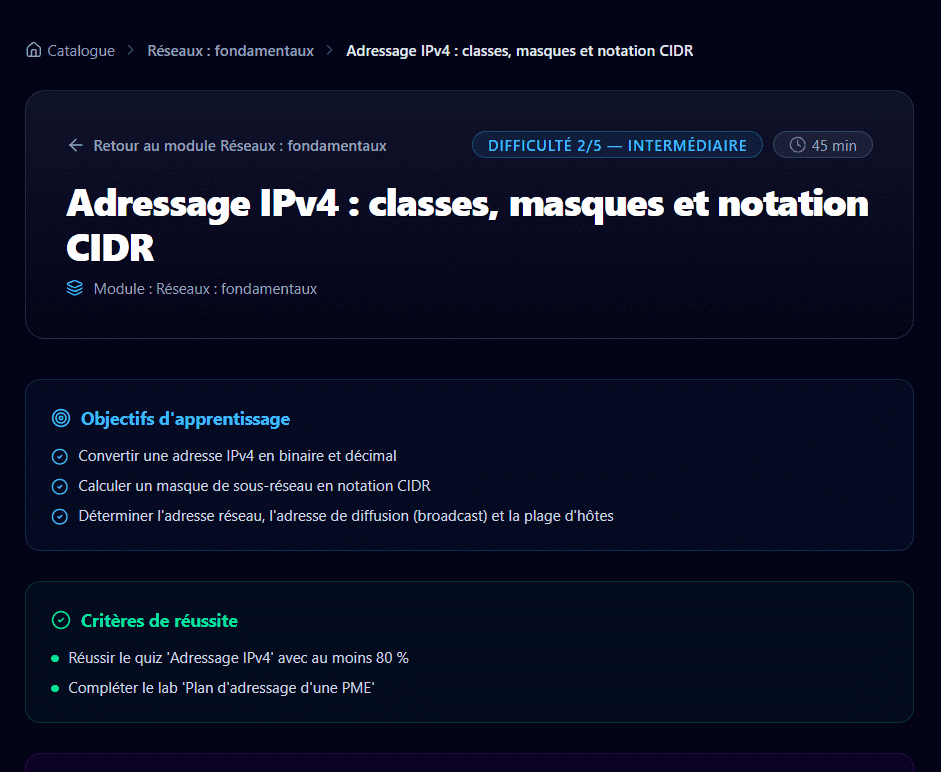

<div align="center">

# 🎓 OpenSIO



**La plateforme d'entraînement pour le BTS SIO option SISR**

[](https://git.io/typing-svg)

[](https://github.com/Klemz-696/opensio/actions/workflows/ci.yml)
[](LICENSE)
[](https://nextjs.org)
[](https://nestjs.com)
[](https://www.postgresql.org)
[](https://www.prisma.io)
[](https://www.typescriptlang.org)

</div>

---

## 📖 À propos

**OpenSIO** est une plateforme web pédagogique conçue pour les étudiants de **BTS SIO option SISR** (Solutions d'Infrastructure, Systèmes et Réseaux). Elle centralise le contenu de formation — modules, leçons, quiz d'évaluation et bientôt ateliers pratiques — dans une application moderne, sécurisée et auto-hébergeable, pensée pour un environnement LAN de formation.

Projet réalisé dans le cadre du BTS SIO : l'architecture, la sécurité et la qualité de code suivent un cahier des charges contractuel (*blueprint*), avec une revue de code complète à chaque lot avant fusion.

## ✨ Fonctionnalités

- 🗂️ **Catalogue structuré** — années de formation, modules avec niveau de difficulté, durées estimées et codes de compétences du référentiel
- 📚 **Leçons en Markdown** — rendu sécurisé (sanitization stricte), coloration syntaxique Shiki, métadonnées pédagogiques (objectifs, prérequis, critères de réussite)
- ✅ **Quiz interactifs** — correction 100 % côté serveur, seuil de réussite configurable (80 % par défaut), explications pédagogiques après soumission, historique des tentatives
- 🔐 **Authentification robuste** — JWT en mémoire vive, rotation des refresh tokens avec détection de réutilisation, hachage Argon2id
- 🛡️ **Sécurité by design** — RBAC (étudiant / formateur / admin), rate limiting, erreurs RFC 7807, journal d'audit complet
- 🎨 **UX soignée** — skeletons de chargement accessibles, design responsive, navigation instantanée

## 🖼️ Aperçu

<div align="center">

| Catalogue | Leçon |
|:---:|:---:|
|  |  |

| Quiz en cours | Résultat corrigé |
|:---:|:---:|
|  |  |

</div>

## 🛠️ Stack technique

| Couche | Technologies |
|---|---|
| Frontend | Next.js 15 (App Router, React 19, Turbopack), Tailwind CSS, Shiki |
| Backend | NestJS 11 (monolithe modulaire), Prisma 6 |
| Base de données | PostgreSQL 16 (Docker) |
| Contenu | Markdown + frontmatter YAML, schémas Zod |
| Qualité | Vitest (109 tests au Lot 5), ESLint, Turborepo, GitHub Actions |
| Sécurité | Argon2id, JWT, rehype-sanitize, audit RGPD |

## 🏗️ Architecture

Monorepo pnpm + Turborepo :

```
opensio/
├── apps/
│   ├── api/                # API REST NestJS — localhost:4000/api/v1
│   └── web/                # Frontend Next.js — localhost:3000
├── packages/
│   ├── config/             # Configurations partagées (TS, ESLint, Tailwind)
│   └── content-schema/     # Schémas Zod du contenu pédagogique
├── content/                # Leçons & quiz (Markdown + frontmatter)
├── infra/docker/           # PostgreSQL 16 pour le développement
├── scripts/                # Contrôle de gouvernance (règle D-13)
└── docs/                   # Journal de bord du projet
```

## 🚀 Démarrage rapide

Prérequis : Node.js 24, pnpm, Docker Desktop.

```powershell
git clone https://github.com/Klemz-696/opensio.git
cd opensio
pnpm install
copy .env.example .env
docker compose -f infra/docker/docker-compose.dev.yml up -d
pnpm --filter @opensio/api exec prisma migrate dev
pnpm seed
pnpm content:sync
pnpm dev
```

- Frontend : http://localhost:3000
- API : http://localhost:4000/api/v1 (sonde de santé : `/api/v1/health`)

Comptes de démonstration (développement local uniquement) :

| Rôle | Email | Mot de passe |
|---|---|---|
| Étudiant | `student@opensio.local` | `StudentOpenSIO2026!` |
| Administrateur | `admin@opensio.local` | `AdminOpenSIO2026!` |

## 🔐 Sécurité & qualité

- **Mots de passe** : hachage Argon2id (64 Mio, 3 itérations, parallélisme 4)
- **Sessions** : access token JWT en mémoire vive (jamais en `localStorage`), refresh token en cookie `HttpOnly; SameSite=Lax` avec rotation et détection de réutilisation (révocation en chaîne)
- **Quiz** : les bonnes réponses (`correctChoiceIds`) ne quittent jamais le serveur ; soumissions idempotentes (rejet 422 sur réutilisation incohérente d'une clé)
- **Contenu** : sanitization Markdown stricte (`rehype-sanitize`), protection anti-traversée de chemin
- **Audit** : journalisation des actions sensibles (connexions, soumissions de quiz, administration)
- **Gouvernance** : règle D-13 (≤ 400 lignes par fichier source, vérifiée en CI), pipeline CI complet (lint → types → taille → tests → build), revue systématique avant fusion

## 🗺️ Feuille de route

| Lot | Contenu | Statut |
|---|---|---|
| 0 | Socle monorepo & gouvernance | ✅ |
| 1 | Modèle de données (15 tables, seed) | ✅ |
| 2 | Schémas de contenu & synchronisation | ✅ |
| 3 | Authentification & sécurité | ✅ |
| 4 | Catalogue & leçons | ✅ |
| 5 | Quiz interactifs | ✅ |
| 6 | Progression & tableau de bord | 🚧 Prochain |
| 7 | Ateliers pratiques (labs) | ⬜ |
| 8 | Terminal & assistant IA | ⬜ |

## 📄 Licence

Distribué sous licence MIT — voir [LICENSE](LICENSE).
