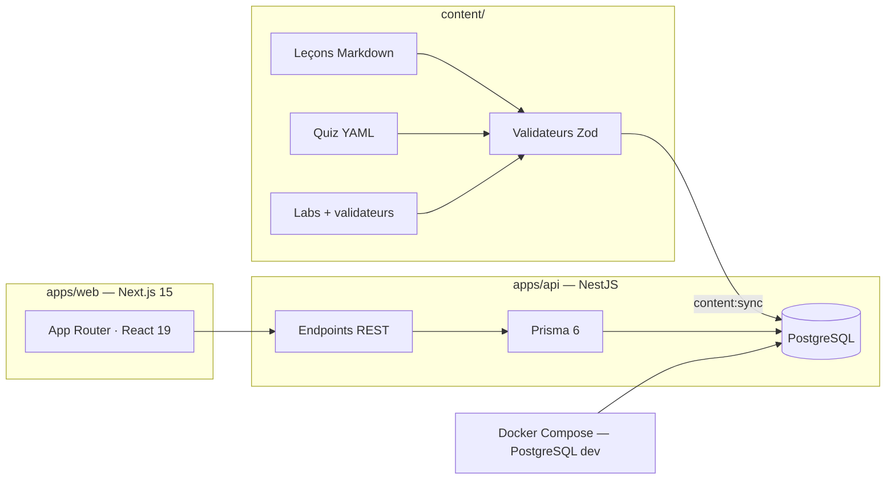

<!--
  NOTE MAINTENANCE
  - Les listes de modules ci-dessous reflètent l'état du catalogue à la clôture
    (19/19 modules). La source de vérité est docs/modules-map.md : si un module
    est renommé, mettre à jour les deux tableaux.
  - Captures d'écran : déposer les images dans docs/assets/ puis remplacer les
    placeholders de la section Aperçu.
-->

<p align="center">
  
</p>

<p align="center">
  <a href="https://git.io/typing-svg">
    
  </a>
</p>

<p align="center">
  <a href="https://github.com/Klemz-696/opensio/actions/workflows/ci.yml"></a>
  
  
  
  
  
  
  
  
  <a href="./LICENSE"></a>
</p>

---

## 🎯 Présentation

**OpenSIO** est une plateforme web d'apprentissage conçue pour les étudiants de
**BTS SIO option SISR** (Solutions d'Infrastructure, Systèmes et Réseaux).
Elle transforme le référentiel officiel en un parcours interactif complet :
cours structurés, quiz auto-corrigés et ateliers pratiques validés
automatiquement par des validateurs autonomes.

Le projet est né d'un constat simple : réviser l'administration systèmes et
réseaux exige de la pratique, pas seulement des PDF. OpenSIO fournit un
environnement où chaque notion est immédiatement mise en application.

## ✨ Fonctionnalités

| Fonctionnalité | Description |
| --- | --- |
| 📚 Catalogue structuré | 2 parcours (1ʳᵉ et 2ᵉ année), 19 modules, leçons numérotées avec prérequis explicites |
| ❓ Quiz corrigés | Choix simples et multiples, explication pédagogique pour chaque réponse, seuil de réussite à 80 % |
| 🧪 Labs auto-validés | Ateliers pratiques avec validateurs autonomes, solutions de référence, indices à pénalités |
| 📊 Suivi de progression | Dashboard personnel, avancement par module et par parcours |
| 🌗 Bi-thème natif | Thème clair et sombre vérifiés automatiquement en CI |
| 🔐 Authentification | Comptes par rôle (étudiant / administrateur), hashage Argon2id |
| 🛠️ Back-office | Interface d'administration des utilisateurs et du contenu |

## 📚 Le catalogue SISR

Le catalogue complet — objectifs, fiches et statut de chaque module — est
détaillé dans [docs/modules-map.md](docs/modules-map.md).

### 1ʳᵉ année — Fondamentaux

| # | Module | Thèmes |
| --- | --- | --- |
| 1 | Linux — Administration | Ligne de commande, permissions, services systemd |
| 2 | Réseaux — Fondamentaux | Adressage IP, VLAN, modèle OSI/TCP-IP |
| 3 | Windows Server | Active Directory, GPO, services de domaine |
| 4 | Virtualisation & Systèmes | Hyperviseurs, Proxmox VE, cloud-init |
| 5 | Sauvegardes & Stockage | RAID, stratégie 3-2-1, RTO/RPO |
| 6 | Support & Parc — GLPI | ITIL, tickets, SLA, inventaire |
| 7 | Anglais technique | Vocabulaire, documentation, tickets de support |
| 8 | Module de socle | Voir [modules-map](docs/modules-map.md) |

### 2ᵉ année — Approfondissement SISR

| # | Module | Thèmes |
| --- | --- | --- |
| 1 | Routage & Interconnexion | OSPF, inter-VLAN, NAT/PAT |
| 2 | Sécurité périmétrique | Pare-feu stateful, nftables, VPN |
| 3 | Conteneurisation Docker | Images, réseaux, volumes, Compose |
| 4 | Automatisation & DevOps | CI/CD, Ansible, IaC |
| 5 | Supervision & Observabilité | Prometheus, Grafana, logs |
| 6 | Cloud privé & Virtualisation | Clusters, migration, quotas |
| 7 | Sécurité des systèmes | Durcissement ANSSI/CIS, patch management |
| 8 | Gestion de projets agile | Scrum, Kanban, estimation |
| 9 | Veille & Certification | Veille techno, parcours de certification |
| 10 | Administration de bases de données | SQL, PostgreSQL, réplication |
| 11 | Serveurs web, PKI & TLS | Certificats, HTTPS, reverse proxy |
| 12 | VPN & Accès distants | Site-à-site, nomade, WireGuard |

## 🧱 Architecture



## 🛠️ Stack technique

| Couche | Technologie |
| --- | --- |
| Frontend | Next.js 15 (App Router), React 19, Tailwind CSS |
| Backend | NestJS 11, Prisma 6 |
| Base de données | PostgreSQL 18 (Docker en développement) |
| Contenu | Markdown / YAML / JSON validés par Zod |
| Tests | Vitest, Testing Library, validateurs de contenu |
| Tooling | pnpm workspaces, Turborepo, ESLint 9, TypeScript strict |
| CI | GitHub Actions — lint, types, D-13, thème, tests, build |

## 🚀 Démarrage rapide

Prérequis : **Node.js**, **pnpm**, **Docker Desktop**.

```bash
# 1. Cloner et installer
git clone https://github.com/Klemz-696/opensio.git
cd opensio
pnpm install

# 2. Configurer l'environnement
cp .env.example .env   # renseigner DATABASE_URL et les secrets

# 3. Démarrer PostgreSQL (service "db")
docker compose -f infra/docker/docker-compose.dev.yml up -d db

# 4. Initialiser la base
pnpm --filter @opensio/api exec prisma migrate deploy
pnpm seed

# 5. Synchroniser le catalogue pédagogique
pnpm content:sync

# 6. Lancer web + API
pnpm dev
```

Frontend : http://localhost:3000 · API : http://localhost:4000

Le guide complet est dans [docs/installation.md](docs/installation.md) et le
déploiement dans [docs/deployment.md](docs/deployment.md).

## 📂 Structure du monorepo

```text
opensio/
├── apps/
│   ├── api/            # NestJS 11 · Prisma · sync de contenu
│   └── web/            # Next.js 15 · interface élève et admin
├── content/            # tracks → modules → leçons / quiz / labs
├── packages/           # config partagée (TS, ESLint, Tailwind) + content-schema
├── infra/docker/       # docker-compose.dev.yml (PostgreSQL)
├── scripts/            # check-file-size (D-13), check-theme-classes
└── docs/               # cartographie, guides, journal, roadmap
```

## ✅ Qualité & gouvernance de code

- **Règle D-13** : aucun fichier source de plus de 400 lignes (vérifié en CI)
- **Bi-thème** : `scripts/check-theme-classes.mjs` garantit la couverture clair/sombre
- **Contenu** : `content/validate.mjs` exécute 100 % des validateurs de labs
- **Chaîne complète** : lint → typecheck → tests → build, bloquante sur chaque PR

## 🗺️ Feuille de route

Le catalogue SISR (19/19 modules) est **terminé**. La route vers la v1.0 —
durcissement, accessibilité, tests E2E, déploiement — est détaillée dans
[docs/roadmap.md](docs/roadmap.md), et chaque étape est tracée dans le
[journal de bord](docs/journal.md).

## 📖 Documentation

| Document | Contenu |
| --- | --- |
| [docs/modules-map.md](docs/modules-map.md) | Cartographie complète des 19 modules |
| [docs/content-guide.md](docs/content-guide.md) | Guide d'écriture du contenu pédagogique |
| [docs/installation.md](docs/installation.md) | Installation pas à pas |
| [docs/deployment.md](docs/deployment.md) | Mise en production |
| [docs/journal.md](docs/journal.md) | Journal de bord décision par décision |

## 🤝 Contribuer

Une contribution = une branche = une Pull Request. Le contenu pédagogique suit
[docs/content-guide.md](docs/content-guide.md) ; le code respecte la règle D-13
et la CI doit rester verte. Jamais de push direct sur `main`.

## 📄 Licence

Code distribué sous licence [MIT](LICENSE).

<p align="center">
  
</p>
