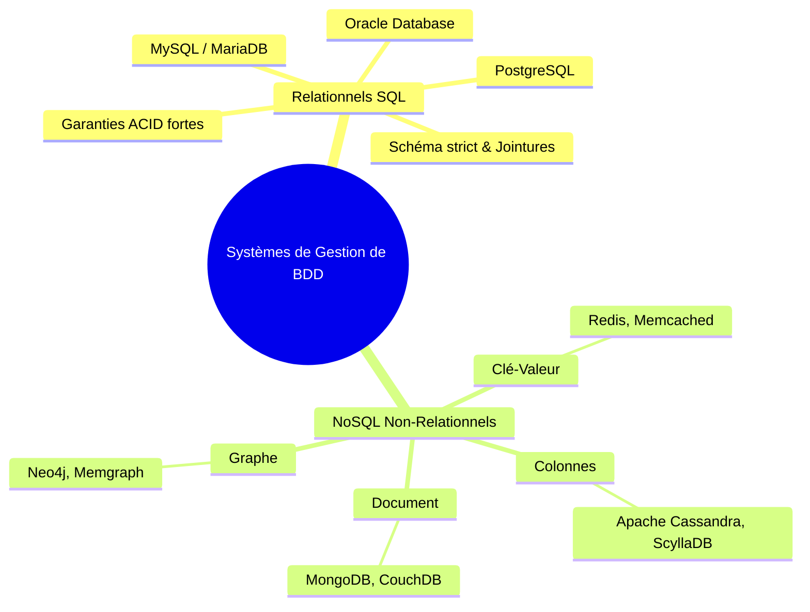

# Concepts des Bases de Données : Relationnel vs NoSQL, Transactions & ACID

Les bases de données constituent le cœur applicatif de tout système d'information moderne. Pour un administrateur systèmes et réseaux (SISR), la compréhension fine des modèles de stockage, des garanties transactionnelles et de la concurrence d'accès est indispensable pour déployer, sécuriser et maintenir des services fiables et performants.

---

## 1. SGBD Relationnel (SQL) vs NoSQL

Le choix d'un Système de Gestion de Base de Données (SGBD) repose sur la structure des données, le volume et le profil des requêtes.



### 1.1. Les SGBD Relationnels (SGBD-R)

Les SGBD relationnels s'appuient sur l'algèbre relationnelle formulée par Edgar F. Codd (1970). Les données sont structurées en **tables** composées de lignes (*tuples*) et de colonnes (*attributs*).

- **Schéma strict (Schema-on-Write)** : La structure (types, contraintes, longueurs) est validée lors de l'insertion.
- **Normalisation** : Réduction de la redondance et prévention des anomalies de mise à jour.
- **Langage déclaratif SQL** : Requêtage standardisé permettant des jointures complexes.
- **Cas d'usage cibles** : Données hautement structurées, systèmes de facturation, ERP, gestion de parc GLPI, annuaires et applications métier nécessitant une cohérence sans faille.

### 1.2. Les Modèles NoSQL (Not Only SQL)

Les bases NoSQL privilégient l'évolutivité horizontale (*scale-out*) et la flexibilité de structure (*Schema-on-Read*) :

| Modèle | Représentation des données | Exemples majeurs | Cas d'usage privilégiés |
|---|---|---|---|
| **Document** | Documents hiérarchiques JSON/BSON | MongoDB, CouchDB | Catalogues e-commerce, profils utilisateurs, CMS |
| **Clé-Valeur** | Paires clé -> valeur binaire/chaîne | Redis, Memcached, DynamoDB | Mise en cache, sessions web, compteurs temps réel |
| **Colonnes larges** | Familles de colonnes extensibles | Cassandra, ScyllaDB, HBase | Séries temporelles, métrologie, IoT, Big Data |
| **Graphe** | Nœuds, relations et propriétés | Neo4j, Amazon Neptune | Réseaux sociaux, analyse de fraude, topologie réseau |

### 1.3. Le Théorème CAP (Eric Brewer)

Dans un système de données distribué à travers un réseau, il est théoriquement impossible de garantir simultanément les trois propriétés suivantes :

1. **Cohérence (*Consistency*)** : Chaque lecture reçoit l'écriture la plus récente ou une erreur.
2. **Disponibilité (*Availability*)** : Chaque requête non défaillante reçoit une réponse (sans garantie de dernière écriture).
3. **Tolérance au Partitionnement (*Partition Tolerance*)** : Le système continue de fonctionner malgré des pertes de paquets ou coupures réseau entre nœuds.

Dans un environnement réseau réel, les pannes réseau étant inévitables ($P$ obligatoire), tout système distribué doit arbitrer entre **CP** (cohérence privilégiée, rejet des requêtes en cas de doute) et **AP** (disponibilité maximale avec cohérence à terme — *Eventual Consistency*).

---

## 2. Propriétés ACID & Gestion Transactionnelle

Une **transaction** est une séquence logique d'opérations de lecture et d'écriture exécutée comme une unité de travail indivisible.

### 2.1. Les 4 Piliers ACID

```
A — Atomicité   : Tout s'exécute avec succès ou rien n'est appliqué (Tout ou Rien).
C — Cohérence   : La transaction fait passer la base d'un état valide à un autre état valide.
I — Isolation   : Les transactions simultanées s'exécutent sans interférences mutuelles.
D — Durabilité  : Une fois validées (COMMIT), les modifications sont écrites sur disque (WAL).
```

- **Atomicité (*Atomicity*)** : Si une coupure de courant survient au milieu d'un virement bancaire (débit effectué, crédit en attente), la base annule automatiquement les modifications partielles lors du redémarrage.
- **Cohérence (*Consistency*)** : Toutes les règles métier et contraintes d'intégrité (`NOT NULL`, `CHECK`, `FOREIGN KEY`) sont respectées à l'issue de la transaction.
- **Isolation (*Isolation*)** : Deux transactions concurrentes ne voient pas les états intermédiaires l'une de l'autre tant qu'elles ne sont pas validées.
- **Durabilité (*Durability*)** : Les données validées persistent même en cas de crash grâce au journal des écritures préalables (*Write-Ahead Logging* / WAL sous PostgreSQL, *Redo Log* sous MySQL InnoDB).

### 2.2. Commandes de Contrôle Transactionnel (TCL)

Sous PostgreSQL et MySQL (moteur InnoDB), les blocs transactionnels se contrôlent explicitement :

```sql
-- Début de la transaction
BEGIN;

-- Opération 1 : Débit du compte source
UPDATE comptes SET solde = solde - 500 WHERE id_compte = 101;

-- Point de sauvegarde intermédiaire
SAVEPOINT avant_frais;

-- Opération 2 : Prélèvement de frais
UPDATE comptes SET solde = solde - 15 WHERE id_compte = 101;

-- Annulation conditionnelle vers le point de sauvegarde en cas d'erreur sur les frais
ROLLBACK TO SAVEPOINT avant_frais;

-- Opération 3 : Crédit du compte destinataire
UPDATE comptes SET solde = solde + 500 WHERE id_compte = 202;

-- Validation définitive et écriture disque
COMMIT;
```

Si une anomalie survient avant le `COMMIT`, l'instruction `ROLLBACK` restaure immédiatement l'état initial des tables.

---

## 3. Niveaux d'Isolation & Anomalies de Concurrence

Lorsque plusieurs sessions exécutent simultanément des transactions, des phénomènes indésirables peuvent altérer les résultats.

### 3.1. Les 4 Anomalies de Concurrence Majeures

1. **Lecture sale (*Dirty Read*)** : La transaction T1 lit une ligne modifiée par la transaction T2 qui n'a pas encore été validée (et qui pourrait faire un `ROLLBACK`).
2. **Lecture non reproductible (*Non-Repeatable Read*)** : La transaction T1 lit une ligne, la transaction T2 modifie ou supprime cette ligne et fait un `COMMIT`. Si T1 relit la ligne, elle obtient une valeur différente.
3. **Lecture fantôme (*Phantom Read*)** : La transaction T1 lit un ensemble de lignes répondant à un critère (`WHERE statut = 'ACTIF'`). La transaction T2 insère une nouvelle ligne respectant ce critère et valide. Si T1 réexécute la même requête, une nouvelle ligne « fantôme » apparaît.
4. **Anomalie de sérialisation (*Serialization Anomaly*)** : Le résultat de l'exécution simultanée d'un groupe de transactions validées est différent de n'importe quel ordre d'exécution séquentiel possible.

### 3.2. La Matrice des Niveaux d'Isolation SQL ANSI

La norme SQL ANSI définit 4 niveaux d'isolation croissants :

| Niveau d'Isolation | Lecture sale (*Dirty Read*) | Lecture non reproductible | Lecture fantôme (*Phantom Read*) | Verrouillage / Coût |
|---|:---:|:---:|:---:|---|
| **Read Uncommitted** | Possible | Possible | Possible | Minimal (Non supporté par PostgreSQL) |
| **Read Committed** | **Protégé** | Possible | Possible | Défaut sous PostgreSQL & SQL Server |
| **Repeatable Read** | **Protégé** | **Protégé** | Possible (Protégé en MVCC Postgres) | Défaut sous MySQL InnoDB |
| **Serializable** | **Protégé** | **Protégé** | **Protégé** | Coût CPU élevé, retries applicatifs requis |

### 3.3. Configuration du Niveau d'Isolation en SQL

```sql
-- Définition pour la transaction courante
SET TRANSACTION ISOLATION LEVEL REPEATABLE READ;
BEGIN;
SELECT SUM(montant) FROM factures WHERE annee = 2026;
-- Les lectures suivantes verront une vue figée (snapshot) au démarrage de la transaction
COMMIT;
```

---

## 4. Gestion de la Concurrence : MVCC et Verrous

Pour assurer l'isolation sans bloquer les lecteurs lors des écritures, PostgreSQL et MySQL InnoDB utilisent le mécanisme **MVCC (*Multi-Version Concurrency Control*)** :

- **Principe du MVCC** : *« Les lecteurs ne bloquent jamais les rédacteurs, et les rédacteurs ne bloquent jamais les lecteurs »*.
- **Gestion des versions** : Lorsqu'une ligne est mise à jour (`UPDATE`), PostgreSQL ne l'écrase pas immédiatement : il crée une nouvelle version du tuple avec des identifiants de transaction système (`xmin`, `xmax`).
- **Pointeurs et visibilité** : Chaque transaction accède à un instantané (*snapshot*) des lignes visibles selon son horodatage transactionnel.
- **Nettoyage** : Les anciennes versions mortes (*dead tuples*) sont ultérieurement purgées par le processus `VACUUM`.

### Les Verrous Explicites et Deadlocks

En cas de mise à jour simultanée sur la même ligne par deux transactions, un **verrou exclusif de ligne** est posé. Si la transaction A attend la transaction B et que la transaction B attend la transaction A, une situation d'interblocage (**Deadlock**) survient :

```text
Session 1 : Bloque la ligne Utilisateur 10 -> Demande la ligne Utilisateur 20
Session 2 : Bloque la ligne Utilisateur 20 -> Demande la ligne Utilisateur 10
--> Détection automatique de Deadlock par le moteur SGBD : annulation d'une des deux transactions.
```
