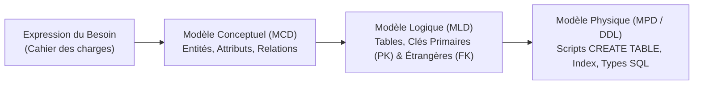

# Modélisation des Données & Requêtage SQL Avancé (DDL, DML, DQL)

La modélisation des données est l'étape architecturale critique garantissant la cohérence, la pérennité et les performances d'un système d'information. Une base mal conçue engendre des redondances de données, des anomalies de mise à jour et des requêtes inefficaces.

---

## 1. Démarche de Conception : Du MCD au MLD

La méthode de modélisation Merise sépare l'analyse conceptuelle de l'implémentation logique et physique.



### 1.1. Modèle Conceptuel de Données (MCD)

- **Entité** : Objet ou concept métier concret ou abstrait (ex: `UTILISATEUR`, `TICKET`, `EQUIPEMENT`).
- **Attributs / Propriétés** : Caractéristiques décrivant l'entité (ex: `email`, `date_creation`, `ip_address`).
- **Association / Relation** : Lien sémantique entre entités (ex: `Creer`, `Affecter`, `Contenir`).
- **Cardinalités** : Nombre minimum et maximum de fois où une entité participe à une association (`(0,1)`, `(1,1)`, `(0,n)`, `(1,n)`).

### 1.2. Règles de Passage du MCD au MLD

1. **Association 1:N (ou 0:N avec 1:1)** : La clé primaire de l'entité côté $N$ reçoit la clé primaire de l'autre entité en tant que **clé étrangère (*Foreign Key*)**.
   - *Exemple* : Un ticket est créé par un seul utilisateur, un utilisateur peut créer $N$ tickets $\rightarrow$ La table `tickets` intègre la colonne `id_utilisateur` en clé étrangère.
2. **Association N:M (ou 0:n avec 0:n)** : Création d'une **table de jointure / table associative** dont la clé primaire est composée de l'union des clés primaires des entités participantes.
   - *Exemple* : Un utilisateur appartient à plusieurs groupes, un groupe contient plusieurs utilisateurs $\rightarrow$ Table associative `utilisateurs_groupes(id_utilisateur, id_groupe)`.

---

## 2. Normalisation des Données (Formes Normales)

La normalisation organise les données pour minimiser la redondance et éviter les anomalies d'insertion, de modification et de suppression.

```
1FN (1ère Forme Normale) : Tous les attributs sont atomiques (pas de listes, valeurs indivisibles).
2FN (2ème Forme Normale) : 1FN respectée + tout attribut n'appartenant pas à la clé dépend de la TOTALITÉ de la clé primaire.
3FN (3ème Forme Normale) : 2FN respectée + aucun attribut ne dépend d'un autre attribut non-clé (pas de dépendance transitive).
```

### Exemple de Dé-normalisation Corrigée (Passage en 3FN)

- **Non conforme (Transitivité)** : `TICKETS(id_ticket, description, id_technicien, nom_technicien, email_technicien)` $\rightarrow$ `nom_technicien` dépend de `id_technicien`, pas de `id_ticket`.
- **Conforme 3FN** :
  - `TICKETS(id_ticket, description, id_technicien)`
  - `TECHNICIENS(id_technicien, nom_technicien, email_technicien)`

---

## 3. Implémentation DDL et Contraintes d'Intégrité

Le langage de définition de données (**DDL**) traduit le MLD en tables physiques.

```sql
-- Création de la table des départements
CREATE TABLE departements (
    id_departement SERIAL PRIMARY KEY,
    nom_departement VARCHAR(80) NOT NULL UNIQUE,
    code_service VARCHAR(10) NOT NULL UNIQUE,
    actif BOOLEAN NOT NULL DEFAULT TRUE
);

-- Création de la table des utilisateurs avec contraintes
CREATE TABLE utilisateurs (
    id_utilisateur BIGSERIAL PRIMARY KEY,
    id_departement INT NOT NULL,
    nom VARCHAR(60) NOT NULL,
    prenom VARCHAR(60) NOT NULL,
    email VARCHAR(255) NOT NULL UNIQUE,
    date_embauche DATE NOT NULL DEFAULT CURRENT_DATE,
    quota_stockage_mo INT NOT NULL CHECK (quota_stockage_mo > 0),
    CONSTRAINT fk_utilisateur_departement
        FOREIGN KEY (id_departement)
        REFERENCES departements(id_departement)
        ON DELETE RESTRICT
        ON UPDATE CASCADE
);

-- Table des tickets avec clés étrangères et clauses d'intégrité
CREATE TABLE tickets_support (
    id_ticket BIGSERIAL PRIMARY KEY,
    id_demandeur BIGINT NOT NULL,
    id_technicien BIGINT,
    titre VARCHAR(200) NOT NULL,
    description TEXT NOT NULL,
    priorite VARCHAR(20) NOT NULL CHECK (priorite IN ('BASSE', 'MOYENNE', 'HAUTE', 'CRITIQUE')),
    statut VARCHAR(20) NOT NULL DEFAULT 'NOUVEAU' CHECK (statut IN ('NOUVEAU', 'EN_COURS', 'RESOLU', 'CLOS')),
    date_creation TIMESTAMP WITH TIME ZONE NOT NULL DEFAULT CURRENT_TIMESTAMP,
    date_cloture TIMESTAMP WITH TIME ZONE,
    CONSTRAINT fk_ticket_demandeur
        FOREIGN KEY (id_demandeur) REFERENCES utilisateurs(id_utilisateur) ON DELETE CASCADE,
    CONSTRAINT fk_ticket_technicien
        FOREIGN KEY (id_technicien) REFERENCES utilisateurs(id_utilisateur) ON DELETE SET NULL,
    CONSTRAINT chk_date_cloture_coherente
        CHECK (date_cloture IS NULL OR date_cloture >= date_creation)
);
```

### Actions Référentielles sur les Clés Étrangères

- `ON DELETE RESTRICT` / `NO ACTION` : Interdit la suppression du parent s'il existe des enregistrements enfants liés.
- `ON DELETE CASCADE` : Supprime automatiquement les enregistrements enfants lors de la suppression du parent (ex: commentaires d'un ticket).
- `ON DELETE SET NULL` : Conserve l'enregistrement enfant en passant la colonne FK à `NULL` (ex: technicien supprimé mais ticket conservé).

---

## 4. Indexation et Vues SQL

### 4.1. Indexation Stratégique

Les index accélèrent les lectures (`SELECT`) au prix d'un surcoût lors des écritures (`INSERT`, `UPDATE`, `DELETE`) et d'espace disque :

```sql
-- Index simple sur clé étrangère (évite les scans séquentiels lors des jointures)
CREATE INDEX idx_tickets_demandeur ON tickets_support(id_demandeur);

-- Index composite optimisant les filtres fréquents combinés
CREATE INDEX idx_tickets_statut_date ON tickets_support(statut, date_creation DESC);

-- Index partiel (indexe uniquement un sous-ensemble pertinent)
CREATE INDEX idx_tickets_ouverts_critiques ON tickets_support(priorite)
WHERE statut IN ('NOUVEAU', 'EN_COURS');
```

### 4.2. Vues Classiques vs Vues Matérialisées

- **Vue standard (`CREATE VIEW`)** : Requête stockée sous forme d'alias. Aucun stockage physique ; la requête sous-jacente est exécutée dynamiquement à chaque appel.
- **Vue matérialisée (`CREATE MATERIALIZED VIEW`)** : Stocke physiquement le résultat de la requête sur disque. Idéale pour les tableaux de bord et rapports analytiques lourds. Doit être rafraîchie périodiquement (`REFRESH MATERIALIZED VIEW`).

```sql
-- Vue de reporting standard
CREATE OR REPLACE VIEW v_statistiques_tickets_departement AS
SELECT 
    d.id_departement,
    d.nom_departement,
    COUNT(t.id_ticket) AS total_tickets,
    COUNT(CASE WHEN t.statut IN ('NOUVEAU', 'EN_COURS') THEN 1 END) AS tickets_actifs,
    COUNT(CASE WHEN t.priorite = 'CRITIQUE' THEN 1 END) AS tickets_critiques
FROM departements d
LEFT JOIN utilisateurs u ON u.id_departement = d.id_departement
LEFT JOIN tickets_support t ON t.id_demandeur = u.id_utilisateur
GROUP BY d.id_departement, d.nom_departement;
```

---

## 5. Requêtes Avancées (DQL) : Jointures, CTE et Fonctions Fenêtres

### 5.1. Types de Jointures

- `INNER JOIN` : Retourne uniquement les lignes ayant une correspondance dans les deux tables.
- `LEFT [OUTER] JOIN` : Retourne toutes les lignes de la table gauche et les correspondances de la table droite (ou `NULL`).
- `FULL OUTER JOIN` : Retourne toutes les lignes des deux tables avec `NULL` en l'absence de correspondance.

### 5.2. Expressions de Table Communes (CTE / `WITH`)

Les CTE améliorent la lisibilité des requêtes analytiques complexes :

```sql
WITH techniciens_occupes AS (
    SELECT 
        id_technicien, 
        COUNT(*) AS nb_tickets_en_cours
    FROM tickets_support
    WHERE statut = 'EN_COURS' AND id_technicien IS NOT NULL
    GROUP BY id_technicien
)
SELECT 
    u.nom, 
    u.prenom, 
    COALESCE(t.nb_tickets_en_cours, 0) AS charge_actuelle
FROM utilisateurs u
INNER JOIN techniciens_occupes t ON u.id_utilisateur = t.id_technicien
WHERE t.nb_tickets_en_cours >= 5
ORDER BY charge_actuelle DESC;
```
