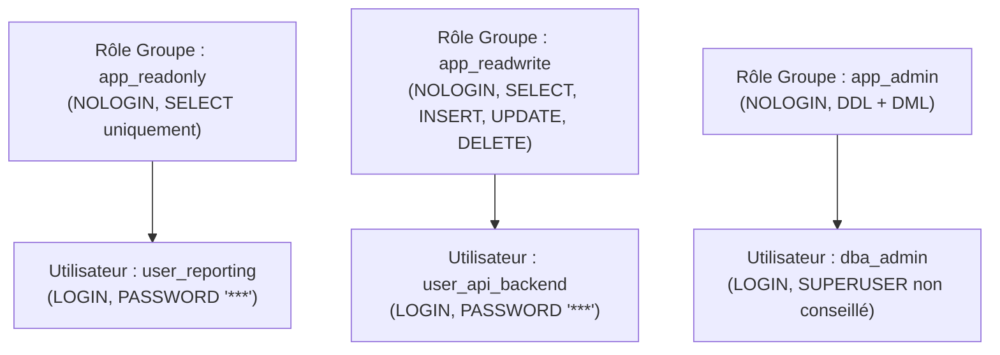

# Administration & Exploitation des SGBD (PostgreSQL & MySQL/MariaDB)

L'administrateur de bases de données (DBA) ou l'administrateur système a pour mission de garantir la disponibilité, la sécurité, l'intégrité et la pérennité des données d'entreprise. Cette leçon explore l'exploitation courante et avancée de **PostgreSQL** et **MySQL/MariaDB**.

---

## 1. Fichiers de Configuration & Architecture des Services

### 1.1. PostgreSQL : Structure et Fichiers Clés

Sous Debian/Ubuntu, les fichiers de configuration de PostgreSQL sont localisés dans `/etc/postgresql/<version>/main/` :

```
/etc/postgresql/16/main/
├── postgresql.conf   # Paramètres du moteur (mémoire, connexions, journaux, WAL)
├── pg_hba.conf       # Contrôle d'accès basé sur les hôtes (Host-Based Authentication)
└── pg_ident.conf     # Mappage des identités système vers les rôles PostgreSQL
```

#### Paramètres essentiels dans `postgresql.conf` :

```ini
# Écoute sur les interfaces réseau (défaut : 'localhost')
listen_addresses = '*'
port = 5432

# Gestion des connexions
max_connections = 100

# Paramètres mémoire de base
shared_buffers = 2GB          # ~25% de la RAM disponible sur serveur dédié
work_mem = 16MB               # Alloué par opération de tri/hachage
maintenance_work_mem = 256MB  # Alloué pour VACUUM, CREATE INDEX

# Journalisation des requêtes
logging_collector = on
log_destination = 'csvlog'
log_directory = 'log'
log_min_duration_statement = 200 # Enregistre les requêtes > 200 ms
```

### 1.2. Sécurité des Accès dans `pg_hba.conf`

Le fichier `pg_hba.conf` contrôle qui peut se connecter, depuis quelle IP, sur quelle base et avec quelle méthode d'authentification :

```text
# TYPE   DATABASE        USER            ADDRESS                 METHOD
# Connexions locales UNIX socket (administrateur local)
local    all             postgres                                peer

# Connexions locales par socket pour utilisateurs applicatifs
local    all             all                                     scram-sha-256

# Réseau interne d'entreprise (LAN applicatif)
host     app_db          app_user        10.20.1.0/24            scram-sha-256

# Réseau de supervision (Nagios / Prometheus exporter)
host     app_db          pg_monitor      10.20.1.50/32           scram-sha-256

# REJET EXPLICITE de tout autre accès
host     all             all             0.0.0.0/0               reject
```

> 🔐 **Bonne pratique de sécurité** : Utilisez toujours `scram-sha-256` (remplaçant les méthodes vulnérables `trust` ou `md5`).

---

## 2. Gestion des Rôles, Utilisateurs et Privilèges (RBAC)

PostgreSQL unifie les notions d'utilisateurs et de groupes sous le concept de **rôles** (`ROLE`).



### 2.1. Mise en Place du Contrôle d'Accès par Rôles (RBAC)

```sql
-- 1. Création des rôles de groupe sans droit de connexion
CREATE ROLE app_readonly NOLOGIN;
CREATE ROLE app_readwrite NOLOGIN;

-- 2. Attribution des privilèges sur la base et le schéma
GRANT CONNECT ON DATABASE production_db TO app_readonly, app_readwrite;
GRANT USAGE ON SCHEMA public TO app_readonly, app_readwrite;

-- Privilèges en lecture seule
GRANT SELECT ON ALL TABLES IN SCHEMA public TO app_readonly;
ALTER DEFAULT PRIVILEGES IN SCHEMA public GRANT SELECT ON TABLES TO app_readonly;

-- Privilèges en lecture/écriture
GRANT SELECT, INSERT, UPDATE, DELETE ON ALL TABLES IN SCHEMA public TO app_readwrite;
GRANT USAGE, SELECT, UPDATE ON ALL SEQUENCES IN SCHEMA public TO app_readwrite;
ALTER DEFAULT PRIVILEGES IN SCHEMA public GRANT SELECT, INSERT, UPDATE, DELETE ON TABLES TO app_readwrite;

-- 3. Création des comptes utilisateurs nominatifs rattachés aux groupes
CREATE USER api_service WITH PASSWORD 'MotDePasseTresComplexe123!';
GRANT app_readwrite TO api_service;

CREATE USER bi_reporter WITH PASSWORD 'RapportAnalytiqueSecure456!';
GRANT app_readonly TO bi_reporter;
```

### 2.2. Durcissement du Schéma Public

Par défaut, PostgreSQL accorde le droit `CREATE` sur le schéma `public` à tous les utilisateurs (`PUBLIC`). Pour empêcher la création intempestive de tables par des utilisateurs non privilégiés :

```sql
REVOKE CREATE ON SCHEMA public FROM PUBLIC;
```

---

## 3. Stratégies de Sauvegarde et Restauration

### 3.1. Sauvegardes Logiques avec `pg_dump` et `pg_dumpall`

La sauvegarde logique extrait la structure DDL et les données sous forme de commandes SQL ou d'archive compressée propriétaire.

```bash
# Sauvegarde d'une seule base au format Custom compressé (recommandé pour la production)
pg_dump -h 127.0.0.1 -U postgres -F c -b -v -f /backup/db_prod_$(date +%F).dump production_db

# Sauvegarde de toutes les bases + Rôles et Globaux (format texte SQL)
pg_dumpall -h 127.0.0.1 -U postgres --globals-only -f /backup/globals_$(date +%F).sql

# Restauration parallèle sur un serveur cible avec pg_restore
pg_restore -h 127.0.0.1 -U postgres -d production_db -v -j 4 /backup/db_prod_2026-08-27.dump
```

| Outil | Format de sortie | Avantages | Inconvénients |
|---|---|---|---|
| `pg_dump -F p` | Fichier texte brut `.sql` | Lisible, éditable manuellement | Volumineux, restauration séquentielle lente |
| `pg_dump -F c` | Format Custom binaire | Compressé, restauration sélective, parallélisable (`-j`) | Nécessite `pg_restore` pour la lecture |
| `mysqldump` | Fichier SQL brut | Universel sur MySQL/MariaDB | Bloquant sans `--single-transaction` sur InnoDB |

### 3.2. Sauvegarde MySQL / MariaDB avec `mysqldump`

```bash
# Sauvegarde consistante en ligne (sans verrouillage grâce à --single-transaction)
mysqldump -h localhost -u root -p \
  --single-transaction \
  --quick \
  --routines \
  --triggers \
  --databases entreprise_db | gzip > /backup/mysql_entreprise_$(date +%F).sql.gz

# Restauration d'une archive MySQL
gunzip < /backup/mysql_entreprise_2026-08-27.sql.gz | mysql -u root -p entreprise_db
```

---

## 4. Maintenance Préventive et Optimisation MVCC

### 4.1. Le Rôle Fondamental de `VACUUM` sous PostgreSQL

En raison du modèle MVCC, lorsqu'une ligne est mise à jour (`UPDATE`) ou supprimée (`DELETE`), l'ancien tuple reste physiquement sur le disque sous forme de « tuple mort » (*dead tuple*).

- **`VACUUM` standard** : Parcourt les tables, marque l'espace des tuples morts comme réutilisable pour les prochaines insertions. **Non bloquant** pour les lectures et écritures.
- **`VACUUM FULL`** : Réécrit intégralement la table sur le disque pour restituer l'espace libéré au système de fichiers de l'OS. **Bloquant exclusif** (pose un verrou `AccessExclusiveLock`).
- **`ANALYZE`** : Met à jour les statistiques de distribution des données utilisées par l'optimiseur de requêtes.
- **`REINDEX`** : Reconstruit les index corrompus ou fragmentés (`REINDEX TABLE nom_table`).

```sql
-- Maintenance courante manuelle recommandée
VACUUM (VERBOSE, ANALYZE) tickets_support;

-- Vérification de l'état des tuples morts
SELECT 
    relname AS table_name,
    n_live_tup AS tuples_vivants,
    n_dead_tup AS tuples_morts,
    last_vacuum,
    last_autovacuum
FROM pg_stat_user_tables
ORDER BY n_dead_tup DESC;
```
