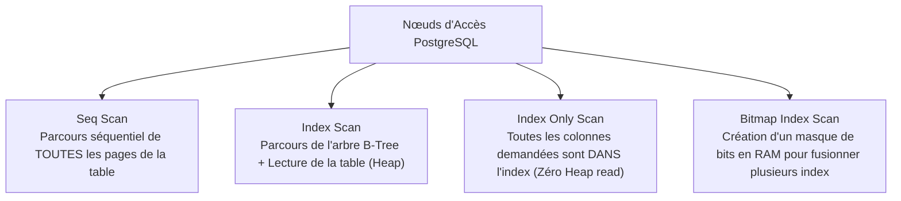
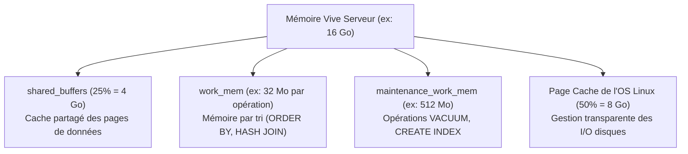
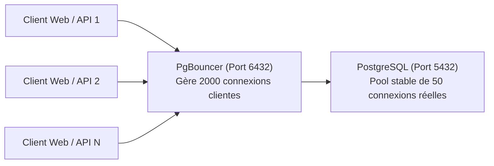

# Performance, Optimisation des Requêtes & Métrologie SGBD

L'optimisation des performances d'une base de données repose sur une démarche méthodique : analyse du comportement du planificateur (*query planner*), indexation ciblée, calibrage précis de la mémoire et gestion mutualisée des connexions.

---

## 1. Analyse des Plans d'Exécution avec `EXPLAIN`

Avant d'exécuter une requête SQL, le planificateur évalue plusieurs stratégies d'accès et choisit celle dont le **coût estimé (*cost*)** est le plus bas.

```sql
-- Estimation théorique basée sur les statistiques (sans exécuter la requête)
EXPLAIN SELECT * FROM tickets_support WHERE statut = 'EN_COURS';

-- Exécution réelle avec mesure des temps et des blocs mémoire (I/O)
EXPLAIN (ANALYZE, BUFFERS, COSTS, VERBOSE)
SELECT t.id_ticket, t.titre, u.email
FROM tickets_support t
INNER JOIN utilisateurs u ON u.id_utilisateur = t.id_demandeur
WHERE t.statut = 'NOUVEAU' AND t.priorite = 'CRITIQUE';
```

### 1.1. Les Principaux Nœuds d'Accès aux Données



- **Sequential Scan (`Seq Scan`)** : Lecture intégrale de la table bloc par bloc. Efficace pour les petites tables ou lorsqu'une requête ramène plus de 15–20 % des lignes. Catastrophique sur des millions de lignes avec filtre sélectif.
- **Index Scan** : Recherche dans l'index B-Tree pour trouver le pointeur physique du tuple (*tuple ID* / TID) puis lecture de la page de données correspondante sur le disque.
- **Index Only Scan** : Idéal. Les colonnes du `SELECT` et du `WHERE` figurent toutes dans l'index. Si la *visibility map* indique que les pages sont propres, la table sous-jacente n'est même pas consultée.
- **Bitmap Index Scan + Bitmap Heap Scan** : Construit une carte des pages mémoire contenant les résultats, trie les accès par ordre physique sur le disque pour éviter les lectures aléatoires, puis lit les données.

---

## 2. Stratégies Avancées d'Indexation

Un index accélère la recherche mais ralentit chaque `INSERT`, `UPDATE` et `DELETE`. Une stratégie équilibrée s'impose.

### 2.1. Types d'Index Disponibles sous PostgreSQL

| Type d'Index | Structure / Algorithme | Opérateurs supportés | Cas d'usage typiques |
|---|---|---|---|
| **B-Tree** (Défaut) | Arbre équilibré auto-balancé | `=`, `<`, `<=`, `>`, `>=`, `BETWEEN`, `IN` | Clés primaires, identifiants, dates, recherches d'intervalles |
| **GIN** (*Generalized Inverted Index*) | Index inversé | `@>`, `?`, `?&`, `@@` | Recherche plein texte (*Full Text Search*), colonnes `JSONB`, tableaux |
| **GiST** (*Generalized Search Tree*) | Arbre de recherche générique | `&&`, `@>`, `<@` | Données géographiques PostGIS, polygones, plages de dates (`daterange`) |
| **BRIN** (*Block Range Index*) | Résumé min/max par bloc | `=`, `<`, `>` | Tables d'historique massives triées par date d'insertion (IoT, logs) |

### 2.2. Index Composites et Règle du Préfixe

Dans un index composite sur `(statut, date_creation)` :
- ✅ Une requête filtrant sur `WHERE statut = 'CLOS'` utilisera l'index.
- ✅ Une requête filtrant sur `WHERE statut = 'CLOS' AND date_creation > '2026-01-01'` utilisera pleinement l'index.
- ⚠️ Une requête filtrant **uniquement** sur `WHERE date_creation > '2026-01-01'` ne pourra pas exploiter le premier niveau de l'index de manière optimale.

### 2.3. Pièges Classiques Neutralisant les Index

```sql
-- ❌ INVALIDE : La fonction LOWER() appliquée sur la colonne empêche l'utilisation d'un index standard B-Tree
SELECT * FROM utilisateurs WHERE LOWER(email) = 'admin@opensio.lan';

-- ✅ SOLUTION : Créer un index fonctionnel (sur expression)
CREATE INDEX idx_utilisateurs_email_lower ON utilisateurs(LOWER(email));
```

---

## 3. Détection des Requêtes Lentes avec `pg_stat_statements`

L'extension native `pg_stat_statements` enregistre les statistiques d'exécution agrégées de toutes les requêtes exécutées sur le serveur.

### 3.1. Activation dans `postgresql.conf`

```ini
# Activation de la bibliothèque partagée (nécessite un redémarrage)
shared_preload_libraries = 'pg_stat_statements'

# Paramétrage de la capture
pg_stat_statements.max = 10000
pg_stat_statements.track = all
```

```sql
-- Création de la vue dans la base de données
CREATE EXTENSION IF NOT EXISTS pg_stat_statements;

-- Requête du Top 5 des requêtes les plus coûteuses en temps total
SELECT 
    substring(query, 1, 80) AS requete,
    calls AS nombre_appels,
    round(total_exec_time::numeric, 2) AS temps_total_ms,
    round(mean_exec_time::numeric, 2) AS temps_moyen_ms,
    rows AS total_lignes_retournees
FROM pg_stat_statements
ORDER BY total_exec_time DESC
LIMIT 5;
```

---

## 4. Calibrage de la Mémoire et du Cache

Un dimensionnement adéquat de la mémoire évite les lectures/écritures disques répétées.



### Règles de Dimensionnement Recommandées :

- **`shared_buffers`** : Fixé à **25 %** de la mémoire vive totale sous Linux (ex: 4 Go pour un serveur de 16 Go).
- **`work_mem`** : Alloué dynamiquement pour chaque opération de tri (`ORDER BY`, `DISTINCT`, `Hash Join`). Si une requête comporte 4 tris simultanés, elle consommera $4 \times \text{work\_mem}$. Si l'espace est insuffisant, le tri bascule sur disque (`Sort Method: external merge Disk`), dégradant fortement la vitesse.
- **`maintenance_work_mem`** : Mémoire allouée aux opérations administratives ponctuelles (`VACUUM`, `CREATE INDEX`).

---

## 5. Connexion Pooling avec PgBouncer

Chaque connexion directe à PostgreSQL consomme un processus système Linux (`fork`), allouant entre 5 et 10 Mo de RAM. Lorsqu'une application web ouvre des centaines de connexions concurrentes, le serveur sature.

**PgBouncer** est un proxy léger de gestion de pool de connexions :



### Modes de Fonctionnement de PgBouncer :

1. **Session Pooling** : La connexion PostgreSQL est réservée au client pendant toute la durée de sa session connectée.
2. **Transaction Pooling (Recommandé)** : La connexion PostgreSQL n'est attribuée au client que pendant la durée d'une transaction SQL (`BEGIN` $\rightarrow$ `COMMIT`). Dès la fin de la transaction, la connexion retourne dans le pool pour servir un autre client. Permet de servir des milliers de clients avec quelques dizaines de connexions réelles.
3. **Statement Pooling** : La connexion est restituée après chaque instruction unique (incompatible avec les transactions multi-lignes).
