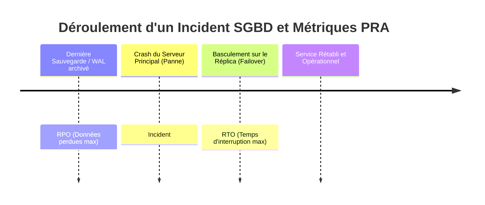
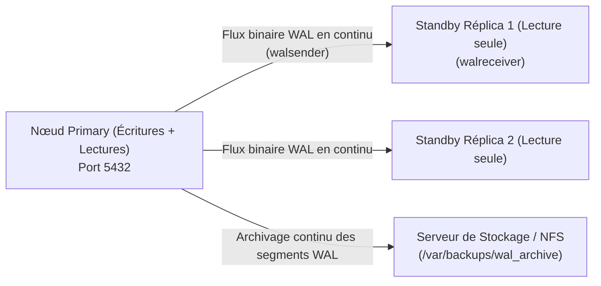
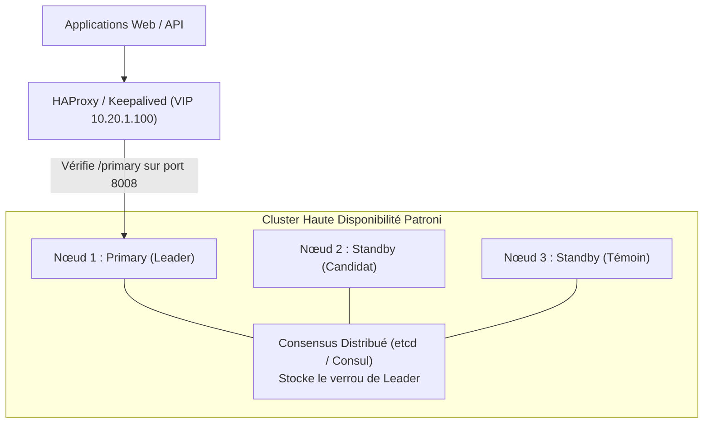

# Haute Disponibilité, Réplication & Sauvegardes Point-in-Time (PITR)

Dans un environnement de production critique, une panne matérielle ou une erreur d'administration sur le serveur de base de données ne doit ni interrompre le service ni entraîner de perte de données. Cette leçon aborde les architectures à haute disponibilité (HA), la réplication en temps réel et la restauration continue (PITR).

---

## 1. Objectifs de Résilience : RTO, RPO & Disponibilité

La conception d'une architecture de base de données s'évalue selon deux métriques clés du Plan de Reprise d'Activité (PRA) :



- **RTO (*Recovery Time Objective*)** : Durée maximale admissible d'interruption de service entre la panne et la reprise opérationnelle (cible : quelques secondes avec basculement automatique).
- **RPO (*Recovery Point Objective*)** : Volume ou durée maximale de données acceptables de perdre lors d'un sinistre (cible : 0 seconde avec réplication synchrone).
- **Disponibilité (SLA)** : 99.9 % autorise 8h45 d'arrêt/an ; 99.99 % autorise seulement 52 minutes d'arrêt/an.

---

## 2. Réplication Physique sous PostgreSQL (Streaming Replication)

PostgreSQL utilise le journal des transactions **WAL (*Write-Ahead Log*)** pour synchroniser un serveur primaire (*Primary*) et un ou plusieurs serveurs secondaires (*Standby* / Réplicas).



### 2.1. Configuration du Serveur Primaire (`postgresql.conf`)

```ini
# Niveau d'information WAL pour supporter la réplication
wal_level = replica
max_wal_senders = 10
max_replication_slots = 10

# Archivage continu des segments WAL de 16 Mo
archive_mode = on
archive_command = 'test ! -f /backup/wal_archive/%f && cp %p /backup/wal_archive/%f'

# Synchronisation (off = asynchrone haute performance, on = synchrone sans perte)
synchronous_commit = on
synchronous_standby_names = 'standby_node1'
```

### 2.2. Autorisation Réseau sur le Primaire (`pg_hba.conf`)

```text
# Autoriser le compte de réplication dédié depuis l'IP du réplica
host    replication     replicator      10.20.1.20/32           scram-sha-256
```

### 2.3. Initialisation du Réplica avec `pg_basebackup`

Sur le serveur secondaire, la base est initialisée par une copie binaire directe depuis le primaire :

```bash
# Arrêt du service local
systemctl stop postgresql

# Nettoyage et clonage binaire complet avec slot de réplication
pg_basebackup -h 10.20.1.10 -p 5432 -U replicator \
  -D /var/lib/postgresql/16/main/ \
  -Fp -Xs -R -P -v
```

> 💡 L'option `-R` génère automatiquement le fichier signal `standby.signal` et les directives de connexion `primary_conninfo` dans la configuration.

### 2.4. Réplication Synchrone vs Asynchrone

| Caractéristique | Réplication Asynchrone (Défaut) | Réplication Synchrone |
|---|---|---|
| **Impact sur la latence du Primary** | Nul (le `COMMIT` valide dès l'écriture locale) | Élevé (le `COMMIT` attend l'accusé de réception du Standby) |
| **RPO (Perte de données)** | Léger décalage possible (*Replication Lag*) | **RPO = 0** (zéro perte de transaction validée) |
| **Disponibilité en cas de coupure réseau** | Le primaire continue d'écrire | Le primaire est bloqué en écriture si le réplica ne répond plus |

---

## 3. Réplication Multi-Maître et Clusters Galera

Dans les architectures multi-maîtres, chaque nœud accepte simultanément des requêtes en lecture et en écriture (`INSERT`/`UPDATE`).

- **Galera Cluster (MySQL / MariaDB)** : Réplication synchrone multi-primaire basée sur la certification de transactions et le protocole wsrep (*Write Set Replication*).
- **Quorum et Split-Brain** : Pour éviter qu'une scission réseau ne sépare le cluster en deux sous-groupes écrivant des données divergentes (*Split-Brain*), Galera impose un nombre impair de nœuds (minimum 3 nœuds) pour maintenir la majorité stricte ($> 50\%$).

---

## 4. Orchestration du Basculement Automatique (Failover)

Le basculement manuel (*Manual Failover*) engendre un RTO de plusieurs minutes. Les infrastructures de production déploient des orchestrateurs automatisés :



- **Patroni** : Démon Python s'exécutant sur chaque nœud PostgreSQL. Il utilise un magasin de configuration distribué (DCS type `etcd` ou `Consul`) pour élire le nœud maître via un bail (*Leader Key Lease*).
- Si le nœud primaire ne renouvelle pas son bail dans le temps imparti (ex: crash matériel), le DCS élit automatiquement le réplica le plus à jour.
- HAProxy ou Keepalived détecte le changement de leader via la sonde HTTP `/primary` et redirige instantanément le trafic applicatif vers le nouveau maître sans intervention humaine.

---

## 5. Restauration à un Instant Précis : Point-In-Time Recovery (PITR)

Le **PITR (*Point-In-Time Recovery*)** permet de rejouer les journaux de transactions (WAL) jusqu'à une date ou une transaction précise, annulant une erreur critique (ex: un `DROP TABLE` accidentel à 14h32m10s).


### Procédure Opérationnelle de Restauration PITR :

1. Arrêter le serveur et restaurer les fichiers de données du dernier `pg_basebackup`.
2. Créer le fichier `recovery.signal` dans le répertoire des données (`$PGDATA`).
3. Ajouter dans `postgresql.conf` :
   ```ini
   # Commande pour récupérer les segments WAL archivés
   restore_command = 'cp /backup/wal_archive/%f %p'

   # Cible temporelle exacte d'arrêt du rejeu
   recovery_target_time = '2026-08-27 14:32:00 CET'
   recovery_target_action = 'promote' # Promeut la base en lecture/écriture à la cible
   ```
4. Démarrer PostgreSQL : le moteur rejoue tous les segments jusqu'à la seconde spécifiée puis ouvre la base aux utilisateurs.
