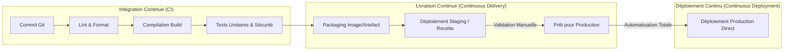

# Principes DevOps, Culture Collaborative et Fondements CI/CD

Le mouvement **DevOps** réconcilie deux mondes aux objectifs historiquement opposés : le développement (*Dev*), axé sur la livraison rapide de nouvelles fonctionnalités, et l'exploitation des systèmes et réseaux (*Ops*), axée sur la stabilité, la disponibilité et la sécurité de l'infrastructure.

---

## 1. Dépasser le « Mur de la Confusion » et Modèle CAMS

Dans le modèle traditionnel en cascade, les développeurs livraient de volumineuses archives de code aux exploitants, créant des frictions majeures et des déploiements nocturnes à haut risque.

```text
┌───────────────────────────┐         ┌───────────────────────────┐
│     Équipe Dev (Code)     │         │     Équipe Ops (Infra)    │
│  Objectif : Changement    │ ◄═════► │  Objectif : Stabilité     │
│  Livrables : Fonctionnalités│   MUR   │  Livrables : Disponibilité│
└───────────────────────────┘         └───────────────────────────┘
```

La culture DevOps brise ce mur en unifiant les responsabilités autour des **4 piliers CAMS** :
1. **Culture** : Responsabilité partagée du produit (*"You build it, you run it"*), communication fluide et tolérance à l'échec constructif (post-mortems sans blâme).
2. **Automation (Automatisation)** : Remplacement des interventions manuelles répétitives et faillibles par des scripts et des pipelines déclaratifs reproductibles.
3. **Measurement (Mesure)** : Collecte systématique de métriques sur les performances applicatives, les taux d'erreur et les temps de déploiement.
4. **Sharing (Partage)** : Diffusion des connaissances, des outils et des retours d'expérience entre tous les intervenants du cycle de vie logiciel.

---

## 2. Le Continuum d'Automatisation : CI vs CD



- **Intégration Continue (CI — _Continuous Integration_)** : Chaque modification de code fusionnée dans le dépôt central déclenche automatiquement la compilation, les analyses statiques (linting, audit de vulnérabilités) et l'exécution des suites de tests automatisés pour détecter les régressions au plus tôt (**Shift-Left Testing**).
- **Livraison Continue (CD — _Continuous Delivery_)** : Le code validé est automatiquement packagé sous forme d'artefacts immuables (images Docker, paquets) et déployé sur des environnements de pré-production (*Staging*). La mise en production finale nécessite un clic d'approbation humaine.
- **Déploiement Continu (CD — _Continuous Deployment_)** : Tout changement qui passe l'intégralité du pipeline automatisé est immédiatement et automatiquement mis en production sans aucune intervention humaine.

---

## 3. Les 4 Métriques de Performance DORA

Le programme de recherche **DORA** (*DevOps Research and Assessment*) a identifié quatre métriques fondamentales pour évaluer la maturité DevOps d'une organisation :

| Métrique DORA | Définition | Objectif Haute Performance |
|---|---|---|
| **Deployment Frequency** | Fréquence à laquelle le code est déployé en production | Plusieurs fois par jour |
| **Lead Time for Changes** | Temps écoulé entre le premier commit et son exécution en production | Moins d'une heure |
| **Change Failure Rate (CFR)** | Pourcentage de déploiements nécessitant un correctif d'urgence ou un rollback | Inférieur à 5 % |
| **Time to Restore Service (MTTR)** | Temps nécessaire pour rétablir le service lors d'un incident majeur | Moins d'une heure |
