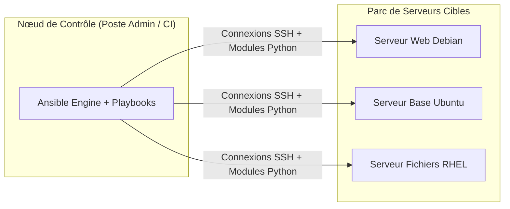

# Gestion de Configuration Automatisée et Idempotente avec Ansible

**Ansible** est l'outil de référence pour l'automatisation du déploiement, la gestion de configuration et l'orchestration de parcs de serveurs hétérogènes.

---

## 1. Architecture Sans Agent (_Agentless_)

Contrairement aux outils traditionnels (Puppet, Chef) qui nécessitent l'installation et la maintenance d'un agent logiciel lourd sur chaque machine cliente, Ansible fonctionne en mode **Agentless** :



- Le nœud de contrôle se connecte aux cibles distantes par **SSH** (ou WinRM pour Windows).
- Il transmet de petits modules Python éphémères, les exécute sur la cible, puis les supprime automatiquement.

---

## 2. Inventaire et Notion Fondamentale d'Idempotence

### Fichier d'inventaire (`hosts.ini`) :
```ini
[webservers]
web-01.opensio.local ansible_host=192.168.10.11
web-02.opensio.local ansible_host=192.168.10.12

[dbservers]
db-01.opensio.local ansible_host=192.168.20.50

[production:children]
webservers
dbservers

[webservers:vars]
http_port=80
app_env=production
```

### Le concept d'Idempotence :
Une tâche Ansible est dite **idempotente** si son exécution répétée produit rigoureusement le même état cible sans provoquer d'effets secondaires indésirables :
- Si le paquet `nginx` est déjà installé dans la version demandée, Ansible indique `ok` et ne fait rien.
- Si le paquet est manquant, Ansible l'installe et indique `changed`.

---

## 3. Structure d'un Playbook avec Template Jinja2 et Handlers

```yaml
---
# playbook.yml
- name: "Déploiement et sécurisation du serveur Web Nginx"
  hosts: webservers
  become: true # Élévation de privilèges (sudo)

  vars:
    domain_name: "app.opensio.local"
    nginx_port: 80

  tasks:
    - name: "Installer le serveur Web Nginx"
      ansible.builtin.apt:
        name: nginx
        state: present
        update_cache: yes

    - name: "Déployer la configuration du VirtualHost via Template Jinja2"
      ansible.builtin.template:
        src: templates/vhost.conf.j2
        dest: /etc/nginx/sites-available/app.conf
        owner: root
        group: root
        mode: "0644"
      notify: "Recharger le service Nginx"

    - name: "Activer le VirtualHost via lien symbolique"
      ansible.builtin.file:
        src: /etc/nginx/sites-available/app.conf
        dest: /etc/nginx/sites-enabled/app.conf
        state: link
      notify: "Recharger le service Nginx"

    - name: "Supprimer la configuration par défaut"
      ansible.builtin.file:
        path: /etc/nginx/sites-enabled/default
        state: absent

    - name: "S'assurer que Nginx est démarré et activé au boot"
      ansible.builtin.systemd:
        name: nginx
        state: started
        enabled: yes

  handlers:
    - name: "Recharger le service Nginx"
      ansible.builtin.systemd:
        name: nginx
        state: reloaded
```

### Template Jinja2 associé (`templates/vhost.conf.j2`) :
```nginx
server {
    listen {{ nginx_port }};
    server_name {{ domain_name }};

    root /var/www/html;
    index index.html;

    location / {
        try_files $uri $uri/ =404;
    }
}
```

> [!TIP]
> Les **Handlers** ne sont exécutés qu'une seule fois à la fin du playbook, et uniquement si au moins une tâche ayant la directive `notify` a renvoyé l'état `changed`. Cela évite les rechargements de services inutiles et intempestifs.
