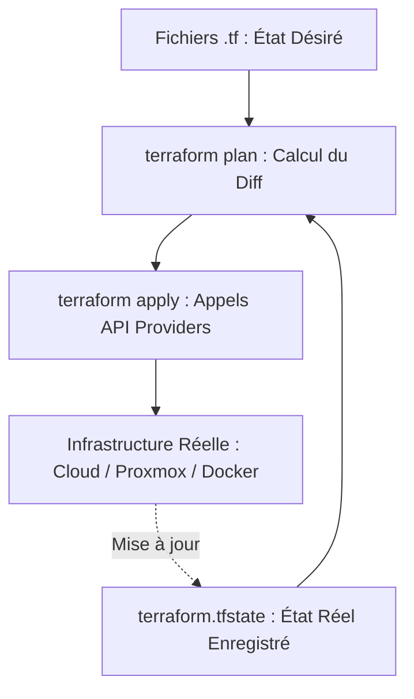

# Infrastructure as Code (IaC), Provisioning Déclaratif avec Terraform

L'**Infrastructure as Code (IaC)** permet de décrire, provisionner et gérer l'ensemble des ressources matérielles et cloud (machines virtuelles, réseaux, pare-feu, conteneurs, enregistrements DNS) sous forme de fichiers de code déclaratifs versionnés dans Git.

---

## 1. Déclaratif vs Impératif et Architecture Terraform

- **Approche Impérative (Scripts Bash/PowerShell)** : Décrit la liste ordonnée des étapes à effectuer (*"Exécute cette commande pour créer une VM, puis ajoute ce disque"*). Difficilement maintenable et non prédictible en cas d'erreur partielle.
- **Approche Déclarative (Terraform / HCL)** : Décrit l'**état final désiré** (*"Je veux 3 machines virtuelles Ubuntu avec 4 Go de RAM dans le VLAN 10"*). Terraform calcule automatiquement les opérations d'écart (*diff*) nécessaires pour atteindre cet état.



---

## 2. Exemple de Configuration Terraform (`main.tf`)

```hcl
terraform {
  required_version = ">= 1.8.0"
  required_providers {
    docker = {
      source  = "kreuzwerker/docker"
      version = "~> 3.0"
    }
  }

  # Backend distant sécurisé pour le partage d'état en équipe
  backend "local" {
    path = "terraform.tfstate"
  }
}

provider "docker" {
  host = "unix:///var/run/docker.sock"
}

# 1. Définition d'une ressource Réseau
resource "docker_network" "app_network" {
  name   = "production-network"
  driver = "bridge"
}

# 2. Définition d'une ressource Image
resource "docker_image" "nginx" {
  name         = "nginx:alpine"
  keep_locally = false
}

# 3. Définition d'une ressource Conteneur
resource "docker_container" "web_server" {
  name  = var.container_name
  image = docker_image.nginx.image_id

  ports {
    internal = 80
    external = var.external_port
  }

  networks_advanced {
    name = docker_network.app_network.name
  }
}
```

### Variables et Sorties associées :
```hcl
# variables.tf
variable "container_name" {
  type        = string
  description = "Nom du conteneur de production"
  default     = "web-production"
}

variable "external_port" {
  type        = number
  description = "Port d'écoute public exposé sur l'hôte"
  default     = 8080
}

# outputs.tf
output "web_url" {
  description = "URL d'accès au service déployé"
  value       = "http://localhost:${var.external_port}"
}
```

---

## 3. Le Cycle de Vie des Commandes Terraform

| Commande | Rôle & Action |
|---|---|
| **`terraform init`** | Initialise le répertoire de travail, télécharge les plugins de providers et configure le backend d'état. |
| **`terraform plan`** | Compare l'état actuel (`.tfstate`) avec le code source et génère un plan d'exécution prédictif sans rien modifier. |
| **`terraform apply`** | Applique les modifications validées en appelant les API des fournisseurs pour converger vers l'état cible. |
| **`terraform destroy`** | Détruit l'ensemble des ressources gérées par le projet de manière ordonnée et contrôlée. |
| **`terraform fmt`** | Réindente et formate automatiquement tous les fichiers `.tf` selon les standards HCL. |

> [!CAUTION]
> Le fichier **`terraform.tfstate`** contient la cartographie complète de vos ressources et peut inclure des mots de passe ou clés en clair. Il ne doit **jamais être committé dans un dépôt Git public**, mais stocké dans un *Remote Backend* sécurisé (ex: bucket S3 chiffré avec verrouillage d'état via DynamoDB).
