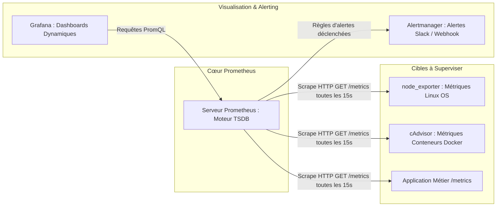

# Observabilité des Systèmes, Métriques Prometheus et Tableaux de Bord Grafana

L'**Observabilité** permet de déduire l'état interne d'un système complexe (serveurs physiques, conteneurs, microservices, réseaux) à partir de l'analyse de ses données externes émises en temps réel.

---

## 1. Les 3 Piliers de l'Observabilité

```text
┌─────────────────────────────────────────────────────────────┐
│                 LES 3 PILIERS DE L'OBSERVABILITÉ            │
├─────────────────────────────────────────────────────────────┤
│ 1. MÉTRIQUES (Metrics) : Valeurs numériques horodatées      │
│    -> CPU: 78 %, RAM: 3.2 Go, Req/s: 450 (Prometheus)       │
│                                                             │
│ 2. JOURNAUX (Logs) : Événements textuels contextuels        │
│    -> "2026-08-27 14:02:11 ERROR Failed connection to DB"   │
│                                                             │
│ 3. TRACES (Distributed Tracing) : Parcours d'une requête    │
│    -> Client -> Nginx (12ms) -> API (45ms) -> DB (110ms)   │
└─────────────────────────────────────────────────────────────┘
```

---

## 2. Architecture de Collecte Prometheus

Contrairement aux outils de supervision historiques (SNMP/Zabbix) qui reposent sur des agents poussant passivement des alertes, **Prometheus** fonctionne sur un modèle de **tirage périodique (_Pull Model_)** :



### Exemple de configuration `prometheus.yml` :
```yaml
global:
  scrape_interval: 15s
  evaluation_interval: 15s

scrape_configs:
  - job_name: "linux-nodes"
    static_configs:
      - targets: ["192.168.10.11:9100", "192.168.10.12:9100"]

  - job_name: "docker-containers"
    static_configs:
      - targets: ["192.168.10.11:8080"]
```

---

## 3. Le Langage de Requêtes PromQL

PromQL permet d'interroger la base de données temporelle de Prometheus pour calculer des taux et agréger des métriques :

- **Pourcentage d'utilisation CPU moyen sur 5 minutes** :
  ```promql
  100 - (avg by (instance) (rate(node_cpu_seconds_total{mode="idle"}[5m])) * 100)
  ```
- **Débit de requêtes HTTP par seconde par code de retour** :
  ```promql
  sum by (status) (rate(http_requests_total[1m]))
  ```
- **Mémoire vive disponible restante (en Go)** :
  ```promql
  node_memory_MemAvailable_bytes / (1024 * 1024 * 1024)
  ```

---

## 4. Fiabilité des Services : SLI, SLO et SLA

Dans la culture SRE (*Site Reliability Engineering*) :
- **SLI (_Service Level Indicator_)** : La métrique objective mesurée en temps réel (ex: *"99.92 % des requêtes HTTP renvoient un code 200 en moins de 300 ms"*).
- **SLO (_Service Level Objective_)** : L'objectif cible interne que l'équipe technique s'engage à maintenir (ex: `99.9 %`).
- **SLA (_Service Level Agreement_)** : L'engagement contractuel juridique avec les clients, comportant des pénalités financières en cas de non-respect (ex: `99.5 %`).
- **Budget d'erreur (_Error Budget_)** : La marge d'indisponibilité acceptable ($100\% - \text{SLO} = 0.1\%$). Tant que le budget d'erreur n'est pas consommé, l'équipe peut déployer de nouvelles fonctionnalités à un rythme soutenu.
