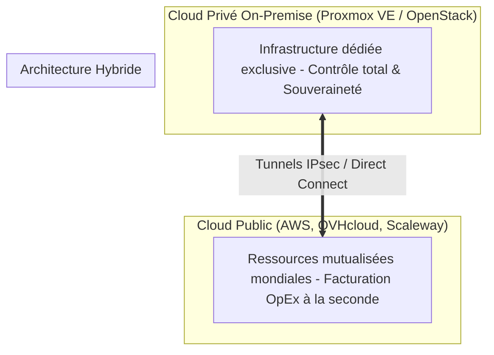

# Concepts du Cloud Computing, Modèles de Services et Stratégies Hybrides

Le **Cloud Computing** transforme la gestion des infrastructures informatiques en remplaçant l'achat de serveurs statiques par l'accès à la demande à un pool mutualisé et configurable de ressources numériques (calcul, stockage, réseaux).

---

## 1. La Pyramide des Modèles de Service (NIST)

Le modèle de responsabilité partagée dépend du niveau d'abstraction choisi :

```text
┌─────────────────────────────────────────────────────────────┐
│ 1. SaaS (Software as a Service)                             │
│    -> Logiciel clé en main : Microsoft 365, Nextcloud       │
│    -> L'utilisateur gère : Ses données et utilisateurs.     │
├─────────────────────────────────────────────────────────────┤
│ 2. PaaS (Platform as a Service)                             │
│    -> Environnement d'exécution : OpenShift, Heroku, S3     │
│    -> L'utilisateur gère : Ses applications et son code.    │
├─────────────────────────────────────────────────────────────┤
│ 3. IaaS (Infrastructure as a Service)                       │
│    -> Ressources brutes : VMs KVM, Réseaux SDN, Volumes SAN │
│    -> L'utilisateur gère : L'OS, les correctifs, la sécurité│
└─────────────────────────────────────────────────────────────┘
```

---

## 2. Comparatif des Modèles de Déploiement



| Critère | Cloud Public | Cloud Privé (On-Premise) | Cloud Hybride |
|---|---|---|---|
| **Modèle Financier** | **OpEx** (Dépenses d'exploitation variables) | **CapEx** (Investissement matériel initial) | Mixte optimisé |
| **Souveraineté des Données** | Soumis aux lois de l'hébergeur (ex: *Cloud Act*) | **Souveraineté totale** interne à l'entreprise | Données sensibles sur site, frontaux en cloud |
| **Élasticité** | Quasi-infinie et instantanée | Limitée à la capacité physique du cluster | **Cloud Bursting** lors des pics d'activité |
| **Maintenance Hyperviseur** | Gérée par le fournisseur cloud | Entièrement gérée par l'équipe interne | Partagée selon le placement des charges |

---

## 3. Souveraineté Numérique et Cadre Réglementaire Européen

Pour les organisations manipulant des données sensibles (santé, défense, secteur public), le Cloud Privé ou le recours à des hébergeurs qualifiés **SecNumCloud** par l'ANSSI garantit :
1. **L'Immunité aux lois extraterritoriales** : Protection contre les réquisitions de données étrangères sans mandat judiciaire européen.
2. **La Conformité RGPD et Directive NIS 2** : Maîtrise rigoureuse de la localisation géographique des centres de données et auditabilité des journaux d'accès.
3. **La Réversibilité** : Absence de verrouillage technologique propriétaire (*Vendor Lock-in*) grâce à des technologies open source (KVM, Proxmox, OpenStack).
