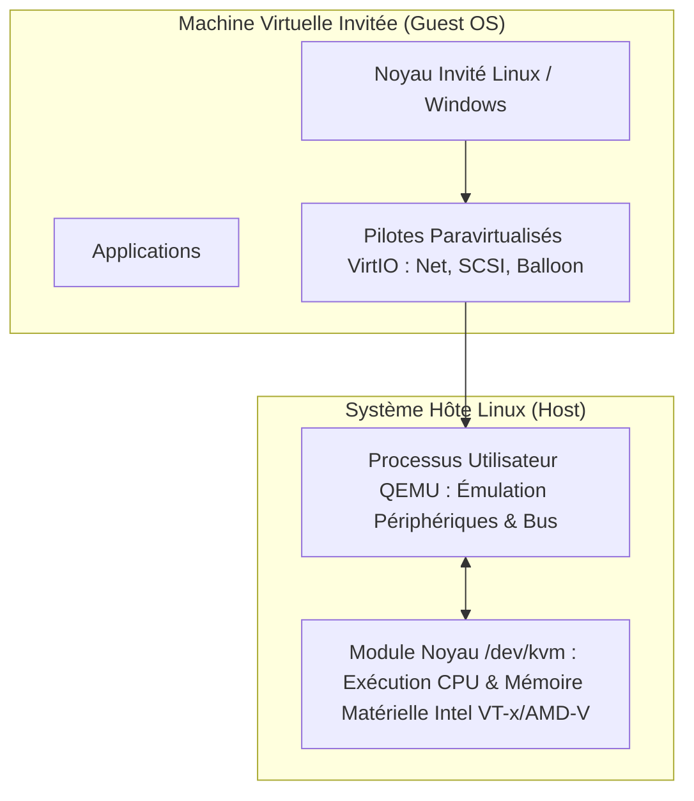
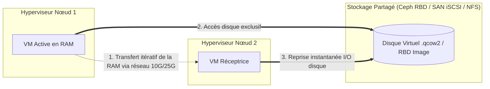

# Virtualisation Avancée : KVM, QEMU, Libvirt, Stockage Partagé et Live Migration

**KVM** (*Kernel-based Virtual Machine*) est le standard industriel de virtualisation sous Linux, propulsant les plus grands centres de données mondiaux et plateformes de Cloud privé.

---

## 1. L'Écosystème KVM, QEMU et Paravirtualisation VirtIO



- **KVM** transforme le noyau Linux en hyperviseur de Type 1 : chaque machine virtuelle est un processus standard sous Linux ordonnancé directement par le CPU hôte.
- **QEMU** émule le BIOS/UEFI, les cartes mères virtuelles et les bus PCI.
- **VirtIO** élimine le coût d'émulation logicielle en faisant communiquer directement l'invité et l'hôte via des anneaux de mémoire partagée (*vrings*), offrant un débit réseau et disque proche du métal physique (*Bare-Metal*).

---

## 2. Administration Déclarative avec Libvirt et `virsh`

`libvirt` fournit une API unifiée et l'outil CLI **`virsh`** :

```bash
# Lister les machines virtuelles actives
virsh list --all

# Démarrer une machine virtuelle
virsh start srv-web-01

# Créer un snapshot cohérent à chaud
virsh snapshot-create-as --domain srv-web-01 --name snap_pre_upgrade --description "Avant MAJ OS"

# Afficher les interfaces réseau virtuelles
virsh domiflist srv-web-01
```

---

## 3. Stockage Partagé, Live Migration et Prévention du Split-Brain

Pour permettre le basculement instantané de machines virtuelles entre nœuds d'un cluster sans coupure de service (**Live Migration**) :



### Mécanismes de résilience du cluster :
1. **Quorum Corosync** : Le cluster doit maintenir une majorité stricte de votes ($N/2 + 1$) pour autoriser les écritures et décisions de bascule automatique (**HA**).
2. **Fencing (STONITH)** : En cas de perte de communication d'un nœud, les nœuds survivants coupent immédiatement son alimentation électrique (via IPMI/iLO) pour empêcher qu'il n'écrive sur le stockage partagé en parallèle (**Split-Brain**).
