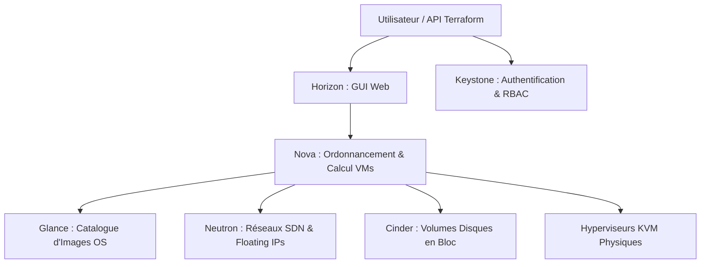

# Plateformes de Cloud Privé : Architectures Proxmox VE et OpenStack

Un **Cloud Privé** apporte l'agilité et l'automatisation du Cloud public tout en conservant le contrôle complet du matériel et la souveraineté des données.

---

## 1. Proxmox VE : L'Infrastructure Hyperconvergée (HCI) Accessible

**Proxmox Virtual Environment** intègre nativement le calcul, le stockage et le réseau au sein d'une même plateforme logicielle :

```text
┌─────────────────────────────────────────────────────────────┐
│                    PROXMOX VE CLUSTER                       │
├──────────────────────────────┬──────────────────────────────┤
│ 1. MOTEUR DE CALCUL          │ 2. STOCKAGE HYPERCONVERGÉ    │
│    - KVM : Machines Virtuelles│    - Ceph OSD / Pools RBD    │
│    - LXC : Conteneurs Système │    - ZFS sur disques NVMe   │
├──────────────────────────────┼──────────────────────────────┤
│ 3. RÉSEAU SOFTWARE-DEFINED   │ 4. CLUSTERING & QUORUM       │
│    - Proxmox SDN (VXLAN/EVPN)│    - Corosync 3 (pmxcfs)     │
│    - Linux Bridges & VLANs    │    - Haute Disponibilité (HA)│
└──────────────────────────────┴──────────────────────────────┘
```

---

## 2. OpenStack : L'IaaS Modulaire pour les Grands Centres de Données

OpenStack orchestre des milliers de nœuds physiques grâce à des microservices interconnectés par des files de messages (RabbitMQ) :



### Rôles des briques modulaires OpenStack :
- **Keystone** : Fournit le catalogue de services, l'authentification des utilisateurs et la gestion des tokens de sécurité.
- **Nova** : Pilote le cycle de vie des instances de calcul (VMs) et sélectionne le meilleur nœud hyperviseur via son *scheduler*.
- **Neutron** : Crée des routeurs virtuels, des sous-réseaux isolés et attribue des adresses IP publiques (*Floating IPs*).
- **Cinder** : Attache des disques virtuels persistants aux instances via iSCSI ou Ceph RBD.
- **Glance** : Stocke et distribue les images de systèmes d'exploitation prêtes à l'emploi (formats `.qcow2`, `.raw`).

---

## 3. Multi-Tenance, Pools de Ressources et Quotas

Pour héberger plusieurs départements ou clients sur une même infrastructure partagée sans risque de saturation :

```text
┌─────────────────────────────────────────────────────────────┐
│               PROJET / TENANT : "ÉQUIPE-DATA"               │
├─────────────────────────────────────────────────────────────┤
│ • Quota Calcul   : Max 32 vCPU (Consommé : 18 vCPU)         │
│ • Quota Mémoire  : Max 128 Go RAM (Consommé : 64 Go)        │
│ • Quota Disque   : Max 2 To Stockage SSD (Consommé : 850 Go)│
│ • Quota Réseau   : Max 4 Floating IPs Publiques             │
│ • Droits RBAC    : Rôle "Member" (Interdiction réseau root) │
└─────────────────────────────────────────────────────────────┘
```
