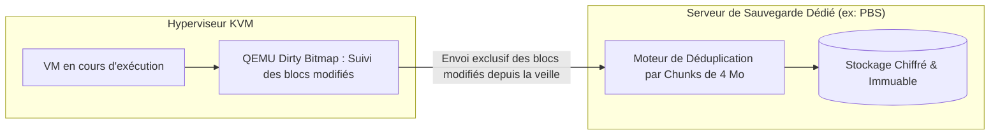

# Exploitation, Sauvegardes Dédupliquées, Capacity Planning et Sécurité du Cloud Privé

L'exploitation d'un Cloud Privé exige une gouvernance rigoureuse des ressources physiques, une politique de sauvegarde infaillible et une étanchéité absolue des réseaux de gestion.

---

## 1. Capacity Planning et Gestion de la Surallocation (_Overcommitment_)

La virtualisation permet de mutualiser les ressources en exploitant le fait que toutes les machines virtuelles ne consomment pas leur pic maximal en même temps :

| Ressource | Ratios Standards Recommandés | Mécanismes Techniques Associés |
|---|---|---|
| **vCPU / CPU Physique** | **`1.5:1`** à **`2:1`** en production critique<br>**`4:1`** en environnement de test/recette | Ordonnanceur standard Linux (CFS - *Completely Fair Scheduler*). |
| **Mémoire RAM** | **`1:1`** en production (pas de surallocation)<br>**`1.2:1`** avec KSM | **KSM (_Kernel Samepage Merging_)** déduplique les pages RAM identiques en mémoire.<br>**VirtIO Ballooning** récupère la RAM inutilisée des invités. |
| **Stockage Disque** | **`2:1`** avec Thin Provisioning | Provisionnement dynamique (*Thin Provisioning*) sur pools ZFS ou Ceph. |

---

## 2. Sauvegardes d'Infrastructure et Déduplication à la Source

Pour sauvegarder des téraoctets de machines virtuelles sans saturer le réseau :



- **Sauvegardes incrémentales à chaud** : QEMU conserve une carte en mémoire (*Dirty Bitmap*) des secteurs modifiés depuis le dernier snapshot, éliminant le besoin de relire l'intégralité du disque virtuel.
- **Déduplication par blocs** : Si 50 machines virtuelles partagent le même système Debian de base, les blocs communs ne sont stockés qu'une seule fois sur le serveur de sauvegarde.

---

## 3. Segmentation Réseau et Durcissement de Sécurité

Selon les guides de bonnes pratiques de l'**ANSSI**, les flux réseau d'un cluster doivent être strictement cloisonnés sur des interfaces physiques distinctes ou des VLANs isolés :

```text
┌─────────────────────────────────────────────────────────────┐
│             MATRICE DE SEGMENTATION DU CLUSTER              │
├─────────────────────────────────────────────────────────────┤
│ 1. Réseau Management & OOB (IPMI / iLO / Web UI) : VLAN 99  │
│    -> Isolé, accessible uniquement via Bastion SSH ou VPN.  │
│                                                             │
│ 2. Réseau de Cluster Corosync (Quorum) : VLAN 98            │
│    -> Latence ultra-faible garantie (< 2 ms), lien dédié.   │
│                                                             │
│ 3. Réseau de Stockage / Ceph Sync : VLAN 97 (10G / 25G)     │
│    -> Séparé des flux applicatifs pour éviter la saturation.│
│                                                             │
│ 4. Réseau Public & VMs de Production : VLANs 10, 20, 30     │
│    -> Flux utilisateurs filtrés par le Pare-feu de cluster. │
└─────────────────────────────────────────────────────────────┘
```
