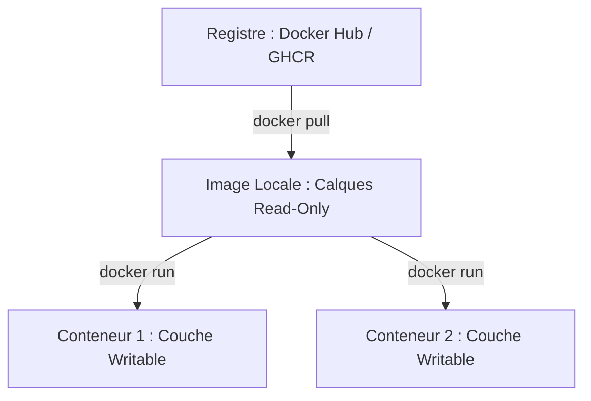

# Principes de la Conteneurisation, Architecture Docker et Cycle de Vie

La conteneurisation permet d'empaqueter une application avec l'ensemble de ses dépendances (bibliothèques, binaires, configurations) dans une unité standardisée et isolée, exécutable de manière reproductible sur tout environnement Linux.

---

## 1. Machine Virtuelle (VM) vs Conteneur

Contrairement à une machine virtuelle traditionnelle qui embarque un système d'exploitation invité complet (*Guest OS*) et émule du matériel via un hyperviseur, le conteneur partage directement le **noyau du système hôte** :

```text
┌───────────────────────────────┐        ┌───────────────────────────────┐
│     Machine Virtuelle (VM)    │        │       Conteneur Docker        │
├───────────────────────────────┤        ├───────────────────────────────┤
│ Application A │ Application B │        │ Application A │ Application B │
│ Binaires/Libs │ Binaires/Libs │        │ Binaires/Libs │ Binaires/Libs │
│ Guest OS (Win)│ Guest OS (Deb)│        │       (Espace Utilisateur)    │
├───────────────────────────────┤        ├───────────────────────────────┤
│     Hyperviseur (Type 1/2)    │        │       Docker Engine (runc)    │
├───────────────────────────────┤        ├───────────────────────────────┤
│     OS Hôte / Matériel        │        │   Noyau Linux Hôte / Matériel │
└───────────────────────────────┘        └───────────────────────────────┘
```

### Les fondations du noyau Linux :
1. **`Namespaces` (Isolation)** : Isole la vue de chaque conteneur sur le système :
   - `pid` : arbre de processus isolé (l'application principale s'exécute en PID 1 dans le conteneur).
   - `net` : interfaces réseau, adresses IP et tables de routage dédiées.
   - `mnt` : points de montage de système de fichiers isolés.
   - `ipc` / `uts` / `user` : mémoire partagée, nom d'hôte et mappage des utilisateurs.
2. **`Control Groups (Cgroups)` (Limitation)** : Mesure et plafonne la consommation de ressources matérielles (CPU, mémoire RAM, entrées/sorties disque IOPS).

---

## 2. Images, Conteneurs et Système de Fichiers en Couches

- **Image Docker** : Modèle immuable en lecture seule (*Read-Only*), constitué d'un empilement de couches (*layers*) mises en cache.
- **Conteneur** : Instance vivante issue d'une image, enrichie d'une **fine couche d'écriture éphémère** (*Writable Container Layer*) gérée par le pilote de stockage **Overlay2** en mode *Copy-on-Write* (CoW).
- **Registre d'images** (Docker Hub, Harbor, GHCR) : Dépôt centralisé stockant les images étiquetées par des tags (`nginx:1.27-alpine`).



---

## 3. Commandes Fondamentales du Cycle de Vie

| Action | Commande | Description |
|---|---|---|
| **Créer & Exécuter** | `docker run -d --name mon-web -p 8080:80 nginx:alpine` | Télécharge l'image si besoin, instancie et lance le conteneur en arrière-plan |
| **Lister actifs** | `docker ps` | Affiche les conteneurs en cours d'exécution |
| **Lister tous** | `docker ps -a` | Affiche tous les conteneurs (actifs et arrêtés) |
| **Consulter les logs**| `docker logs -f mon-web` | Suit en temps réel les flux `stdout` et `stderr` du conteneur |
| **Exécuter une commande** | `docker exec -it mon-web sh` | Ouvre un shell interactif dans le conteneur en fonctionnement |
| **Arrêter proprement** | `docker stop mon-web` | Envoie le signal `SIGTERM` (10s de grâce), puis `SIGKILL` |
| **Supprimer conteneur** | `docker rm -f mon-web` | Supprime définitivement la couche d'écriture du conteneur |
| **Purger ressources** | `docker system prune -a` | Nettoie les conteneurs arrêtés, réseaux inutilisés et images orphelines |

---

## 4. Gestion du Processus Principal (PID 1)

Dans un conteneur, l'application déclarée dans `CMD` ou `ENTRYPOINT` s'exécute en **PID 1**. 
Elle a la responsabilité de recevoir et traiter correctement les signaux du système d'exploitation (`SIGTERM` pour arrêt propre, `SIGINT`). Si le processus PID 1 s'arrête, le conteneur s'arrête immédiatement.
