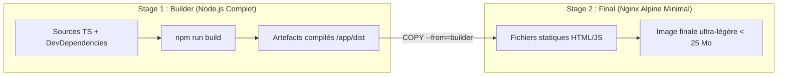

# Dockerfile, Construction d'Images Optimisées et Multi-Stage Builds

Un fichier `Dockerfile` est une recette déclarative décrivant l'assemblage pas à pas d'une image de conteneur autonome, sécurisée et reproductible.

---

## 1. Instructions Clés d'un Dockerfile

```dockerfile
# 1. Image de base officielle et allégée
FROM node:22-alpine

# 2. Répertoire de travail dans le conteneur
WORKDIR /app

# 3. Optimisation du cache : copier d'abord les manifestes de dépendances
COPY package*.json ./
RUN npm ci --only=production && npm cache clean --force

# 4. Copie du reste des sources
COPY . .

# 5. Définition des variables d'environnement
ENV NODE_ENV=production
ENV PORT=3000

# 6. Documentation des ports (informatif)
EXPOSE 3000

# 7. Sécurité : basculer sur un compte non privilégié (non-root)
USER node

# 8. Commande de démarrage par défaut (forme exec recommandée)
CMD ["node", "src/server.js"]
```

### Détail des directives :
- **`WORKDIR`** : Crée le répertoire s'il n'existe pas et s'y positionne pour toutes les commandes suivantes. Évite d'utiliser des `cd` fragiles.
- **`RUN`** : Exécute des commandes pendant la phase de *build*. Chaque instruction `RUN` crée une nouvelle couche d'image. Il est recommandé de chaîner les commandes avec `&&` pour mutualiser les calques.
- **`CMD` vs `ENTRYPOINT`** :
  - `CMD ["node", "app.js"]` : Commande par défaut, facilement surchargeable lors du `docker run`.
  - `ENTRYPOINT ["nginx", "-g", "daemon off;"]` : Fixe le binaire principal de manière inamovible.
- **`USER`** : Exécute l'application avec un utilisateur non-root afin de limiter les risques en cas d'évasion de conteneur.

---

## 2. Le Fichier `.dockerignore`

Tout comme `.gitignore`, le fichier `.dockerignore` à la racine du projet exclut les fichiers inutiles ou confidentiels du **contexte de build** envoyé au démon Docker :

```text
# .dockerignore
node_modules
.git
.env*
*.log
dist
tests
README.md
```

---

## 3. Les Builds Multi-Étapes (_Multi-Stage Builds_)

Dans les langages compilés (Go, Rust, C) ou transpilés (TypeScript, React, Angular), les outils de compilation (compilateurs, SDK, outils de test) alourdissent inutilement l'image de production.

Le **Multi-Stage Build** résout ce problème en séparant l'étape de construction de l'étape finale d'exécution :



### Exemple concret d'un Dockerfile Multi-Stage :
```dockerfile
# ─── Étape 1 : Construction / Compilation ───
FROM node:22-alpine AS builder
WORKDIR /app
COPY package*.json ./
RUN npm ci
COPY . .
RUN npm run build

# ─── Étape 2 : Runtime de Production minimaliste ───
FROM nginx:alpine
# Copie exclusive des fichiers compilés depuis le builder
COPY --from=builder /app/dist /usr/share/nginx/html
EXPOSE 80
CMD ["nginx", "-g", "daemon off;"]
```

> [!TIP]
> Un Dockerfile multi-stage permet de faire passer la taille d'une image de production de **1 Go à moins de 30 Mo**, tout en éliminant les vulnérabilités de sécurité liées aux outils de développement inutilisés en production.
