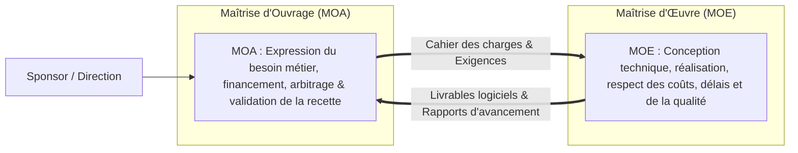
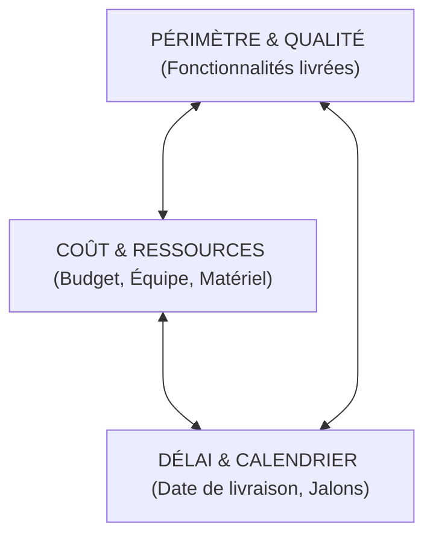

# Fondamentaux de la Gestion de Projet IT, Parties Prenantes et Triangle Coût/Délai/Qualité

Un **projet informatique** est une entreprise temporaire initiée pour créer un produit, un service ou une infrastructure unique, soumise à des contraintes strictes de délais, de budget et d'exigences qualitatives.

---

## 1. Le Cycle de Vie d'un Projet Informatique

Le déroulement standard d'un projet s'articule autour de 6 grandes phases séquentielles ou itératives :

```text
┌─────────────────────────────────────────────────────────────┐
│ 1. CADRAGE       -> Étude d'opportunité, ROI, Note de cadrage│
├─────────────────────────────────────────────────────────────┤
│ 2. CONCEPTION    -> Cahier des charges fonctionnel & tech.  │
├─────────────────────────────────────────────────────────────┤
│ 3. RÉALISATION   -> Développement logiciel, config infra     │
├─────────────────────────────────────────────────────────────┤
│ 4. RECETTE (VABF)-> Tests fonctionnels, conformité métier    │
├─────────────────────────────────────────────────────────────┤
│ 5. DÉPLOIEMENT   -> Mise en production, formation, bascule  │
├─────────────────────────────────────────────────────────────┤
│ 6. CLÔTURE       -> Bilan de projet, passage en RUN         │
└─────────────────────────────────────────────────────────────┘
```

---

## 2. Distinction MOA (Maîtrise d'Ouvrage) vs MOE (Maîtrise d'Œuvre)

Pour éviter les conflits d'intérêts et clarifier les responsabilités :



- **MOA (Client / Métier)** : « *Quoi faire et Pourquoi ?* » (Porteur du besoin, valide le résultat final).
- **MOE (Équipe Technique / Prestataire)** : « *Comment faire et Avec quels outils ?* » (Responsable de la mise en œuvre technique).

---

## 3. Le Triangle d'Or (Triple Contrainte de Projet)

Toute décision managériale impacte l'équilibre fondamental entre trois dimensions indissociables :



> **Règle d'or de l'arbitrage** : Si la direction avance la date de livraison (Délai réduit), il faut impérativement soit augmenter le budget/ressources (Coût accru), soit réduire le nombre de fonctionnalités prévues (Périmètre réduit), sous peine de dégrader sévèrement la Qualité.

---

## 4. Matrice de Gestion des Risques

Un risque est un événement incertain dont la survenance impacterait négativement les objectifs du projet :

$$\text{Criticité du Risque} = \text{Probabilité d'apparition} \times \text{Gravité de l'impact}$$

- **Éviter** : Modifier le plan de projet pour éliminer la cause du risque.
- **Atténuer / Réduire** : Mettre en place des mesures préventives (ex: formations, sauvegardes redondantes).
- **Transférer** : Souscrire une assurance ou externaliser l'activité à un tiers spécialisé.
- **Accepter** : Assumer le risque résiduel faible avec un plan de secours documenté.
