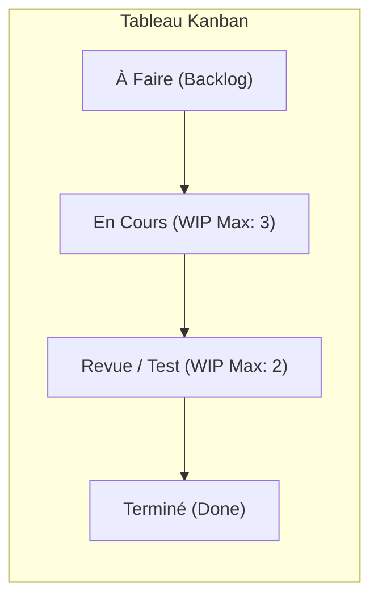

# Méthodologies Agiles : Le Manifeste Agile, le Cadre Scrum et le Flux Kanban

Les méthodes traditionnelles séquentielles (*Cycle en V*) présupposent que le besoin client est parfaitement figé dès le premier jour. Les **méthodologies Agiles** partent du constat inverse : le besoin évolue au contact des utilisateurs et du marché.

---

## 1. Les 4 Valeurs du Manifeste Agile (2001)

1. **Les individus et leurs interactions** de préférence aux processus et aux outils.
2. **Des logiciels opérationnels** de préférence à une documentation exhaustive.
3. **La collaboration avec les clients** de préférence à la négociation contractuelle.
4. **L'adaptation au changement** de préférence au suivi rigide d'un plan.

---

## 2. Le Cadre Scrum : Rôles, Artefacts et Événements

**Scrum** est un cadre de travail léger conçu pour générer de la valeur grâce à des solutions adaptatives :

```text
┌─────────────────────────────────────────────────────────────┐
│                      LE CADRE SCRUM                         │
├──────────────────────────────┬──────────────────────────────┤
│ 1. LES 3 RÔLES               │ 2. LES 3 ARTÉFACTS           │
│    • Product Owner (PO)      │    • Product Backlog         │
│    • Scrum Master (SM)       │    • Sprint Backlog          │
│    • Developers (Équipe)     │    • Incrément (Potentiel.   │
│                              │      livrable selon la DoD)  │
├──────────────────────────────┴──────────────────────────────┤
│ 3. LES 5 CÉRÉMONIES (ÉVÉNEMENTS RYTHMÉS)                    │
│    • Le Sprint (Boîte de temps de 1 à 4 semaines)           │
│    • Sprint Planning (Sélection du travail à accomplir)     │
│    • Daily Scrum (Synchronisation quotidienne de 15 minutes)│
│    • Sprint Review (Démonstration et feedback utilisateurs) │
│    • Sprint Retrospective (Amélioration continue d'équipe)  │
└─────────────────────────────────────────────────────────────┘
```

---

## 3. La Méthode Kanban : Fluidité et Limitation du Travail en Cours

Contrairement à Scrum qui cadence le travail par Sprints fixes, **Kanban** gère un flux continu tiré :



### Le concept fondamental du WIP (Work In Progress) :
- En limitant le nombre maximal de tâches autorisées simultanément dans une colonne (ex: *WIP = 3* pour 4 développeurs), Kanban force l'équipe à terminer les tâches en souffrance avant d'en commencer de nouvelles (**« Arrêter de commencer, commencer à finir »**).
- Cela élimine le multitâche destructeur et met immédiatement en évidence les goulots d'étranglement (*bottlenecks*).
