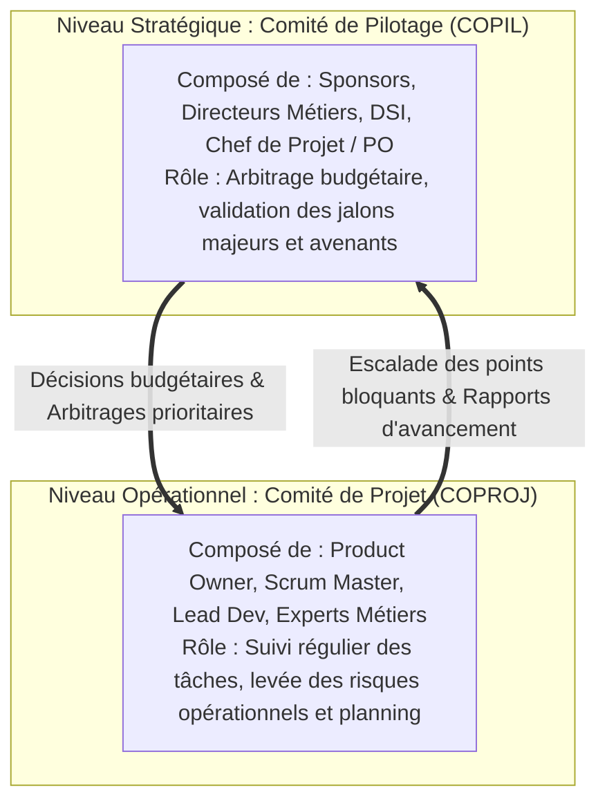

# Gouvernance, Communication de Projet, Documentation Légère et Gestion des Changements

Même dans une organisation Agile, la gestion de projet exige une **communication structurée avec la direction**, un **suivi budgétaire rigoureux** et une **traçabilité des décisions techniques**.

---

## 1. Les Instances de Gouvernance : COPIL vs COPROJ



---

## 2. Le Flash Report et la Météo Projet

Le **Flash Report** est un document d'une seule page transmis aux décideurs pour résumer la santé globale du projet :

```text
┌─────────────────────────────────────────────────────────────┐
│                 FLASH REPORT - PROJET OPENSIO               │
├─────────────────────────────────────────────────────────────┤
│ • Météo Globale  : ☀️ VERT (Dans les clous)                 │
│ • Budget Consommé: 62 % (Prévisionnel : 65 %) - Conforme    │
│ • Jalon Suivant  : Jalon 3 "Recette VABF" prévu le 15/10    │
├─────────────────────────────────────────────────────────────┤
│ FAITS MARQUANTS DE LA PÉRIODE :                             │
│ + Livraison réussie de l'authentification MFA.              │
│ ! Risque identifié : Retard potentiel sur l'API de paiement. │
│ ? Décision requise du COPIL : Arbitrage sur l'option Cloud.  │
└─────────────────────────────────────────────────────────────┘
```

---

## 3. Documentation Légère : Les ADR (Architecture Decision Records)

Plutôt que de rédiger des documents Word de 200 pages vite obsolètes, les équipes modernes utilisent des fiches **ADR** au format Markdown dans le dépôt Git :

```markdown
# ADR 04 : Choix de PostgreSQL plutôt que MongoDB pour les Utilisateurs

## Statut : Accepté (2026-08-27)
## Contexte :
Le projet nécessite des transactions financières strictes (ACID) et un modèle relationnel pour les droits d'accès.

## Décision :
Nous adoptons PostgreSQL comme base relationnelle principale.

## Conséquences :
- Positif : Intégrité référentielle garantie, support natif de JSONB.
- Négatif : Nécessite des migrations de schéma formelles.
```

---

## 4. Recette Fonctionnelle et Procès-Verbal (PV)

La fin de réalisation est sanctionnée par deux étapes formelles :
1. **VABF (_Validation d'Aptitude au Bon Fonctionnement_)** : La MOA teste le système dans un environnement de recette pour vérifier la conformité au cahier des charges.
2. **PV de Recette** : Document signé entre la MOA et la MOE actant la livraison :
   - *Sans réserve* : Acceptation totale, déclenchement du paiement final.
   - *Avec réserves* : Acceptation conditionnée à la correction sous 15 jours des anomalies mineures listées.
