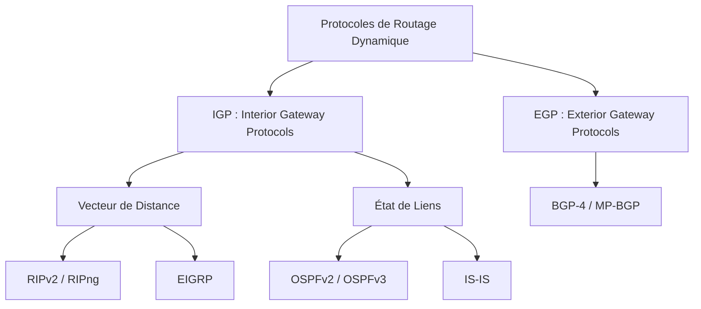

# Principes du Routage IP : Statique vs Dynamique, Tables et Métriques

Le routage est la fonction fondamentale de la couche réseau (Couche 3 OSI) permettant d'acheminer des datagrammes IP d'une machine source vers une machine destination à travers une succession d'équipements d'interconnexion (routeurs ou commutateurs de niveau 3).

---

## 1. Fonctionnement du Moteur de Routage IP

Lorsqu'un routeur reçoit un paquet IP sur une interface d'entrée :
1. **Vérification d'intégrité** : Le routeur vérifie le checksum de l'en-tête IPv4 et décrémente le champ **TTL** (_Time to Live_). Si $TTL = 0$, le paquet est détruit et un message ICMP _Time Exceeded_ (Type 11) est renvoyé à l'émetteur.
2. **Consultation de la table de routage (RIB / FIB)** : Le routeur compare l'adresse IP de destination avec les entrées de sa table selon la règle du **masque le plus long** (_Longest Prefix Match_).
3. **Réencapsulation de niveau 2** : Le paquet est encapsulé dans une nouvelle trame Ethernet (avec l'adresse MAC du prochain saut obtenue via la table ARP/NDP) et transmis sur l'interface de sortie.

```text
[ Paquet IP entrant ] ──► [ TTL - 1 ] ──► [ Consultation FIB ]
                                                    │
                             ┌──────────────────────┴──────────────────────┐
                             ▼                                             ▼
                [ Route trouvée (Next-Hop IP) ]                [ Aucune route / Pas de 0.0.0.0/0 ]
                             │                                             │
                             ▼                                             ▼
                 [ Résolution ARP / MAC ]                     [ Paquet jeté + ICMP Unreachable ]
                             │
                             ▼
                 [ Envoi Trame Ethernet ]
```

---

## 2. Routage Statique et Routes Flottantes

### 2.1. Définition et Syntaxe
Une route statique est configurée manuellement par l'administrateur. Elle est déterministe et ne consomme aucun paquet réseau d'échange.

- **Syntaxe Cisco IOS** :
  ```text
  Router(config)# ip route 192.168.20.0 255.255.255.0 10.0.0.2
  Router(config)# ip route 0.0.0.0 0.0.0.0 203.0.113.1  ! Route par défaut
  ```
- **Syntaxe Linux (iproute2)** :
  ```bash
  sudo ip route add 192.168.20.0/24 via 10.0.0.2 dev eth1
  sudo ip route add default via 203.0.113.1 dev eth0
  ```

### 2.2. Distance Administrative (AD) et Route Flottante
La **Distance Administrative (AD)** mesure la fiabilité de la source d'information de routage. Plus la valeur est faible, plus la route est prioritaire :

| Source de routage | Distance Administrative (par défaut) |
|---|---|
| Interface directement connectée | **0** |
| Route statique | **1** |
| eBGP (BGP Externe) | **20** |
| EIGRP interne | **90** |
| **OSPF** | **110** |
| IS-IS | **115** |
| RIP | **120** |
| iBGP (BGP Interne) | **200** |

> [!TIP]
> **Route Statique Flottante (_Floating Static Route_)** : En attribuant une distance administrative supérieure à celle du protocole dynamique (ex: `ip route 0.0.0.0 0.0.0.0 198.51.100.2 120`), la route statique reste inactive dans la table tant que la liaison OSPF principale (AD 110) fonctionne, et s'active instantanément en secours en cas de rupture de lien !

---

## 3. Routage Dynamique : Taxonomie et Protocoles

Dans les réseaux d'entreprise complexes, la topologie évolue dynamiquement. Les protocoles de routage dynamique découvrent automatiquement les réseaux distants et recalculent les chemins en cas de panne :



- **Vecteur de distance (Distance Vector)** : Les routeurs s'échangent périodiquement leur table de routage complète avec leurs voisins directs ("routage par rumeur"). Métrique : nombre de sauts (_hop count_) pour RIP. Risque de boucles et convergence lente.
- **État de liens (Link-State)** : Chaque routeur inonde l'ensemble de la zone avec l'état de ses interfaces (LSA). Chaque équipement construit une cartographie complète et exacte de la topologie et exécute l'algorithme SPF de Dijkstra pour trouver l'arbre des plus courts chemins.
