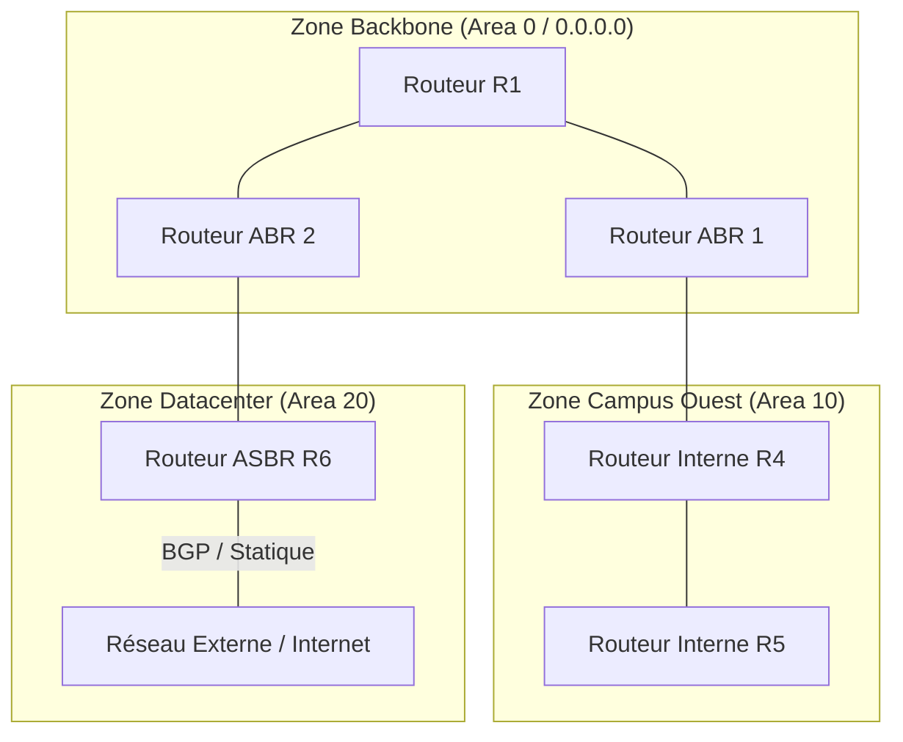

# OSPFv2 : Architecture de Zones, Voisinage, DR/BDR et Métriques

**OSPFv2** (_Open Shortest Path First Version 2_, RFC 2328) est le protocole de routage dynamique à état de liens standard le plus déployé dans les réseaux d'entreprise et de campus.

---

## 1. Architecture Hiérarchique en Zones OSPF

Pour limiter la charge CPU et la propagation des annonces LSA dans les grands réseaux, OSPF découpe le domaine de routage en **zones** :



- **Backbone (Area 0)** : Cœur obligatoire du réseau. Toutes les autres zones doivent obligatoirement être raccordées physiquement ou logiquement à l'Area 0.
- **ABR (_Area Border Router_)** : Routeur frontière possédant des interfaces dans l'Area 0 et dans au moins une zone secondaire. Il maintient une base topologique (LSDB) distincte par zone.
- **ASBR (_Autonomous System Boundary Router_)** : Routeur injectant des routes externes dans OSPF (via redistribution statique, BGP ou RIP).

---

## 2. Machine à États d'Adjacence OSPF

Pour devenir voisins et synchroniser leurs bases de données, deux routeurs franchissent 7 étapes successives :

| État | Action et Échange |
|---|---|
| **1. Down** | Aucun paquet Hello reçu du voisin. |
| **2. Init** | Paquet Hello reçu, mais le Router-ID local n'apparaît pas encore dans la liste des voisins vus. |
| **3. 2-Way** | Communication bidirectionnelle établie (les deux routeurs se voient dans les Hellos). Élection du **DR** et **BDR** sur les réseaux broadcast. |
| **4. ExStart** | Négociation de la relation Maître / Esclave et détermination du numéro de séquence initial. |
| **5. Exchange** | Échange des paquets **DBD** (_Database Description_) résumant les LSA possédés par chaque routeur. |
| **6. Loading** | Envoi de requêtes **LSR** (_Link-State Request_) et réception des mises à jour **LSU** (_Link-State Update_) pour récupérer les LSA manquants. |
| **7. Full** | Les bases de données topologiques (LSDB) sont strictement identiques. Adjacence opérationnelle. |

> [!IMPORTANT]
> **Conditions strictes pour former une adjacence OSPF** :
> 1. Même **Area ID** sur les interfaces interconnectées.
> 2. Même **masque de sous-réseau** (sur les liens broadcast).
> 3. Mêmes **timers Hello** (10s par défaut) et **Dead** (40s par défaut).
> 4. Paramètres d'authentification identiques (si activée).
> 5. **Router-ID** uniques dans l'ensemble du domaine.

---

## 3. Élection de DR et BDR sur Réseaux Multi-Accès

Sur un segment Ethernet partagé où $N$ routeurs sont connectés, établir des relations complètes générerait $\frac{N(N-1)}{2}$ adjacences et une inondation massive de paquets LSA. OSPF élit :
- **DR (_Designated Router_)** : Collecteur central des LSA envoyé à l'adresse multicast `224.0.0.6`.
- **BDR (_Backup Designated Router_)** : Routeur de secours prêt à remplacer le DR sans interruption.
- **DROther** : Les autres routeurs n'établissent une adjacence **FULL** qu'avec le DR et le BDR (ils restent en état **2-WAY** entre eux).

```text
Critères d'élection (au démarrage ou reload) :
1. Priorité d'interface la plus élevée (ip ospf priority, 0 à 255. 0 = jamais élu DR/BDR).
2. En cas d'égalité, Router-ID le plus élevé (configuré manuellement, ou IP de Loopback la plus haute, ou IP active la plus haute).
```

---

## 4. Calcul du Coût OSPF et Bande Passante de Référence

Le coût OSPF d'un lien est inversement proportionnel à sa bande passante :

$$\text{Coût} = \frac{\text{Reference Bandwidth}}{\text{Interface Bandwidth}}$$

Par défaut, la bande passante de référence historique est de $100\text{ Mbps}$ ($10^8\text{ bps}$) :
- FastEthernet (100 Mbps) : $\frac{100}{100} = 1$
- GigabitEthernet (1 Gbps) : $\frac{100}{1000} = 0.1 \rightarrow \mathbf{1}$ (arrondi à 1)
- 10 GigabitEthernet (10 Gbps) : $\frac{100}{10000} \rightarrow \mathbf{1}$

> [!CAUTION]
> Avec la valeur par défaut, un lien 100 Mbps et un lien 10 Gbps ont le même coût OSPF (1) ! Il est **indispensable** de réajuster la bande passante de référence sur tous les routeurs :
> ```text
> Router(config-router)# auto-cost reference-bandwidth 100000  ! Référence à 100 Gbps
> ```
> *Coûts obtenus : FastEthernet = 1000, Gigabit = 100, 10G = 10, 100G = 1.*
