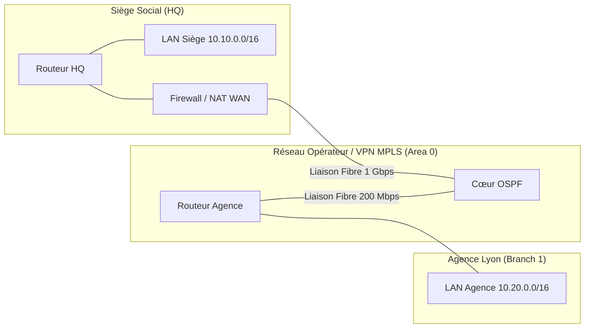

# NAT, PAT, Route par Défaut et Interconnexion Multi-Sites

Face à la pénurie des adresses IPv4 publiques, les réseaux d'entreprise utilisent des plages d'adresses privées (RFC 1918). Les routeurs de bordure assurent la passerelle vers Internet grâce aux mécanismes de **NAT** (_Network Address Translation_) et **PAT** (_Port Address Translation_).

---

## 1. Typologie des Mécanismes NAT

```text
[ Hôte LAN (192.168.1.50:52134) ]
               │
               ▼ (Trafic sortant vers 93.184.216.34:443)
┌─────────────────────────────────────────────────────────────┐
│ Routeur NAT / Passerelle Border                             │
│   • Inside Interface  : g0/0 (IP 192.168.1.254)             │
│   • Outside Interface : g0/1 (IP Publique 203.0.113.10)     │
│   • Table de translation PAT :                              │
│     192.168.1.50:52134  <───►  203.0.113.10:41002           │
└──────────────────────────────┬──────────────────────────────┘
                               │
                               ▼ (Paquet translaté vers Internet)
                 [ Serveur Web Public (93.184.216.34:443) ]
```

1. **NAT Statique (1:1)** : Associe de manière permanente une adresse IP privée à une adresse IP publique unique. Utilisé pour exposer des serveurs Web ou mails en zone DMZ.
2. **NAT Dynamique** : Mappe des adresses privées vers un pool d'adresses publiques selon la règle du premier arrivé, premier servi.
3. **PAT (_Port Address Translation_ / Surcharge / Masquerade)** : Mappe des milliers d'adresses privées sur **une seule adresse IP publique** en modifiant le numéro de port TCP/UDP source (valeurs dynamiques de 1024 à 65535).

---

## 2. Configuration du PAT (Overload) sur Routeur

Exemple de configuration Cisco IOS pour autoriser le LAN `192.168.0.0/16` à sortir sur Internet via l'interface WAN `GigabitEthernet0/1` :

```text
! 1. Définition des interfaces interne et externe
Router(config)# interface GigabitEthernet0/0
Router(config-if)# ip nat inside
!
Router(config)# interface GigabitEthernet0/1
Router(config-if)# ip nat outside
!
! 2. ACL identifiant les flux sources autorisés à être translatés
Router(config)# ip access-list standard ACL-LAN-NAT
Router(config-std-nacl)# permit 192.168.0.0 0.0.255.255
!
! 3. Règle de translation avec surcharge (PAT / overload)
Router(config)# ip nat inside source list ACL-LAN-NAT interface GigabitEthernet0/1 overload
```

---

## 3. Route par Défaut et Propagation dans OSPF

Sur le routeur frontière de l'entreprise :
1. On définit la route par défaut vers la passerelle du Fournisseur d'Accès Internet (FAI) :
   ```text
   Router-Border(config)# ip route 0.0.0.0 0.0.0.0 203.0.113.1
   ```
2. On ordonne au routeur d'injecter automatiquement cette route de dernier recours auprès de tous les autres routeurs internes du domaine OSPF :
   ```text
   Router-Border(config)# router ospf 1
   Router-Border(config-router)# default-information originate
   ```
   *Grâce à cette directive, tous les routeurs internes découvrent une route externe `O*E2 0.0.0.0/0` pointant vers le routeur de bordure sans nécessiter de configuration manuelle.*

---

## 4. Architecture d'Interconnexion Multi-Sites



- **Plan d'adressage hiérarchique** : Résumés de routes par site (`10.10.0.0/16` pour le siège, `10.20.0.0/16` pour l'agence 1, `10.30.0.0/16` pour l'agence 2) pour réduire la taille des tables de routage.
- **Continuité de service** : Double adduction opérateur avec basculement automatique via OSPF ou routes statiques flottantes.
