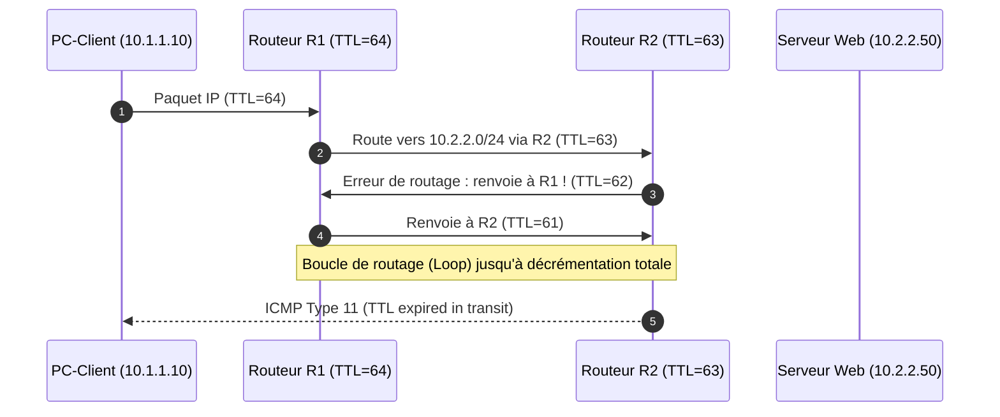

# Supervision, Commandes de Diagnostic et Dépannage du Routage

L'administration quotidienne d'infrastructures d'interconnexion exige une méthodologie rigoureuse de diagnostic pour localiser rapidement les coupures de service et anomalies de routage.

---

## 1. Lecture Experte de la Table de Routage

Sur un routeur Cisco IOS (`show ip route`) ou une pile Linux FRR (`show ip route`) :

```text
Codes: L - local, C - connected, S - static, R - RIP, M - mobile, B - BGP
       D - EIGRP, EX - EIGRP external, O - OSPF, IA - OSPF inter area 
       N1 - OSPF NSSA external type 1, N2 - OSPF NSSA external type 2
       E1 - OSPF external type 1, E2 - OSPF external type 2
       * - candidate default, U - per-user static route

Gateway of last resort is 203.0.113.1 to network 0.0.0.0

O*E2 0.0.0.0/0 [110/1] via 10.0.0.1, 01:14:22, GigabitEthernet0/0
C    10.0.0.0/30 is directly connected, GigabitEthernet0/0
L    10.0.0.2/32 is directly connected, GigabitEthernet0/0
O    192.168.10.0/24 [110/100] via 10.0.0.1, 00:45:10, GigabitEthernet0/0
O IA 192.168.30.0/24 [110/110] via 10.0.0.1, 00:45:10, GigabitEthernet0/0
S    172.16.0.0/16 [1/0] via 10.0.0.5
```

- `[110/100]` : Le premier nombre est la **Distance Administrative** (110 pour OSPF), le second est la **Métrique totale (Coût)** jusqu'à la destination.
- `O IA` : Route OSPF Inter-Area (provenant d'une autre zone que l'Area locale).
- `O*E2` : Route externe OSPF injectée par un ASBR (le coût reste fixe par défaut).

---

## 2. Diagnostic d'Adjacence OSPF

La commande `show ip ospf neighbor` fournit l'état de chaque session :

```text
Neighbor ID     Pri   State           Dead Time   Address         Interface
192.168.100.1     1   FULL/DR         00:00:34    10.0.0.1        GigabitEthernet0/0
192.168.100.2     1   FULL/BDR        00:00:38    10.0.0.5        GigabitEthernet0/1
```

### Principaux états et causes d'anomalies :
1. **Bloqué en état INIT** : Le routeur distant ne reçoit pas les paquets Hello locaux (problème de pare-feu, ACL bloquant le multicast `224.0.0.5` ou câble unidirectionnel).
2. **Bloqué en état 2-WAY** : Normal entre deux routeurs DROther sur un réseau broadcast partagé.
3. **Bloqué en état EXSTART / EXCHANGE** : **MTU Mismatch !** Les deux routeurs ont une taille de MTU différente sur leurs interfaces connectées. Les paquets DBD volumineux sont rejetés.
   - *Solution : Aligner les MTU ou exécuter `ip ospf mtu-ignore` sous l'interface.*

---

## 3. Détection des Boucles de Routage et Asymétrie



- **Boucle de routage (_Routing Loop_)** : Si deux routeurs se renvoient mutuellement un paquet, le champ TTL évite que le paquet ne sature le réseau indéfiniment. `traceroute` affiche une répétition infinie d'adresses IP identiques.
- **Routage Asymétrique** : Le trafic part par le lien A et revient par le lien B. Si un pare-feu à inspection d'état (_Stateful Inspection_) est placé sur le chemin sans voir le paquet SYN initial, il détruira les paquets de retour (_Connection Reset / Drop_).
