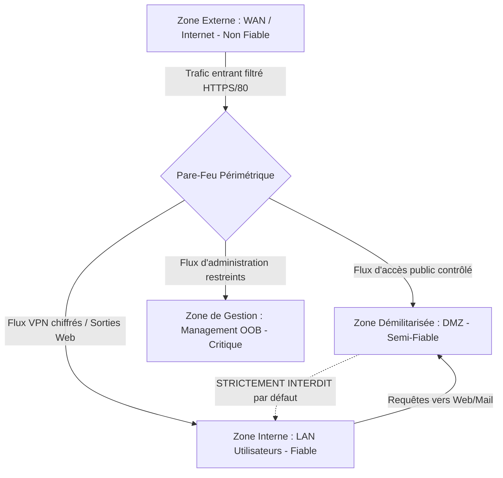

# Principes de la Sécurité Périmétrique, Zones de Confiance et Défense en Profondeur

La sécurité périmétrique constitue la première ligne de défense d'une infrastructure informatique. Elle repose sur la segmentation physique et logique des réseaux afin de contrôler strictement les flux autorisés et d'empêcher les mouvements latéraux d'un attaquant.

---

## 1. Modèle Périmétrique vs Architecture Zero Trust

Historiquement, les réseaux étaient conçus selon le modèle du *"château fort"* : une frontière externe étanche (le pare-feu) séparant l'extérieur hostile (Internet) de l'intérieur considéré comme implicitement de confiance. 

Aujourd'hui, face aux attaques internes, aux ransomwares et au télétravail, la sécurité moderne combine la segmentation périmétrique avec le paradigme **Zero Trust** (*"Never trust, always verify"*), où chaque requête est systématiquement authentifiée, autorisée et chiffrée.

---

## 2. Découpage en Zones de Confiance

Un réseau d'entreprise professionnel doit être cloisonné en **zones de sécurité** homogènes :

### Typologie des zones :
1. **WAN (_Untrusted_)** : Réseau public externe d'où proviennent les requêtes non authentifiées.
2. **DMZ (_Demilitarized Zone / Semi-trusted_)** : Sous-réseau hébergeant les serveurs accessibles depuis Internet (Reverse Proxy Nginx, serveurs Web publics, passerelles de messagerie SMTP).
3. **LAN (_Trusted_)** : Postes de travail des collaborateurs, serveurs de fichiers internes et contrôleurs de domaine Active Directory.
4. **Zone Management / OOB (_Out-of-Band_)** : Réseau dédié et isolé pour l'administration des équipements d'infrastructure (cartes iLO/iDRAC, interfaces SSH de commutateurs).

> [!CRITICAL]
> **Règle d'or de la DMZ** : Si un serveur hébergé en DMZ est compromis par un attaquant depuis Internet, ce serveur **ne doit jamais pouvoir initier de connexion vers le réseau interne LAN**. Les seuls flux autorisés sont initiés du LAN vers la DMZ, ou de la DMZ vers un port de base de données bien précis du LAN avec filtrage strict par adresse IP.

---

## 3. Le Principe de Défense en Profondeur (_Defense-in-Depth_)

La sécurité ne doit jamais reposer sur un équipement unique. La **Défense en Profondeur** superpose plusieurs couches défensives :

| Couche | Mécanisme de Protection |
|---|---|
| **Périmètre externe** | Pare-feu de filtrage avec état (Stateful Firewall), protection anti-DDoS, proxy inverse WAF. |
| **Réseau interne** | Segmentation VLANs / micro-segmentation, filtrage ACLs L3/L4, inspection 802.1X. |
| **Système hôte** | Durcissement OS (CIS Benchmarks), pare-feu local (`nftables`, `Windows Defender Firewall`), EDR. |
| **Identités & Accès** | Authentification multifacteur (MFA), principe du moindre privilège, rotation des clés SSH. |
| **Données & Continuité**| Chiffrement au repos (LUKS/BitLocker), sauvegardes immuables et isolées (Air-Gap). |

---

## 4. Matrice d'Urbanisation des Flux Réseau

Toute ouverture de port sur un pare-feu d'entreprise doit être consignée dans une matrice de flux :

| Règle ID | Source | Destination | Protocole / Port | Action | Justification Métier |
|---|---|---|---|---|---|
| **FW-01** | `WAN (Any)` | `192.168.50.10 (DMZ-Proxy)` | `TCP / 443 (HTTPS)` | **ACCEPT** | Accès public au portail Web sécurisé |
| **FW-02** | `192.168.10.0/24 (LAN)` | `192.168.50.10 (DMZ-Proxy)` | `TCP / 443 (HTTPS)` | **ACCEPT** | Consultation interne de l'application |
| **FW-03** | `192.168.50.10 (DMZ-Proxy)` | `192.168.20.100 (LAN-DB)` | `TCP / 5432 (Postgres)`| **ACCEPT** | Requêtes applicatives vers base de données |
| **FW-DEFAULT**| `Any` | `Any` | `Any` | **DROP + LOG** | Politique de refus implicite (_Default Deny_) |
