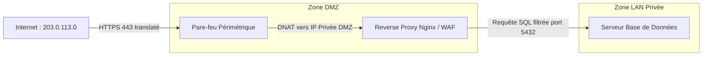

# NAT Sécurisé, Exposition Contrôlée de Services et Réduction de Surface d'Attaque

La publication de services d'entreprise (portail Web, messagerie, passerelle d'accès) sur Internet nécessite une architecture de translation d'adresses rigoureuse afin d'isoler les serveurs internes et d'endiguer les tentatives d'intrusion.

---

## 1. Risques Liés à l'Exposition Directe de Services

Exposer un serveur interne directement sur Internet via une simple redirection de port (*Port Forwarding*) comporte des risques critiques :
- **Attaques par déni de service (DDoS / Syn Flood)**.
- **Exploitation de vulnérabilités applicatives (Zero-Day, RCE, injection SQL)**.
- **Rebond et mouvement latéral** : Si le serveur compromis se trouve directement sur le LAN de production, l'attaquant a accès à l'Active Directory et aux bases de données.

```text
[ Attaquant Internet ] ──► (Exploite CVE Web) ──► [ Serveur Web en LAN ]
                                                            │
                                                            ▼ (Rebond non filtré !)
                                              [ Contrôleur Active Directory ]
```

---

## 2. Architecture de Publication Sécurisée en DMZ

La bonne pratique d'ingénierie consiste à n'exposer **aucun serveur de données directement**, mais d'intercaler un **Reverse Proxy durci** en zone DMZ :



---

## 3. Configuration du DNAT et SNAT avec `nftables`

Sous Linux `nftables`, la translation d'adresses s'effectue dans une table dédiée `nat` avec les chaînes `prerouting` et `postrouting` :

```text
table ip nat {
    # Chaîne PREROUTING : translation de destination (DNAT / Port Forwarding)
    chain prerouting {
        type nat hook prerouting priority dstnat; policy accept;

        # Rediriger le trafic HTTPS public (port 443 sur eth1) vers le Reverse Proxy DMZ (192.168.50.10)
        iif "eth1" tcp dport 443 dnat to 192.168.50.10:443
    }

    # Chaîne POSTROUTING : translation de source (SNAT / Masquerade)
    chain postrouting {
        type nat hook postrouting priority srcnat; policy accept;

        # Masquer les adresses IP privées du LAN et de la DMZ lors de la sortie sur Internet (eth1)
        oif "eth1" masquerade
    }
}
```

> [!IMPORTANT]
> **Règle fondamentale** : Une règle `dnat` dans la chaîne `prerouting` modifie l'adresse IP de destination du paquet, mais **n'autorise pas son passage** ! Le paquet translaté traverse ensuite la chaîne `forward` de la table `filter`, où une règle explicite `ip daddr 192.168.50.10 tcp dport 443 accept` est indispensable pour que la connexion aboutisse.

---

## 4. Mesures de Réduction de la Surface d'Attaque

1. **Restreindre les ports exposés** : Jamais de ports d'administration (SSH/22, RDP/3389, Telnet/23, VNC/5900) ouverts publiquement sur Internet. L'accès admin passe exclusivement par un **VPN sécurisé avec MFA**.
2. **Filtrage par liste blanche d'adresses IP (_IP Whitelisting_)** : Pour les API partenaires ou les accès télétravail fixes, restreindre la règle de pare-feu aux seules adresses IP sources légitimes.
3. **Limitation de débit (_Rate Limiting_)** : Bloquer les attaques par force brute avec nftables :
   ```text
   # Bloquer les connexions si plus de 10 requêtes par minute depuis la même IP
   tcp dport 443 ct state new meter https-flood { ip saddr limit rate over 10/minute } drop
   ```
