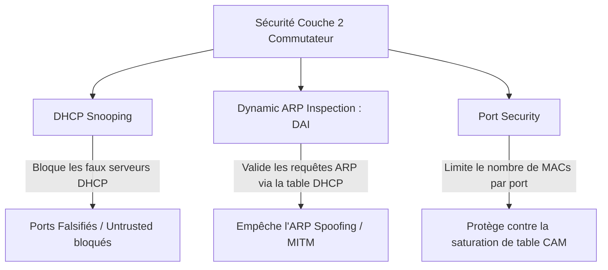

# Durcissement des Équipements Réseau, Gestion AAA et Défense Anti-Attaques

Les équipements d'interconnexion (routeurs, pare-feu, commutateurs de cœur) constituent les cibles prioritaires des cyberattaquants. Leur durcissement rigoureux est indispensable pour empêcher la compromission de l'ensemble du système d'information.

---

## 1. Durcissement des Services et Interfaces d'Administration

```text
               ┌─────────────────────────────────────────┐
               │ RÈGLES DE DURCISSEMENT PÉRIMÉTRIQUE     │
               ├─────────────────────────────────────────┤
               │ 1. Bannir Telnet, HTTP, SNMPv1/v2c      │
               │ 2. Forcer SSHv2 avec clés asymétriques  │
               │ 3. Restreindre l'accès admin par ACL    │
               │ 4. Activer l'authentification AAA       │
               │ 5. Déconnecter les ports non utilisés   │
               └─────────────────────────────────────────┘
```

1. **Désactivation des protocoles en clair** : Supprimer Telnet (`transport input ssh`), désactiver le serveur Web HTTP clair (`no ip http server`), passer à **SNMPv3** avec chiffrement et authentification forte (`authPriv`).
2. **Gestion des accès d'administration** :
   - Bloquer la connexion directe en compte root / administrateur par défaut.
   - Restreindre l'accès aux seules adresses IP du réseau d'administration (Management OOB) via des ACLs dédiées.
   - Activer un délai d'inactivité automatique (_timeout_ de 5 à 10 minutes).
3. **Architecture AAA (Authentication, Authorization, Accounting)** : Centraliser la gestion des comptes d'administration sur des serveurs d'authentification réseau (**RADIUS** ou **TACACS+**) afin d'auditer précisément chaque commande saisie par chaque ingénieur.

---

## 2. Protection contre l'Usurpation d'Adresses IP (uRPF)

L'**IP Spoofing** consiste pour un attaquant à falsifier l'adresse IP source de ses paquets pour contourner des contrôles d'accès ou monter des attaques en déni de service distribué (DDoS réfléchi).

Le mécanisme **uRPF** (_Unicast Reverse Path Forwarding_) vérifie la légitimité de l'adresse source :
- Lorsqu'un paquet arrive sur une interface, le routeur consulte sa table de routage.
- Si le chemin de retour vers l'adresse IP source n'emprunte pas cette même interface, le paquet est **immédiatement détruit**.

```text
Router(config)# interface GigabitEthernet0/1 (Interface WAN)
Router(config-if)# ip verify unicast source reachable-via rx   ! Mode uRPF Strict
```

---

## 3. Sécurisation de la Couche 2 sur Commutateurs

Pour empêcher les attaques internes au sein du LAN, le commutateur doit implémenter des mécanismes de filtrage matériel :



1. **DHCP Snooping** : Marque les ports reliés aux serveurs DHCP légitimes comme *Trusted*. Tout paquet DHCP Offer/Ack émis sur un port non fiable (*Untrusted*) est intercepté et détruit.
2. **Dynamic ARP Inspection (DAI)** : Intercepte toutes les requêtes/réponses ARP et vérifie la correspondance IP/MAC par rapport à la base de baux construite par le DHCP Snooping. Élimine les attaques de type *Man-in-the-Middle* par empoisonnement ARP.
3. **Port Security** : Verrouille un port d'accès sur une adresse MAC unique (`switchport port-security maximum 1`) et désactive le port en cas de tentative de raccordement d'un équipement pirate (`switchport port-security violation shutdown`).

---

## 4. Protection Anti-DDoS et Synchronisation TCP (SYN Cookies)

Face aux attaques volumétriques par saturation de tables d'état (TCP SYN Flood) :
- Le noyau Linux génère des **SYN Cookies** cryptographiques encodés dans le numéro de séquence initial, évitant d'allouer de la mémoire pour les demi-connexions tant que le client n'a pas renvoyé le paquet final ACK :
  ```bash
  sudo sysctl -w net.ipv4.tcp_syncookies=1
  ```
- Les limitations de débit (_Rate Limiting_) sur le pare-feu absorbent les scans de ports agressifs et les rafales de requêtes ICMP.
