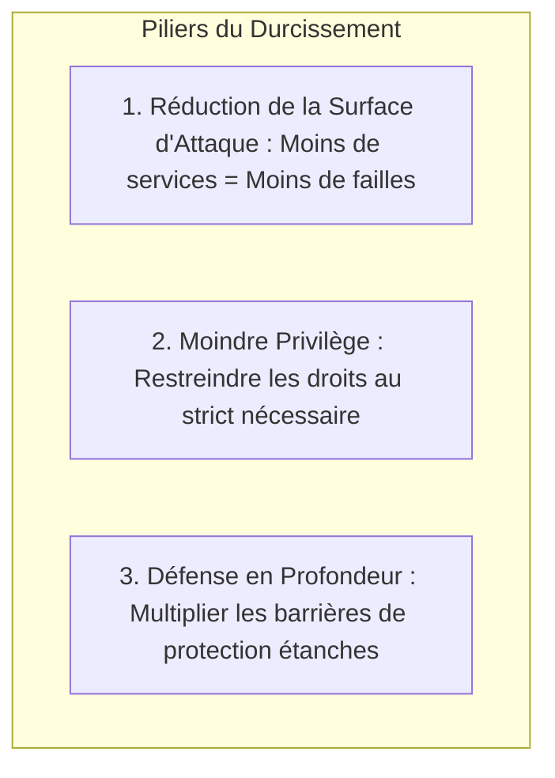

# Principes de Durcissement des Systèmes, Réduction de la Surface d'Attaque et Référentiels ANSSI/CIS

Par défaut, les systèmes d'exploitation grand public et serveurs privilégient la compatibilité et la facilité d'installation. Le **durcissement** (*Hardening*) est l'ensemble des actions techniques permettant de verrouiller un système face aux menaces cyber.

---

## 1. Les Trois Piliers Fondamentaux de la Sécurité Système



1. **Réduction de la surface d'attaque** :
   - Désactiver tous les démons réseau inutilisés (ex: serveur d'impression CUPS sur un serveur de base de données).
   - Supprimer les paquets de compilation (`gcc`, `make`) et utilitaires de diagnostic non requis en production.
   - Bloquer les protocoles obsolètes et non chiffrés (Telnet, FTP, SMBv1).
2. **Principe du moindre privilège** :
   - Aucun service applicatif ne doit s'exécuter avec le compte `root` ou `SYSTEM`.
   - Limiter les commandes `sudo` à des scripts spécifiques plutôt qu'à `ALL=(ALL) ALL`.
3. **Défense en profondeur** :
   - Ne jamais faire confiance à un seul équipement. Si le pare-feu périmétrique est contourné, le pare-feu local de l'hôte, le contrôle d'accès obligatoire (AppArmor/SELinux) et la journalisation doivent bloquer ou détecter l'attaquant.

---

## 2. Les Niveaux de Recommandation de l'ANSSI

L'Agence Nationale de la Sécurité des Systèmes d'Information (ANSSI) structure ses recommandations en 4 niveaux progressifs :

```text
┌─────────────────────────────────────────────────────────────┐
│ 4. HAUT        -> Systèmes ultra-critiques / Défense         │
├─────────────────────────────────────────────────────────────┤
│ 3. RENFORCÉ    -> Données hautement sensibles, DMZ publique  │
│    - Noyau verrouillé, MAC SELinux en mode Enforcing strict.│
├─────────────────────────────────────────────────────────────┤
│ 2. INTERMÉDIAIRE -> Serveurs d'entreprise internes (Standard)│
│    - SSH par clés uniquement, durcissement sysctl, auditd.  │
├─────────────────────────────────────────────────────────────┤
│ 1. MINIMAL     -> Prérequis élémentaires applicables partout│
│    - Mises à jour régulières, mots de passe forts, pas root.│
└─────────────────────────────────────────────────────────────┘
```

---

## 3. Les Benchmarks CIS (Center for Internet Security)

Les guides **CIS Benchmarks** fournissent des checklists prescriptives pour chaque système (Debian, RHEL, Windows Server) classées en deux profils :
- **Level 1** : Configurations de sécurité de base sans impact sur les fonctionnalités standard.
- **Level 2** : Durcissement avancé pour environnements sensibles (pouvant nécessiter des adaptations logicielles).
