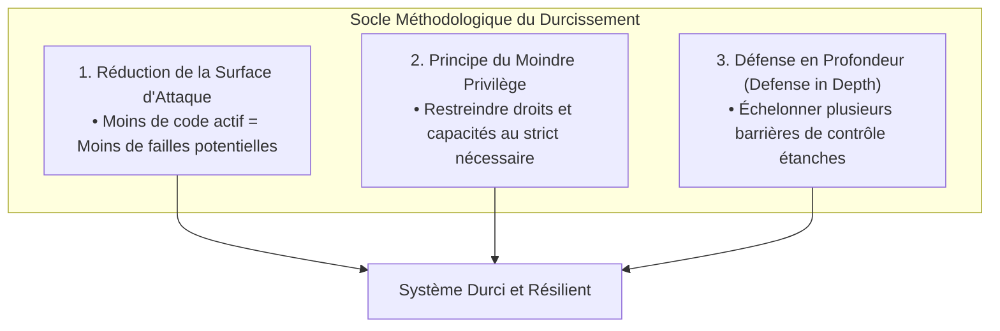
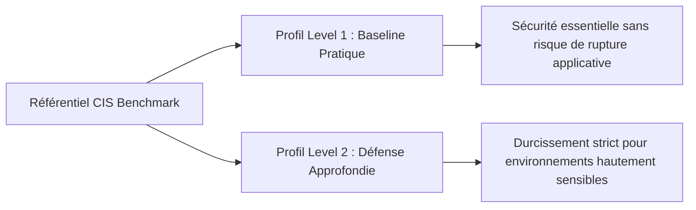

# Principes de Durcissement des Systèmes, Réduction de la Surface d'Attaque et Référentiels ANSSI/CIS

Par défaut, la majorité des systèmes d'exploitation (GNU/Linux, Windows Server) sont livrés avec une configuration privilégiant l'interopérabilité, la compatibilité logicielle historique et la simplicité de mise en route. En environnement de production, cette configuration par défaut expose l'organisation à des risques majeurs de compromission.

Le **durcissement** (*Hardening*) désigne l'ensemble des mesures techniques, organisationnelles et méthodologiques visant à verrouiller un système informatique, éliminer ses faiblesses structurelles et restreindre ses capacités au strict nécessaire métier.

---

## 1. Les Trois Piliers Fondamentaux de la Sécurité Système

La démarche de durcissement repose sur trois principes universels complémentaires :



### 1.1. Réduction de la surface d'attaque
La surface d'attaque représente la somme de tous les points d'entrée par lesquels un attaquant ou un programme malveillant peut tenter d'extraire des données ou d'exécuter du code :
- **Désactivation des services superflus** : un serveur Web ou de base de données ne doit héberger aucun démon d'impression (CUPS), serveur Bluetooth (`bluetoothd`), agent RPC (`rpcbind`) ou partage obsolète.
- **Suppression des utilitaires de compilation et de diagnostic** : retirer les compilateurs (`gcc`, `make`) et les interpréteurs non indispensables en production empêche un attaquant ayant obtenu un accès local non privilégié de compiler directement un exploit noyau (ex: *Dirty Pipe* ou *PwnKit*).
- **Fermeture des ports et protocoles non chiffrés** : proscrire tout protocole transmettant des identifiants en clair (Telnet, FTP, HTTP, SNMPv1/v2c, SMBv1).

```bash
# Lister les services actifs au démarrage sous Linux
systemctl list-unit-files --state=enabled --type=service

# Vérifier tous les ports réseau ouverts et leurs processus associés
ss -tulpn
```

### 1.2. Principe du moindre privilège (*Least Privilege*)
Tout utilisateur, tâche d'automatisation ou service d'arrière-plan doit opérer avec le niveau d'autorisation le plus faible permettant d'accomplir sa mission :
- Aucun service applicatif public (Nginx, PostgreSQL, Apache) ne doit s'exécuter avec le compte `root` ou `SYSTEM`.
- Les administrateurs doivent utiliser des comptes nominatifs avec traçabilité et élever leurs privilèges uniquement lorsque la commande le requiert via `sudo` finement configuré.
- Séparer les rôles d'administration (ex: administration Active Directory distincte de l'administration de la messagerie ou de l'hyperviseur).

### 1.3. Défense en profondeur (*Defense in Depth*)
Ne jamais faire reposer la sécurité du système d'information sur un unique composant de protection (ex: le pare-feu périmétrique). Si une barrière cède, les couches suivantes doivent contenir ou détecter la menace :

```text
┌─────────────────────────────────────────────────────────────┐
│ 1. PÉRIMÈTRE RÉSEAU      -> Pare-feu, DMZ, WAF, VPN MFA     │
├─────────────────────────────────────────────────────────────┤
│ 2. SÉCURITÉ DE L'HÔTE     -> Pare-feu local (UFW/nftables)   │
├─────────────────────────────────────────────────────────────┤
│ 3. CONTRÔLE D'ACCÈS MAC   -> AppArmor / SELinux (Isolation) │
├─────────────────────────────────────────────────────────────┤
│ 4. TRAÇABILITÉ & AUDIT   -> auditd, Sysmon, Centralisation  │
├─────────────────────────────────────────────────────────────┤
│ 5. PROTECTION DES DONNÉES -> Chiffrement LUKS/BitLocker, ACL│
└─────────────────────────────────────────────────────────────┘
```

---

## 2. Le Référentiel de Durcissement de l'ANSSI

L'**ANSSI** (Agence Nationale de la Sécurité des Systèmes d'Information) publie des guides de durcissement structurés en **4 niveaux d'exigence progressifs** pour les systèmes GNU/Linux et Microsoft Windows Server :

```text
┌─────────────────────────────────────────────────────────────────────────┐
│ NIVEAU 4 : HAUT                                                         │
│ • Systèmes d'Importance Vitale (OIV/OSE), données classifiées défense.  │
│ • Cloisonnement matériel, micro-noyaux ou distributions sécurisées CLIP.│
├─────────────────────────────────────────────────────────────────────────┤
│ NIVEAU 3 : RENFORCÉ                                                     │
│ • Serveurs exposés directement sur Internet (DMZ) ou données sensibles. │
│ • MAC obligatoire (SELinux Enforcing strict), signature des modules.    │
├─────────────────────────────────────────────────────────────────────────┤
│ NIVEAU 2 : INTERMÉDIAIRE (Standard d'Entreprise Recommandé)             │
│ • Serveurs applicatifs internes, contrôleurs de domaine, bases SGBD.    │
│ • Clés SSH uniquement, durcissement réseau sysctl, auditd, sudo strict. │
├─────────────────────────────────────────────────────────────────────────┤
│ NIVEAU 1 : MINIMAL                                                      │
│ • Socle universel applicable à 100 % des machines du parc d'entreprise.│
│ • Mises à jour régulières, interdiction des connexions root directes.   │
└─────────────────────────────────────────────────────────────────────────┘
```

### Synthèse des préconisations ANSSI pour le niveau Intermédiaire :
1. **Partitionnement et options de montage sécurisées** : monter `/tmp`, `/var/tmp` et `/dev/shm` avec les options `nodev`, `nosuid`, `noexec`.
2. **Durcissement des accès distants** : OpenSSH configuré sans mot de passe, avec algorithmes cryptographiques modernes (Ed25519, ChaCha20-Poly1305) et temporisation de session.
3. **Protection contre les attaques de pile et mémoire** : activation de l'ASLR (*Address Space Layout Randomization*) au niveau 2 et restriction des messages du noyau (`dmesg_restrict`).
4. **Contrôle d'intégrité et traçabilité** : surveillance des fichiers de configuration critiques (`/etc/passwd`, `/etc/shadow`, `/etc/sudoers`) via `auditd`.

---

## 3. Les Benchmarks du CIS (*Center for Internet Security*)

Le **CIS** édite des référentiels techniques mondiaux (*CIS Benchmarks*) reconnus comme des standards industriels de référence pour l'audit et la conformité :



### 3.1. Profil Level 1 vs Profil Level 2
- **CIS Level 1** : règles de durcissement prioritaires pouvant être appliquées rapidement avec un risque quasi nul d'interrompre des services applicatifs existants (ex: désactiver les protocoles non sécurisés, fixer les permissions 0600 sur les clés privées, configurer les bannières d'avertissement légales).
- **CIS Level 2** : durcissement avancé destiné aux environnements à haute sensibilité (ex: chiffrement intégral, restrictions drastiques des appels système `ptrace`, désactivation du chargement dynamique de modules noyau non requis).

### 3.2. Automatisation et Audit de Conformité
L'audit manuel d'un serveur comptant plusieurs centaines de règles CIS est inefficace. Les équipes de sécurité exploitent des outils d'automatisation :
- **Lynis** : scanner open source d'audit de durcissement et de conformité sous Linux/UNIX générant un indice de durcissement (*Hardening Index*).
- **OpenSCAP** : moteur standardisé (protocoles SCAP/OVAL) permettant d'évaluer automatiquement un serveur face aux profils officiels CIS ou ANSSI et de générer un rapport HTML d'écart de conformité.
- **Ansible Lockdown** : rôles d'Infrastructure as Code (IaC) appliquant automatiquement les règles CIS Level 1/2 de manière reproductible et idempotente.
