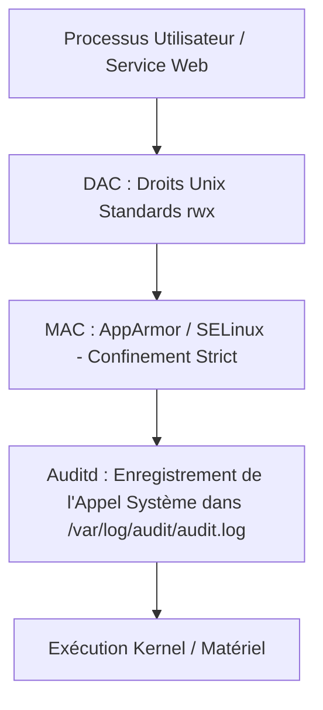

# Durcissement Approfondi Linux : SSH Sécurisé, Noyau Sysctl, Auditd et Contrôle d'Accès MAC

Un serveur Linux en production doit résister aux attaques de force brute, aux tentatives d'élévation de privilèges locales et aux abus d'appels système.

---

## 1. Durcissement Avancé du Démon OpenSSH

Le fichier `/etc/ssh/sshd_config` (ou un snippet dans `/etc/ssh/sshd_config.d/99-hardened.conf`) doit appliquer les directives strictes recommandées par l'ANSSI :

```ini
# Interdire la connexion directe du compte root
PermitRootLogin no

# Désactiver totalement l'authentification par mot de passe (clés Ed25519 requises)
PasswordAuthentication no
PubkeyAuthentication yes
AuthenticationMethods publickey

# Limiter les tentatives de connexion et fermer les sessions inactives
MaxAuthTries 3
ClientAliveInterval 300
ClientAliveCountMax 2

# Désactiver les fonctionnalités superflues et risquées
X11Forwarding no
AllowTcpForwarding no
PermitUserEnvironment no

# Ciphers et échange de clés cryptographiques modernes uniquement
KexAlgorithms sntrup761x25519-sha512@openssh.com,curve25519-sha256
Ciphers chacha20-poly1305@openssh.com,aes256-gcm@openssh.com
MACs hmac-sha2-512-etm@openssh.com,hmac-sha2-256-etm@openssh.com
```

---

## 2. Durcissement du Noyau Linux (`/etc/sysctl.d/99-security.conf`)

Les paramètres du noyau permettent de contrecarrer les attaques réseau et l'exploitation de failles mémoire :

```ini
# Protection contre les attaques TCP SYN Flood
net.ipv4.tcp_syncookies = 1

# Protection contre l'usurpation d'adresses IP (Anti-Spoofing / Reverse Path Filtering)
net.ipv4.conf.all.rp_filter = 1
net.ipv4.conf.default.rp_filter = 1

# Refuser les redirections ICMP (attaques Man-in-the-Middle)
net.ipv4.conf.all.accept_redirects = 0
net.ipv4.conf.default.accept_redirects = 0

# Désactiver le routage de paquets (serveur non routeur)
net.ipv4.ip_forward = 0

# Randomisation complète de l'espace d'adressage mémoire (ASLR niveau 2)
kernel.randomize_va_space = 2

# Masquer les pointeurs noyau et restreindre l'accès à dmesg
kernel.kptr_restrict = 2
kernel.dmesg_restrict = 1
```

---

## 3. Contrôle d'Accès Obligatoire (MAC) et Audit Système (`auditd`)



- **AppArmor / SELinux (MAC - *Mandatory Access Control*)** : Même si un attaquant réussit une injection de commande sur un service Nginx et obtient un shell en tant qu'utilisateur `www-data` ou `root`, le profil AppArmor l'empêche de lire `/etc/shadow`, d'accéder au dossier `/home` ou d'exécuter `/bin/nc`.
- **`auditd`** : Enregistre de manière inviolable toutes les modifications de fichiers d'authentification (`auditctl -w /etc/passwd -p wa -k auth_changes`) et les élévations de privilèges.
