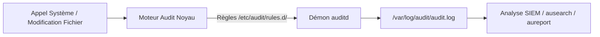
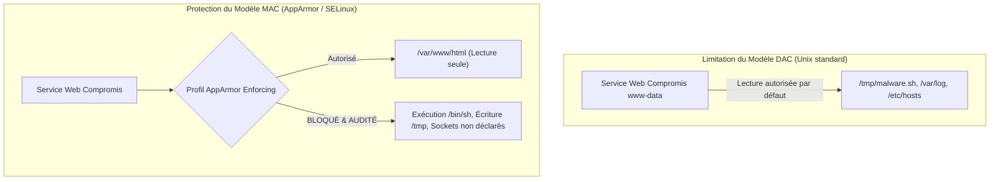

# Durcissement Approfondi Linux : Utilisateurs & Sudo, SSH & 2FA, Noyau Sysctl, Auditd et Contrôle d'Accès MAC

Les serveurs GNU/Linux constituent l'épine dorsale des infrastructures d'hébergement, des services cloud et des conteneurs. Pour résister aux tentatives de compromission et d'élévation locale de privilèges, leur durcissement doit s'opérer sur tous les niveaux du système d'exploitation.

---

## 1. Gestion des Utilisateurs, PAM et Règles Sudo Strictes

### 1.1. Politiques de comptes et mots de passe (`/etc/login.defs` et PAM)
Le fichier `/etc/login.defs` et les modules PAM (*Pluggable Authentication Modules*) imposent des contraintes d'hygiène sur les identités locales :

```ini
# /etc/login.defs
PASS_MAX_DAYS   90      # Renouvellement tous les 90 jours maximum
PASS_MIN_DAYS   1       # Interdiction de changer de mdp plusieurs fois par jour
PASS_WARN_AGE   14      # Avertissement 14 jours avant expiration
UMASK           027     # Droits par défaut stricts (fichiers 640, dossiers 750)
```

Le module `pam_pwquality.so` garantit la robustesse des mots de passe dans `/etc/pam.d/common-password` :
```ini
password requisite pam_pwquality.so retry=3 minlen=14 dcredit=-1 ucredit=-1 ocredit=-1 lcredit=-1 difok=4
```
*(Minimum 14 caractères, au moins 1 chiffre, 1 majuscule, 1 minuscule, 1 caractère spécial, et 4 caractères différents de l'ancien mot de passe).*

Le verrouillage contre les attaques de force brute locale est géré par `pam_faillock.so` (bloque le compte après 5 échecs pendant 15 minutes).

### 1.2. Délégation contrôlée des privilèges avec `sudo`
L'utilisation directe du compte `root` doit être proscrite au profit de règles granulaires dans `/etc/sudoers.d/` (éditées obligatoirement via `visudo -f`) :

```bash
# INTERDIT en production (trop permissif et destructeur)
# adminuser ALL=(ALL:ALL) ALL
# adminuser ALL=(ALL) NOPASSWD: ALL

# BONNE PRATIQUE : autoriser uniquement des commandes de maintenance ciblées
%sysadmins ALL=(root) /usr/bin/systemctl restart nginx, /usr/bin/systemctl reload nginx, /usr/bin/journalctl
```

---

## 2. Durcissement OpenSSH et Double Facteur 2FA / MFA

Le service OpenSSH est la porte d'entrée d'administration principale. Sa configuration (`/etc/ssh/sshd_config.d/99-hardening.conf`) doit être intransigeante :

```ini
# Interdire formellement le login direct du compte root
PermitRootLogin no

# Interdire l'authentification par mot de passe (clés Ed25519 obligatoires)
PasswordAuthentication no
PubkeyAuthentication yes

# Limites de sécurité et temporisation
MaxAuthTries 3
LoginGraceTime 30
ClientAliveInterval 300
ClientAliveCountMax 2

# Désactiver les fonctions superflues
X11Forwarding no
AllowTcpForwarding no
PermitUserEnvironment no

# Cryptographie moderne recommandée par l'ANSSI
KexAlgorithms sntrup761x25519-sha512@openssh.com,curve25519-sha256,curve25519-sha256@libssh.org
Ciphers chacha20-poly1305@openssh.com,aes256-gcm@openssh.com
MACs hmac-sha2-512-etm@openssh.com,hmac-sha2-256-etm@openssh.com
```

### Double Facteur 2FA / MFA (Clé SSH + TOTP)
Pour les accès critiques, combiner la clé asymétrique avec un code TOTP généré par une application d'authentification (ex: Google Authenticator, FreeOTP) via `libpam-google-authenticator` :

```ini
# Dans /etc/ssh/sshd_config :
KbdInteractiveAuthentication yes
AuthenticationMethods publickey,keyboard-interactive
```

---

## 3. Durcissement du Noyau Linux (`/etc/sysctl.d/99-security.conf`)

Les paramètres noyau appliqués à chaud par `sysctl -p /etc/sysctl.d/99-security.conf` neutralisent de nombreuses attaques réseau et mémoire :

```ini
# 1. Protection Réseau Anti-DoS (TCP SYN Flood)
net.ipv4.tcp_syncookies = 1

# 2. Filtrage Anti-Usurpation d'Adresse IP (Reverse Path Filtering)
net.ipv4.conf.all.rp_filter = 1
net.ipv4.conf.default.rp_filter = 1

# 3. Rejet des redirections ICMP (prévention des attaques Man-in-the-Middle)
net.ipv4.conf.all.accept_redirects = 0
net.ipv4.conf.default.accept_redirects = 0
net.ipv4.conf.all.send_redirects = 0

# 4. Désactivation du routage de paquets (serveur d'extrémité)
net.ipv4.ip_forward = 0

# 5. Randomisation complète de la mémoire (ASLR niveau 2)
kernel.randomize_va_space = 2

# 6. Restriction de visibilité des adresses noyau et journaux dmesg
kernel.kptr_restrict = 2
kernel.dmesg_restrict = 1
```

---

## 4. Audit Système et Traçabilité avec `auditd`

Le démon `auditd` intercepte directement les appels système (*syscalls*) au niveau du noyau pour consigner de manière inaltérable les actions critiques dans `/var/log/audit/audit.log`.



### Exemples de règles de surveillance (`/etc/audit/rules.d/audit.rules`) :
```ini
# Surveiller les modifications des comptes et mots de passe
-w /etc/passwd -p wa -k identity_changes
-w /etc/shadow -p wa -k identity_changes
-w /etc/sudoers -p wa -k privilege_escalation
-w /etc/sudoers.d/ -p wa -k privilege_escalation

# Auditer l'utilisation des commandes d'élévation de privilèges (SUID/SGID)
-a always,exit -F path=/usr/bin/sudo -F perm=x -F auid>=1000 -F auid!=4294967295 -k sudo_exec
```

### Commandes usuelles d'investigation :
```bash
# Rechercher tous les événements liés à la clé 'identity_changes'
ausearch -k identity_changes --format text

# Générer un rapport synthétique des échecs d'authentification
aureport -au --failed
```

---

## 5. Contrôle d'Accès Obligatoire (MAC) : AppArmor et SELinux

Le modèle Unix classique (DAC - *Discretionary Access Control*) repose uniquement sur le propriétaire et les permissions `rwx`. Si un attaquant exploite une faille dans le service Nginx (UID `www-data`), il dispose de tous les droits de cet utilisateur sur le disque.

Le contrôle d'accès obligatoire (**MAC** - *Mandatory Access Control*) confine chaque service dans une sandbox hermétique :



### 5.1. AppArmor (Standard Debian / Ubuntu)
- **Modes de fonctionnement** :
  - `Enforce` : applique strictement les règles et bloque tout accès non explicite.
  - `Complain` : n'interdit pas l'action mais consigne une alerte dans les logs pour faciliter la mise au point du profil.
- **Commandes clés** :
  ```bash
  # Afficher l'état des profils actifs
  aa-status
  # Passer un profil en mode de blocage strict
  aa-enforce /etc/apparmor.d/usr.sbin.nginx
  ```

### 5.2. SELinux (Standard Red Hat / Rocky Linux)
- Assigne des labels de sécurité (*Contexts*) aux processus (`system_u:system_r:httpd_t:s0`) et aux fichiers (`httpd_sys_content_t`).
- Le mode `Enforcing` bloque impérativement toute transition de contexte non définie dans la politique.
