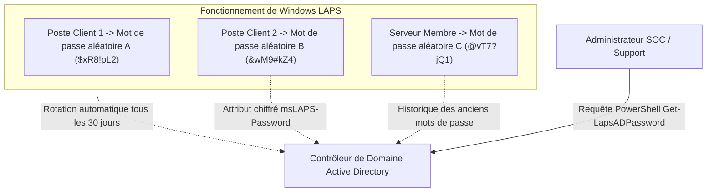

# Durcissement Windows Server : GPO de Sécurité, Windows LAPS, BitLocker, Windows Defender ASR et Audit Active Directory

Dans un réseau d'entreprise Microsoft, l'infrastructure **Active Directory Domain Services (AD DS)** est le centre névralgique du système d'information. Les attaquants ciblent en priorité les faiblesses de configuration, les protocoles réseau historiques et les mots de passe administrateurs dupliqués pour opérer des mouvements latéraux (*Lateral Movement*) jusqu'à compromettre le domaine.

---

## 1. GPO de Sécurité et Élimination des Protocoles Obsolètes

Les **Stratégies de Groupe (GPO)** permettent d'imposer des règles de durcissement uniformes sur tous les contrôleurs de domaine (DC), serveurs membres et postes de travail :

```text
┌─────────────────────────────────────────────────────────────────────────┐
│                     GPO DE DURCISSEMENT RECOMMANDÉE                     │
├─────────────────────────────────────────────────────────────────────────┤
│ 1. DÉSACTIVATION DES PROTOCOLES OBSOLÈTES                               │
│    • SMBv1 : Désactiver impérativement (Vecteur de failles EternalBlue).│
│    • LLMNR & NetBIOS : Désactiver (Protection contre l'empoisonnement). │
│    • NTLMv1 & LM : Interdire formellement (Forcer NTLMv2 et Kerberos).  │
├─────────────────────────────────────────────────────────────────────────┤
│ 2. SÉCURISATION DU BUREAU À DISTANCE (RDP)                              │
│    • Forcer l'authentification NLA (Network Level Authentication).      │
│    • Interdire la connexion RDP avec des comptes d'administration locale│
│    • Verrouillage automatique de session après 15 minutes d'inactivité. │
├─────────────────────────────────────────────────────────────────────────┤
│ 3. RESTRICTIONS DES DROITS & PRIVILÈGES (User Rights Assignment)        │
│    • Restreindre 'SeDebugPrivilege' aux seuls Administrateurs légitimes.│
│    • Interdire l'ouverture de session en tant que service aux users.    │
└─────────────────────────────────────────────────────────────────────────┘
```

```powershell
# Exemple PowerShell de désactivation de SMBv1 sur un serveur
Disable-WindowsOptionalFeature -Online -FeatureName SMB1Protocol -NoRestart

# Vérifier l'état d'activation de SMBv1
Get-WindowsOptionalFeature -Online -FeatureName SMB1Protocol
```

---

## 2. Windows LAPS : Neutralisation des Attaques Pass-the-Hash

Dans une infrastructure sans gestionnaire de mots de passe locaux, le compte `Administrateur` local possède souvent le même mot de passe sur toutes les machines clonées. Si un attaquant vole le hachage NTLM sur un poste client, il peut réutiliser ce hash pour s'authentifier sur tous les autres serveurs du domaine (**Pass-the-Hash**).

**Windows LAPS** (*Local Administrator Password Solution*) résout définitivement ce problème :



### Avantages clés de LAPS :
1. **Unicité** : chaque machine dispose d'un mot de passe fort et distinct généré aléatoirement.
2. **Rotation automatique** : renouvellement périodique programmable (ex: tous les 30 jours) ou sur demande après une intervention de maintenance.
3. **Contrôle d'accès granulaire** : seuls les administrateurs habilités disposent de la permission de lecture sur l'attribut Active Directory stockant le mot de passe chiffré.

---

## 3. Chiffrement Matériel BitLocker et Puce TPM 2.0

Le vol physique d'un serveur ou d'un poste portable permet à un attaquant de monter le disque dur sur un autre système pour contourner les ACLs NTFS et lire la base Active Directory (`ntds.dit`) ou les fichiers de configuration SAM.

- **BitLocker** chiffre l'intégralité du volume système à l'aide de l'algorithme **AES-XTS 256 bits**.
- La puce cryptographique matérielle **TPM 2.0** (*Trusted Platform Module*) mesure l'intégrité de la séquence de démarrage (BIOS/UEFI, chargeur de démarrage, noyau) via les registres PCR (*Platform Configuration Registers*). Si un firmware malveillant est injecté, la puce refuse de libérer la clé de déchiffrement.
- **Sauvegarde de la clé de récupération** : archivage automatique et obligatoire de la clé de déverrouillage à 48 chiffres dans l'annuaire Active Directory via GPO.

---

## 4. Microsoft Defender Antivirus et Règles ASR (*Attack Surface Reduction*)

Microsoft Defender intègre un moteur de règles de réduction de la surface d'attaque (**ASR Rules**) qui bloque proactivement les comportements malveillants typiques :

| Règle ASR Recommandée | GUID de la Règle | Menace Neutralisée |
|---|---|---|
| **Bloquer le vol d'identifiants depuis LSASS** | `9e6c4e1f-7d60-472f-ba1a-a39ef669e4b2` | Empêche des outils comme *Mimikatz* d'extraire les mots de passe de la mémoire de `lsass.exe`. |
| **Bloquer la création de processus enfants par Office** | `d4f940ab-401b-4efc-aadc-ad5f3c50688a` | Neutralise les macros malveillantes Word/Excel exécutant `cmd.exe` ou `powershell.exe`. |
| **Bloquer l'exécution de scripts obfusqués** | `5beb0a24-2187-4824-bb43-98b5eacbfb37` | Détecte et bloque les scripts PowerShell ou VBScript chiffrés / encodés en Base64. |
| **Bloquer les processus non signés depuis USB** | `b2b3f03d-6a65-4f7b-a9c7-1c7ef74a9ba4` | Empêche l'infection par clé USB piégée. |

---

## 5. Audit Avancé et Surveillance des Journaux de Sécurité

La configuration de l'audit avancé Active Directory (*Advanced Audit Policy Configuration*) alimente le journal `Security.evtx` pour la détection SIEM :

```text
┌──────────┬──────────────────────────────────────────┬───────────────────────────────┐
│ Event ID │ Intitulé de l'Événement                  │ Analyse SOC / Alerte          │
├──────────┼──────────────────────────────────────────┼───────────────────────────────┤
│  4624    │ Ouverture de session réussie             │ Type 2 (Console), 3 (Réseau), │
│          │                                          │ 10 (RDP) : traçabilité accès. │
│  4625    │ Échec d'ouverture de session             │ Détection de force brute et   │
│          │                                          │ de pulvérisation (Spraying).  │
│  4720    │ Création d'un compte utilisateur         │ Surveillance des persistances.│
│  4728    │ Ajout d'un membre dans un groupe sécu    │ ALERTE CRITIQUE : Élévation   │
│  4732    │ privilégié (ex: Domain Admins, Admins)   │ de privilèges suspecte.       │
│  7045    │ Installation d'un nouveau service Windows│ Détection de backdoors.       │
│  1102    │ Effacement du journal de sécurité        │ Tentative d'effacement traces.│
└──────────┴──────────────────────────────────────────┴───────────────────────────────┘
```
