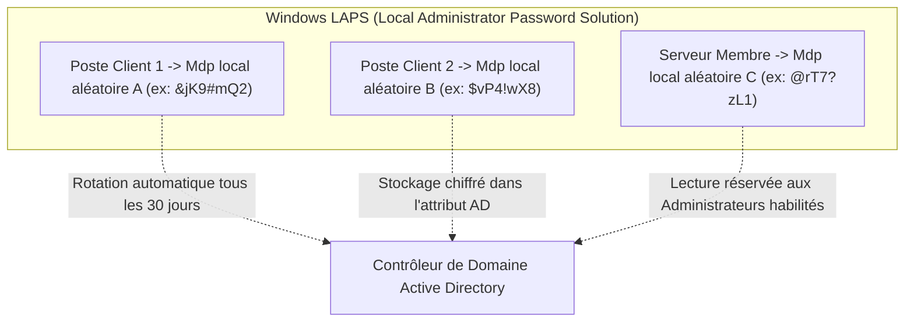

# Durcissement Windows Server : GPO de Sécurité, Windows LAPS, BitLocker et Audit Active Directory

Dans un environnement Microsoft d'entreprise, Active Directory est la cible prioritaire des cyberattaquants. Le durcissement des contrôleurs de domaine, serveurs membres et postes de travail est impératif pour bloquer les attaques de mouvement latéral (*Lateral Movement*).

---

## 1. GPO de Sécurité et Élimination des Protocoles Obsolètes

Les **Stratégies de Groupe (GPO)** permettent de centraliser et d'imposer des règles de sécurité uniformes :

```text
┌─────────────────────────────────────────────────────────────┐
│                 GPO DE DURCISSEMENT RECOMMANDÉE             │
├─────────────────────────────────────────────────────────────┤
│ 1. DÉSACTIVATION DES PROTOCOLES OBSOLÈTES                   │
│    • Désactiver SMBv1 (Vecteur de rançongiciels type WannaCry)│
│    • Désactiver LLMNR et NetBIOS (Vecteurs d'attaques MiTM)  │
│    • Interdire NTLMv1 et forcer NTLMv2 / Kerberos uniquement│
├─────────────────────────────────────────────────────────────┤
│ 2. POLITIQUE DE MOTS DE PASSE & VERROUILLAGE                │
│    • Longueur minimale : 14 à 16 caractères                 │
│    • Verrouillage de compte après 5 tentatives infructueuses│
│    • Durée de verrouillage : 30 minutes minimum             │
├─────────────────────────────────────────────────────────────┤
│ 3. RESTRICTIONS DES DROITS UTILISATEURS                     │
│    • Interdire l'ouverture de session RDP aux comptes locaux│
│    • Bloquer le privilège SeDebugPrivilege aux non-admins    │
└─────────────────────────────────────────────────────────────┘
```

---

## 2. Windows LAPS : Fin des Mots de Passe Administrateurs Dupliqués

Traditionnellement, le compte `Administrateur` local partageait le même mot de passe sur toutes les machines clonées de l'entreprise. Si un attaquant compromettait un seul poste, il extrayait le hachage NTLM et prenait le contrôle de l'ensemble du parc (**Pass-the-Hash**).



---

## 3. Événements Critiques de Sécurité Active Directory

La surveillance des journaux d'événements (*Security Event Log*) permet de détecter les tentatives d'intrusion en temps réel :

| Event ID | Description de l'Événement | Intérêt pour la Sécurité / SOC |
|---|---|---|
| **`4624`** | Ouverture de session réussie (*Logon Type 2=Console, 3=Réseau, 10=RDP*) | Détecter les connexions inhabituelles ou hors horaires ouvrés. |
| **`4625`** | Échec d'ouverture de session | Alerte sur les attaques de force brute ou pulvérisation de mots de passe (*Password Spraying*). |
| **`4720`** | Création d'un compte utilisateur | Détecter la création de comptes dormants non autorisés (persistance). |
| **`4728` / `4732`** | Ajout d'un membre à un groupe de sécurité privilégié (*Domain Admins*) | **Alerte critique immédiate** : tentative d'élévation de privilèges au niveau du domaine. |
| **`4726`** | Suppression d'un compte utilisateur | Traçabilité des départs et du cycle de vie des identités. |
