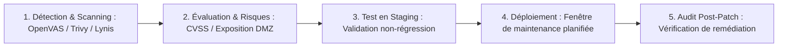

# Gestion des Correctifs, Analyse de Vulnérabilités CVE/CVSS et Patch Management Automatisé

La grande majorité des cyberattaques n'exploitent pas des failles inconnues (*0-day*), mais des vulnérabilités connues pour lesquelles un correctif de sécurité officiel existe depuis plusieurs mois ou années.

---

## 1. Le Standard CVE et la Métrique de Sévérité CVSS

```text
┌─────────────────────────────────────────────────────────────┐
│ EXEMPLE D'IDENTIFIANT : CVE-2024-3094 (Backdoor XZ Utils)   │
├─────────────────────────────────────────────────────────────┤
│ • Dictionnaire CVE : Référence universelle (Année-Numéro)   │
│ • Score CVSS v3.1  : 10.0 / 10.0 (Sévérité CRITIQUE)        │
│ • Vecteur d'Attaque: Réseau (AV:N), Complexité Faible (AC:L)│
│ • Privilèges Requis: Aucun (PR:N), Interaction User: Aucune │
│ • Impact Sécurité  : Compromission totale C:H / I:H / A:H   │
└─────────────────────────────────────────────────────────────┘
```

### Échelle de sévérité CVSS :
- **0.1 – 3.9** : Faible (*Low*)
- **4.0 – 6.9** : Moyen (*Medium*)
- **7.0 – 8.9** : Élevé (*High*) -> Application sous 7 jours
- **9.0 – 10.0** : Critique (*Critical*) -> Application d'urgence sous 24 à 48 heures

---

## 2. Le Cycle de Vie du Patch Management en Entreprise



---

## 3. Automatisation des Mises à Jour de Sécurité sous Linux (`unattended-upgrades`)

Sous Debian et Ubuntu, le paquet `unattended-upgrades` applique automatiquement les correctifs de sécurité critiques sans intervention humaine :

```ini
// /etc/apt/apt.conf.d/50unattended-upgrades
Unattended-Upgrade::Allowed-Origins {
    "${distro_id}:${distro_codename}-security";
};

// Nettoyer les paquets orphelins après mise à jour
Unattended-Upgrade::Remove-Unused-Dependencies "true";

// Redémarrer automatiquement le serveur uniquement si nécessaire à 03h30 du matin
Unattended-Upgrade::Automatic-Reboot "true";
Unattended-Upgrade::Automatic-Reboot-Time "03:30";
```

Activé via `/etc/apt/apt.conf.d/02periodic` :
```ini
APT::Periodic::Update-Package-Lists "1";
APT::Periodic::Download-Upgradeable-Packages "1";
APT::Periodic::AutocleanInterval "7";
APT::Periodic::Unattended-Upgrade "1";
```
