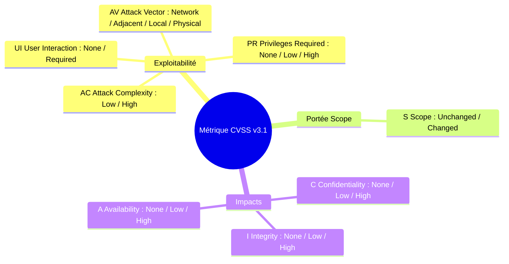
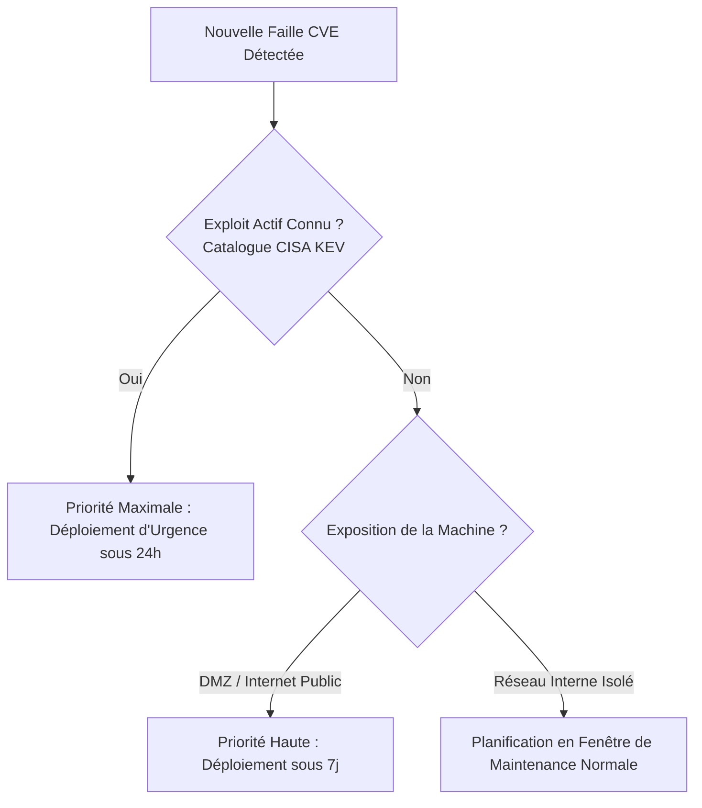

# Gestion des Correctifs, Analyse de Vulnérabilités CVE/CVSS, Scanning et Patch Management Automatisé

La grande majorité des intrusions cyber réussies n'exploitent pas des vulnérabilités inconnues (*Zero-Day*), mais des failles publiques pour lesquelles un correctif de sécurité officiel (*patch*) a été publié par l'éditeur plusieurs semaines ou mois auparavant.

La **gestion des vulnérabilités et des correctifs** (*Patch Management*) est le processus continu d'identification, d'évaluation, de test et de déploiement des mises à jour de sécurité sur l'ensemble du parc informatique.

---

## 1. Le Standard CVE et le Système de Notation CVSS v3.1

### 1.1. Le dictionnaire CVE (*Common Vulnerabilities and Exposures*)
Géré par l'organisation MITRE et le NIST, le standard **CVE** attribue un identifiant unique et public à chaque vulnérabilité de sécurité découverte dans un logiciel ou composant matériel (format : `CVE-AAAA-NNNNN`, ex: `CVE-2024-3094` pour la porte dérobée XZ Utils).

### 1.2. La métrique de sévérité CVSS v3.1 (*Common Vulnerability Scoring System*)
Le score CVSS fournit une note normalisée de **0.0 à 10.0** basée sur un vecteur de caractéristiques techniques (*Vector String*) :

```text
Exemple de Vecteur CVSS v3.1 : CVSS:3.1/AV:N/AC:L/PR:N/UI:N/S:U/C:H/I:H/A:H (Score: 9.8 Critique)
```



### Échelle de sévérité et délais d'application recommandés (SLA) :
| Niveau de Sévérité | Score CVSS v3.1 | Délai d'Application Maximal Recommandé (SLA) |
|---|---|---|
| **Critique (*Critical*)** | **9.0 – 10.0** | **Moins de 24 à 48 heures** (Composants DMZ/Web en urgence immédiate) |
| **Élevé (*High*)** | **7.0 – 8.9** | **Moins de 7 jours** |
| **Moyen (*Medium*)** | **4.0 – 6.9** | **Moins de 30 jours** (Cycle de maintenance mensuel) |
| **Faible (*Low*)** | **0.1 – 3.9** | **Prochain cycle trimestriel ou semestriel** |

---

## 2. Scanning et Détection des Vulnérabilités

Pour maintenir une visibilité constante sur leur exposition, les administrateurs déploient des scanners automatisés :

1. **Scanners d'infrastructure et de réseaux** :
   - **OpenVAS / Greenbone Vulnerability Management** : scanner open source d'évaluation des failles d'hôtes et de services réseau.
   - **Nessus / Qualys / Rapid7 Nexpose** : solutions d'audit de conformité et de vulnérabilités pour parcs d'entreprises.
2. **Scanners d'hôtes et de durcissement** :
   - **Lynis** : inspecte la configuration locale sous Linux et relève les packages non mis à jour et les configurations dégradées.
3. **Scanners de conteneurs et dépendances** :
   - **Trivy / Grype** : analysent les images Docker, dépôts Git et paquets applicatifs pour détecter les CVE connues.

---

## 3. Priorisation des Correctifs et Fenêtrage de Maintenance

Il est techniquement impossible d'appliquer instantanément tous les correctifs sans risquer de déstabiliser les services métiers. La priorisation s'appuie sur une matrice de risques :



### Le Cycle de Déploiement en 5 Étapes :
1. **Évaluation** : analyse du bulletin de sécurité, calcul du score environnemental et identification des serveurs impactés.
2. **Test en Pré-production (Staging)** : validation de l'absence de régression applicative sur un environnement miroir.
3. **Planification & Fenêtrage** : choix d'une fenêtre horaire autorisée à faible impact utilisateur (ex: nuit de mardi à mercredi entre 02h00 et 05h00).
4. **Déploiement Automatisé** : application via outil de gestion centralisée (Ansible, WSUS, SCCM, unattended-upgrades).
5. **Vérification & Plan de Rollback** : contrôle post-patch (re-scan de vulnérabilité) et procédure de retour arrière en cas de panne imprévue.

---

## 4. Automatisation des Correctifs sous Linux et Windows

### 4.1. Automatisation Linux Debian/Ubuntu (`unattended-upgrades`)
Le paquet `unattended-upgrades` assure l'installation sans surveillance des paquets provenant des dépôts officiels de sécurité :

```ini
// /etc/apt/apt.conf.d/50unattended-upgrades
Unattended-Upgrade::Allowed-Origins {
    "${distro_id}:${distro_codename}-security";
};

// Exclure les services critiques nécessitant une recette manuelle
Unattended-Upgrade::Package-Blacklist {
    "nginx";
    "mysql-server";
    "postgresql";
};

// Nettoyage et redémarrage nocturne
Unattended-Upgrade::Remove-Unused-Dependencies "true";
Unattended-Upgrade::Automatic-Reboot "true";
Unattended-Upgrade::Automatic-Reboot-Time "03:30";
```

### 4.2. Orchestration Ansible pour Parcs de Serveurs
Playbook d'application des correctifs avec redémarrage conditionnel contrôlé :

```yaml
- name: Patching de sécurité du parc de serveurs
  hosts: all
  become: true
  tasks:
    - name: Mettre à jour le cache APT et appliquer les correctifs de sécurité
      ansible.builtin.apt:
        update_cache: yes
        upgrade: dist
        autoremove: yes
        autoclean: yes

    - name: Vérifier si un redémarrage système est requis
      ansible.builtin.stat:
        path: /var/run/reboot-required
      register: reboot_required_file

    - name: Redémarrer le serveur si nécessaire
      ansible.builtin.reboot:
        msg: "Redémarrage automatisé post-mise à jour de sécurité"
        reboot_timeout: 300
      when: reboot_required_file.stat.exists
```
