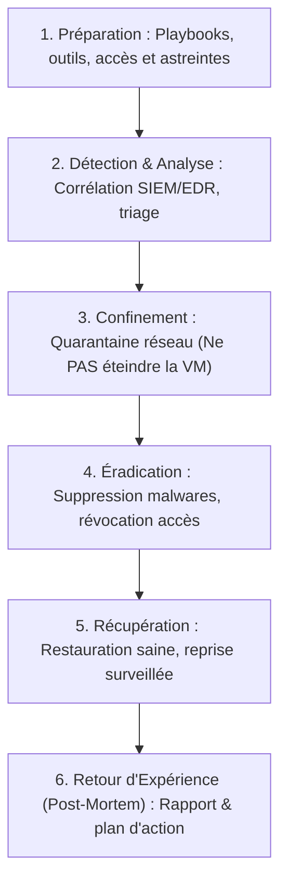

# Réponse aux Incidents Cyber, Forensics de Base, Confinement et Retour d'Expérience (Post-Mortem)

Lorsqu'une intrusion est suspectée ou confirmée, la rapidité et la méthode de l'équipe de réponse aux incidents déterminent si l'attaque sera circonscrite en quelques minutes ou se transformera en catastrophe majeure pour l'organisation.

---

## 1. Le Cycle de Gestion des Incidents (NIST SP 800-61)



---

## 2. Confinement et Respect de l'Ordre de Volatilité (RFC 3227)

L'erreur la plus fréquente lors de la détection d'un ransomware ou d'un pirate consiste à débrancher la prise électrique ou éteindre la machine. **Éteindre la machine détruit immédiatement toutes les preuves critiques résidant en mémoire vive (RAM)** (clés de chiffrement, processus malveillants injectés, connexions réseau actives).

```text
┌─────────────────────────────────────────────────────────────┐
│          ORDRE DE VOLATILITÉ DES PREUVES (RFC 3227)         │
├─────────────────────────────────────────────────────────────┤
│ 1. Plus volatile  : Registres CPU, mémoire cache            │
│ 2. Très volatile  : Mémoire vive (RAM)                      │
│ 3. Volatile       : Tables de routage, connexions réseau    │
│ 4. Persistant     : Disques durs virtuels, systèmes de fich.│
│ 5. Très stable    : Journaux distants (Syslog centralisé)   │
└─────────────────────────────────────────────────────────────┘
```

### Bonne pratique d'isolation :
- Couper l'interface réseau virtuelle (déconnexion du vSwitch / quarantaine VLAN) ou bloquer le trafic via le pare-feu local sans éteindre le système d'exploitation.
- Réaliser un instantané mémoire (*Memory Dump* ou Snapshot VM avec état RAM) avant toute manipulation.

---

## 3. Le Rapport de Post-Mortem (Lessons Learned)

Après la remédiation de l'incident, l'équipe produit un document formel structuré :
1. **Résumé exécutif** : Impact métier, durée d'indisponibilité, données touchées.
2. **Chronologie détaillée des événements** : Heure exacte de l'intrusion initiale, étapes de propagation, heure de détection et heure de reprise.
3. **Vecteur initial de compromission** : Faille logicielle non patchée, hameçonnage (*phishing*), mot de passe faible, compte de service compromis.
4. **Plan d'actions correctives** : Durcissement des GPO, mise en œuvre du MFA obligatoire, déploiement d'un agent EDR sur les serveurs orphelins.
