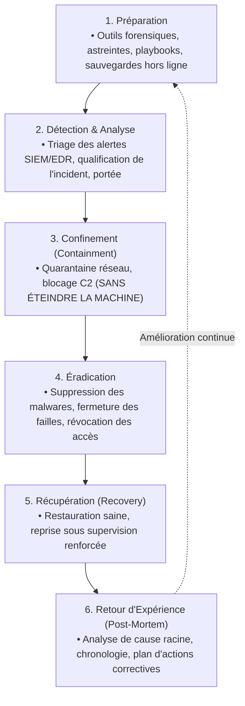

# Réponse aux Incidents Cyber, Forensics de Base, Confinement et Retour d'Expérience (Post-Mortem)

Aucun système d'information n'est invulnérable. Lorsqu'une intrusion ou un comportement anormal est détecté, la rigueur méthodologique et la rapidité d'exécution de l'équipe d'intervention conditionnent la limitation des impacts opérationnels et la préservation de la réputation de l'organisation.

---

## 1. Le Cycle de Gestion des Incidents (NIST SP 800-61 / ISO 27035)

Le cadre du NIST découpe la réponse aux incidents de sécurité en **6 étapes séquentielles** :



---

## 2. Confinement et Ordre de Volatilité des Preuves (RFC 3227)

L'erreur la plus critique et fréquente commise lors de la découverte d'une attaque (ransomware, backdoor) consiste à débrancher brutalement la prise électrique ou éteindre la machine virtuelle.

> **Conséquence fatale** : l'extinction détruit instantanément la mémoire vive (RAM). Or, c'est en RAM que résident les clés de déchiffrement, les processus malveillants injectés sans écriture sur disque (*Fileless Malware*), les sessions ouvertes et les adresses IP des serveurs de commande et contrôle (C2).

```text
┌─────────────────────────────────────────────────────────────────────────┐
│              ORDRE DE VOLATILITÉ DES PREUVES (RFC 3227)                 │
├─────────────────────────────────────────────────────────────────────────┤
│ 1. Plus volatile  : Registres CPU, mémoire cache du processeur          │
│ 2. Très volatile  : Mémoire vive (RAM), tables de routage, connexions   │
│ 3. Volatile       : État du noyau, processus actifs, fichiers temporaires│
│ 4. Persistant     : Disques durs virtuels, partitions, logs locaux       │
│ 5. Très stable    : Journaux distants (SIEM centralisé), sauvegardes    │
└─────────────────────────────────────────────────────────────────────────┘
```

### Bonne pratique d'isolation réseau :
1. Déconnecter l'interface réseau virtuelle au niveau de l'hyperviseur (déconnexion du port group vSwitch ou bascule vers un VLAN de quarantaine isolé).
2. Effectuer un instantané mémoire (*Snapshot VM avec état RAM* ou dump mémoire avec l'outil `LiME`).
3. Bloquer tout trafic sortant avec le pare-feu local sans redémarrer le système d'exploitation.

---

## 3. Commandes de Triage et Diagnostic Forensics sous Linux

Lors de la phase initiale d'investigation sur un serveur compromis, l'administrateur collecte les artefacts système sans altérer l'état de la machine :

```bash
# 1. Inspecter les connexions réseau actives et processus en écoute
ss -tulpn

# 2. Identifier les processus anormaux et leurs chemins d'exécution
ps auxf
ls -l /proc/<PID>/exe

# 3. Vérifier les mécanismes de persistance automatique
crontab -l
ls -la /etc/cron* /var/spool/cron/crontabs/
systemctl list-timers --all
cat /etc/ld.so.preload 2>/dev/null

# 4. Examiner les clés SSH autorisées sur tous les comptes
find /home /root -name "authorized_keys" -exec ls -la {} \;

# 5. Analyser les dernières connexions et tentatives échouées
last -n 20
lastb -n 20
journalctl -u ssh --since "2 hours ago"
```

---

## 4. Indicateurs de Compromission (IoC - *Indicators of Compromise*)

Les **IoC** sont les empreintes numériques laissées par l'attaquant au cours de son intrusion. Ils permettent d'auditer l'ensemble du parc informatique pour détecter d'autres machines infectées :

- **Empreintes cryptographiques de fichiers** : hachage SHA-256 d'un binaire ou d'un script suspect.
- **Réseau** : adresses IP publiques malveillantes, noms de domaines dynamiques utilisés pour le C2.
- **Système** : clés de registre Windows modifiées, nouveaux services créés avec des noms aléatoires.

---

## 5. Le Rapport de Post-Mortem (Lessons Learned)

Une fois la crise résolue et les systèmes restaurés, l'équipe rédige un rapport formel d'analyse post-incident :

```text
┌─────────────────────────────────────────────────────────────────────────┐
│                STRUCTURE DU RAPPORT DE POST-MORTEM                      │
├─────────────────────────────────────────────────────────────────────────┤
│ 1. RÉSUMÉ EXÉCUTIF                                                      │
│    • Impact métier, durée d'indisponibilité, volume de données touchées.│
├─────────────────────────────────────────────────────────────────────────┤
│ 2. CHRONOLOGIE DÉTAILLÉE DES ÉVÉNEMENTS (Timeline)                      │
│    • T0 : Intrusion initiale (Vecteur d'entrée).                        │
│    • T1 : Détection par le SOC / l'administrateur.                      │
│    • T2 : Confinement et neutralisation de la menace.                   │
│    • T3 : Rétablissement complet des services.                          │
├─────────────────────────────────────────────────────────────────────────┤
│ 3. ANALYSE DE LA CAUSE RACINE (Root Cause Analysis)                     │
│    • Faille CVE non patchée, mot de passe faible sans MFA, phishing...  │
├─────────────────────────────────────────────────────────────────────────┤
│ 4. PLAN D'ACTIONS CORRECTIVES (CAPA)                                    │
│    • Mesures techniques : durcissement GPO, MFA obligatoire, EDR.       │
│    • Mesures organisationnelles : formation des équipes, révision GTR.  │
└─────────────────────────────────────────────────────────────────────────┘
```
