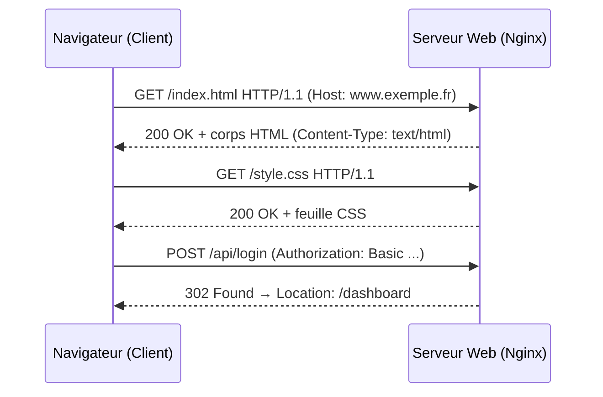
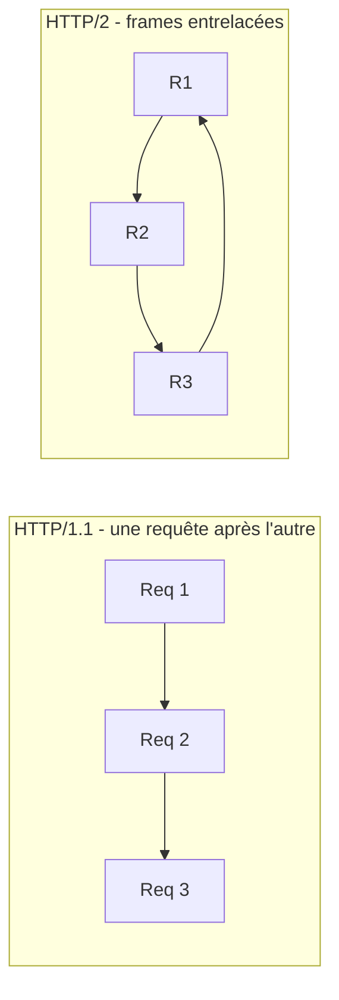

# Protocoles Web : HTTP/1.1, HTTP/2 et HTTP/3

HTTP (*HyperText Transfer Protocol*) est le protocole applicatif du web. Tout administrateur SISR doit maîtriser son cycle de vie car il transite par **tous** les équipements qu'il administre : serveurs web, reverse proxy, pare-feu applicatifs et certificats TLS.

---

## 1. Le cycle requête/réponse HTTP

HTTP suit un modèle client/serveur sans état (*stateless*) : le client ouvre une connexion TCP (port 80 en clair, 443 avec TLS), envoie une requête, le serveur répond puis libère les ressources.



### Anatomie d'une requête

```text
GET /formations/sisr HTTP/1.1          <- Ligne de requête : méthode, cible, version
Host: www.opensio.home.lan             <- Routage des Virtual Hosts
User-Agent: Mozilla/5.0 ...            <- Client à l'origine
Accept: text/html                      <- Formats acceptés
Connection: keep-alive                 <- Réutilisation de la connexion TCP
```

### Méthodes usuelles

| Méthode | Sémantique | Idempotente |
|---|---|---|
| `GET` | Lire une ressource | Oui |
| `POST` | Créer / soumettre un traitement | Non |
| `PUT` | Remplacer intégralement une ressource | Oui |
| `PATCH` | Modifier partiellement | Non |
| `DELETE` | Supprimer | Oui |
| `HEAD` | Comme GET sans corps (health-checks) | Oui |

> **Piège classique** : une méthode idempotente donne le même résultat si elle est rejouée ; c'est la propriété qui autorise les retransmissions automatiques et les retries côté proxy.

---

## 2. Les familles de codes d'état

| Code | Famille | Signification | Exemple de diagnostic |
|---|---|---|---|
| 1xx | Informationnel | Échange en cours | `101 Switching Protocols` (WebSocket) |
| 2xx | Succès | Requête traitée | `200 OK`, `204 No Content` |
| 3xx | Redirection | Ressource déplacée | `301` permanent, `302` temporaire, `304` cache |
| 4xx | Erreur client | Requête invalide | `403` interdit, `404` introuvable, `429` trop de requêtes |
| 5xx | Erreur serveur | Défaillance applicative | `500` interne, `502` Bad Gateway, `503` indisponible |

Un **`502 Bad Gateway`** vu par l'utilisateur derrière un reverse proxy signifie presque toujours : *le proxy est sain mais le backend ne répond pas* — premier réflexe, vérifier le service amont et le port écouté.

---

## 3. HTTP/2 : le multiplexage

HTTP/1.1 limite la parallélisation : une connexion = une requête à la fois (ou des connexions multiples coûteuses). HTTP/2 conserve la sémantique HTTP mais réorganise le transport :



- **Multiplexage de flux** : plusieurs requêtes en parallèle sur une seule connexion TCP ;
- **HPACK** : compression des en-têtes répétés ;
- Négocié par **ALPN** pendant la poignée de main TLS (le navigateur exige presque toujours HTTPS) ;
- Nécessite des en-têtes en minuscules et interdit la réécriture partielle du protocole côté serveur.

## 4. HTTP/3 et QUIC

HTTP/3 remplace TCP par **QUIC**, un protocole de transport construit sur UDP avec TLS 1.3 intégré :

- Suppression du *head-of-line blocking* TCP (un paquet perdu ne bloque plus tous les flux) ;
- Établissement de connexion combiné transport + cryptographie (**0-RTT** en reprise) ;
- Adapté aux réseaux mobiles instables (migration de connexion au changement d'IP).

```nginx
# Annonce HTTP/3 aux navigateurs (réponse d'un serveur Nginx 1.25+)
listen 443 quic reuseport;
add_header Alt-Svc 'h3=":443"; ma=86400';
```

> **À retenir** : HTTP/3 reste minoritaire mais progresse (Google, Cloudflare, Facebook). Un pare-feu qui bloque l'UDP 443 force le repli automatique sur HTTP/2 — comportement à anticiper en entreprise.

---

## 5. En-têtes structurants à connaître

| En-tête | Rôle |
|---|---|
| `Host` | Sélection du Virtual Host côté serveur (obligatoire en HTTP/1.1) |
| `Content-Type` / `Accept` | Négociation de contenu (JSON, HTML, formulaire) |
| `Cache-Control`, `ETag` | Gestion du cache navigateur/proxy |
| `X-Forwarded-For`, `X-Forwarded-Proto` | Transmission de l'IP client et du schéma derrière un proxy |
| `Strict-Transport-Security` | Force HTTPS (voir leçon 6) |

---

## Points clés

1. HTTP est **sans état** : l'état applicatif vit dans les cookies, les jetons ou les sessions.
2. Les codes **4xx** accusent le client, les **5xx** le serveur ou le backend — un reverse proxy transforme souvent une panne backend en 502.
3. HTTP/2 multiplexe les flux sur TLS, HTTP/3 passe sur QUIC/UDP avec TLS 1.3 intégré.
4. `Host`, `X-Forwarded-For` et `Cache-Control` sont les en-têtes les plus exploités en exploitation quotidienne.