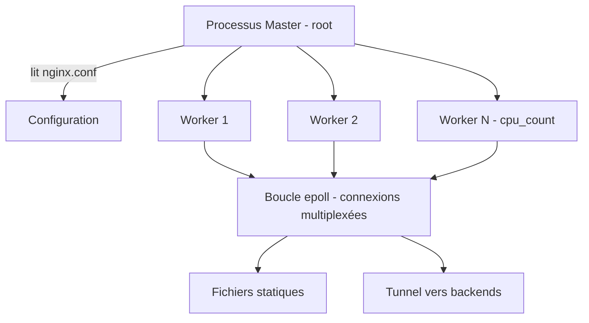

# Serveur Web Nginx : Architecture et Configuration

Nginx est le serveur web le plus déployé au monde devant Apache. Son architecture **événementielle asynchrone** lui permet de servir des milliers de connexions simultanées avec une empreinte mémoire minimale, ce qui en fait le choix par défaut des plateformes modernes (et d'OpenSIO en production).

---

## 1. Architecture événementielle

Contrairement au modèle d'Apache `prefork` (un processus par connexion), Nginx utilise des **boucles d'événements** (*epoll* sous Linux) : un seul thread gère des milliers de connexions.



- **Master** : chargé de lire la configuration, ouvrir les sockets, déléguer aux workers (`nginx -s reload` provoque un rechargement **sans coupure**) ;
- **Workers** : traitent les requêtes ; le nombre recommandé = nombre de cœurs CPU (`auto`) ;
- Fichiers clés sous Debian : `/etc/nginx/nginx.conf` (socle), `/etc/nginx/sites-available/` + liens symboliques vers `sites-enabled/` (Virtual Hosts), `/var/log/nginx/access.log` et `error.log`.

---

## 2. La hiérarchie `http` → `server` → `location`

```nginx
# /etc/nginx/nginx.conf — socle
user www-data;
worker_processes auto;
events { worker_connections 1024; }

http {
    include       /etc/nginx/mime.types;
    access_log    /var/log/nginx/access.log;
    sendfile      on;
    keepalive_timeout 65;

    # Virtual Hosts
    include /etc/nginx/sites-enabled/*;
}
```

```nginx
# /etc/nginx/sites-available/opensio.conf — un Virtual Host
server {
    listen 80;
    server_name opensio.home.lan;

    root /var/www/opensio/public;
    index index.html;

    location / {
        try_files $uri $uri/ =404;   # sert le fichier ou 404
    }

    location /assets/ {
        expires 30d;                  # cache navigateur pour le statique
        add_header Cache-Control "public";
    }
}
```

### Le bloc `location`, moteur de routage interne

| Expression | Comportement |
|---|---|
| `location /api/` | Préfixe : toutes les URI commençant par `/api/` |
| `location = /health` | Match exact (prioritaire) |
| `location ~ \.php$` | Expression régulière sensible à la casse |
| `location ^~ /static/` | Préfixe prioritaire (stoppe la recherche regex) |

### Virtual Hosts par nom

Le serveur choisit le bloc `server` en comparant l'en-tête `Host` aux directives `server_name` ; un `server` marqué `default_server` capte les requêtes non appariées. Le lien symbolique `sites-enabled/` active la configuration :

```bash
ln -s /etc/nginx/sites-available/opensio.conf /etc/nginx/sites-enabled/
nginx -t && systemctl reload nginx    # validation puis rechargement sans coupure
```

---

## 3. Servir des fichiers statiques sans ouvrir de faille

```nginx
server {
    listen 80;
    server_name intranet.home.lan;
    root /srv/intranet;

    # Interdire les dotfiles (.env, .git, .htaccess)
    location ~ /\. { deny all; access_log off; log_not_found off; }

    # Restriction par méthode HTTP
    if ($request_method !~ ^(GET|HEAD|POST)$) { return 444; }

    autoindex off;          # jamais de listing de répertoire en production
    index index.html;
}
```

**Réflexe SISR** : `nginx -t` avant tout rechargement (`directive unknown`, `emerg` = erreur bloquante) ; `error.log` en priorité pour diagnostiquer un 403 (permissions) ou un 404 (chemin racine erroné : le chemin `root` est préfixé à l'URI complète).

---

## Points clés

1. Architecture événementielle : des **workers** asynchrones et non un processus par connexion.
2. `http` > `server` (Virtual Host par `listen`/`server_name`) > `location` (routage par URI) — les directive héritent du haut vers le bas sauf `add_header`.
3. `sites-available` + lien symbolique dans `sites-enabled` = le standard Debian pour activer/désactiver proprement.
4. `nginx -t` avant tout `reload` ; les logs `access.log`/`error.log` sont les premiers outils de diagnostic.