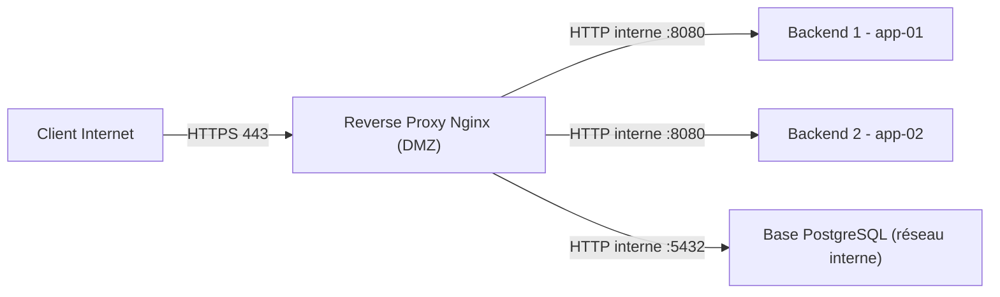

# Reverse Proxy et Répartition de Charge

Un **reverse proxy** se place devant les services internes et les expose au monde extérieur en un point unique : terminaison TLS, filtrage, compression, cache et répartition de charge. C'est la brique centrale de toute architecture web en entreprise — et le socle du déploiement OpenSIO (Caddy joue ce rôle).

---

## 1. Le principe du reverse proxy



Contrairement au *forward proxy* (qui sert les clients vers l'extérieur), le reverse proxy sert l'extérieur au nom des serveurs internes : le backend n'est jamais exposé directement, et le proxy est le seul point qui porte le certificat TLS.

---

## 2. `proxy_pass` et la transmission des en-têtes

```nginx
# /etc/nginx/sites-available/app.conf
upstream opensio_backend {
    least_conn;                         # stratégie de répartition
    server 10.10.20.11:8080 max_fails=3 fail_timeout=30s;
    server 10.10.20.12:8080 max_fails=3 fail_timeout=30s;
    keepalive 16;                       # connexions persistantes vers les backends
}

server {
    listen 443 ssl;
    server_name opensio.home.lan;

    location / {
        proxy_pass http://opensio_backend;

        # Transmission de la réalité client (sinon les logs backend
        # n'enregistrent que l'IP du proxy !)
        proxy_set_header Host              $host;
        proxy_set_header X-Real-IP         $remote_addr;
        proxy_set_header X-Forwarded-For   $proxy_add_x_forwarded_for;
        proxy_set_header X-Forwarded-Proto $scheme;

        # Robustesse applicative
        proxy_http_version 1.1;
        proxy_set_header Connection "";     # keep-alive vers le backend
        proxy_read_timeout  60s;
    }
}
```

> **Piège n°1** : sans `X-Forwarded-For` transmis et exploité, la journalisation et le rate limiting applicatif s'appliquent à l'IP du proxy (tous les clients partagent la même identité).
> **Piège n°2** : `proxy_pass http://upstream/` (slash final) remplace le préfixe de l'URI ; sans slash, l'URI est transmise telle quelle.

### Terminaison TLS au proxy

Le certificat vit sur le proxy (voir leçon 4) ; le trafic proxy → backend circule sur le réseau interne en HTTP. Si le backend a besoin de savoir que l'utilisateur est en HTTPS (`secure cookies`, redirections applicatives), on lui transmet `X-Forwarded-Proto $scheme` et l'application doit le faire confiance uniquement depuis le réseau interne.

---

## 3. Répartition de charge

| Directive upstream | Comportement | Usage type |
|---|---|---|
| *(défaut)* `round_robin` | Tour de rôle équitable | Backends homogènes |
| `least_conn` | Vers le backend avec le moins de connexions actives | Temps de réponse inégaux |
| `ip_hash` | Même client → même backend (affinité) | Sessions en mémoire non partagées |
| `hash $cookie_jsessionId` | Affinité sur une clé applicative | Sticky sessions fine |

```nginx
upstream api_pool {
    least_conn;
    server 10.10.20.11:8080 weight=2;    # machine plus puissante
    server 10.10.20.12:8080;
    server 10.10.20.13:8080 backup;      # repris uniquement si panne
}
```

**Santé des backends** : `max_fails`/`fail_timeout` excluent temporairement un backend qui échoue ; les versions récentes de Nginx Plus (payant) ajoutent les health-checks actifs — à défaut, un probe HTTP simple côté monitoring (`HEAD /health`) complète le dispositif.

### Dégagement d'incident typique

```bash
curl -H 'Host: opensio.home.lan' -k https://10.10.20.10/health   # tester le proxy
tail -f /var/log/nginx/error.log                                 # upstream timed out ?
systemctl status opensio-api                                     # backend en cause ?
```

---

## Points clés

1. Le reverse proxy est le **point unique de terminaison TLS**, de filtrage et de répartition — d'où sa criticité (SPOF à traiter en HA, voir module haute disponibilité).
2. Toujours transmettre `X-Forwarded-For` / `X-Forwarded-Proto` et faire confiance à ces en-têtes **uniquement** depuis le réseau interne.
3. Un upstream avec `least_conn`, `weight` et `backup` couvre la majorité des besoins de répartition en PME.
4. Diagnostiquez dans l'ordre : proxy (`curl` direct, logs Nginx) puis backend (service, port, pare-feu).