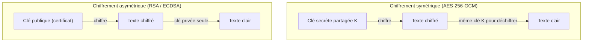

# Cryptographie Asymétrique et Infrastructure à Clés Publiques (PKI)

Comment un navigateur peut-il faire confiance à un serveur qu'il n'a jamais rencontré ? La réponse tient en trois briques : la **cryptographie asymétrique**, le **certificat X.509** et la **chaîne de confiance** ancrée dans une autorité de certification (CA).

---

## 1. Chiffrement symétrique vs asymétrique



| Critère | Symétrique (AES, ChaCha20) | Asymétrique (RSA, ECDSA) |
|---|---|---|
| Clés | Une seule, secrète | Paire publique / privée |
| Vitesse | Très rapide (Go/s) | 100 à 1000× plus lent |
| Distribution des clés | Problématique (canal sécurisé requis) | Publique par nature |
| Usage | Chiffrer le trafic en masse | Authentification, échange de clés, signatures |

> **En pratique** : TLS utilise l'asymétrique **uniquement** pour authentifier le serveur et convenir d'une clé de session, puis chiffre tout le reste en symétrique (AES-GCM). C'est l'objectif de l'échange de clés (ECDHE : *Ephemeral Diffie-Hellman*) qui donne le *perfect forward secrecy*.

- **RSA** : fondé sur la factorisation de grands nombres ; clés 2048 bits minimum (3072 recommandé en CA racine longue durée) ;
- **ECDSA** (courbes elliptiques, ex. `prime256v1`, `secp384r1`) : clés plus courtes et signatures plus rapides à sécurité équivalente — le choix par défaut des certificats modernes.

---

## 2. Le certificat X.509 en détail

```text
Certificate:
    Data:
        Version: 3 (0x2)
        Serial Number: 7a:4e:1c:...
        Signature Algorithm: sha256WithRSAEncryption
        Issuer: C=FR, O=Entreprise, CN=Entreprise Root CA
        Validity
            Not Before: Jan  1 08:00:00 2026 GMT
            Not After : Jan  1 08:00:00 2027 GMT
        Subject: C=FR, L=Lyon, O=Entreprise, CN=opensio.home.lan
        Subject Alternative Name:
            DNS:opensio.home.lan, DNS:www.home.lan, IP:10.10.20.10
        X509v3 extensions:
            Key Usage: Digital Signature, Key Encipherment
            Extended Key Usage: TLS Web Server Authentication
            Basic Constraints: CA:FALSE
```

| Champ | Rôle | Piège associé |
|---|---|---|
| `Subject` / CN | Identité principale (héritage) | Désormais ignoré par les navigateurs |
| **SAN** (*Subject Alternative Name*) | Liste exhaustive des noms/IP couverts | Un nom absent du SAN = avertissement `NET::ERR_CERT_COMMON_NAME_INVALID` |
| `Issuer` | CA qui a signé | Doit correspondre à la chaîne de confiance |
| `Validity` | Bornes de validité | Expiration = panne utilisateur, d'où la rotation automatique |
| `Key Usage` / `EKU` | Usages autorisés | Un certificat de signature ne doit pas servir au TLS |

La **chaîne de confiance** s'établit par signature récursive : le certificat serveur est signé par la CA intermédiaire, elle-même signée par la CA racine dont la clé publique est pré-ancrée dans les systèmes. **Un serveur doit présenter la chaîne complète** (serveur + intermédiaire), sinon le navigateur ne remonte pas à l'ancrage (`missing intermediate certificate`).

## 3. Révocation : CRL et OCSP

Un certificat volé doit pouvoir être invalidé avant son expiration :

- **CRL** (*Certificate Revocation List*) : liste signée publiée périodiquement par la CA — simple mais volumineuse et à la fraîcheur limitée ;
- **OCSP** (*Online Certificate Status Protocol*) : interrogation en ligne à la demande (`ocsp.resp.nom_domaine`) ; l'extension **OCSP stapling** fait porter la réponse OCSP par le serveur lui-même, ce qui préserve la confidentialité et accélère la poignée de main ;
- En pratique, la rotation fréquente (90 jours Let's Encrypt, voire moins) fait de la révocation un filet de secours.

---

## Points clés

1. L'asymétrique **authentifie** et échange les clés ; le symétrique **chiffre** le trafic — TLS combine les deux avec du Diffie-Hellman éphémère.
2. Le champ **SAN** est la source de vérité des noms couverts ; le CN est historique.
3. La **chaîne complète** (serveur + intermédiaires) doit être servie ; l'ancrage de confiance est la CA racine.
4. `Basic Constraints: CA:TRUE/FALSE` distingue un certificat d'autorité d'un certificat d'extrémité — ne jamais l'omettre sur une CA.