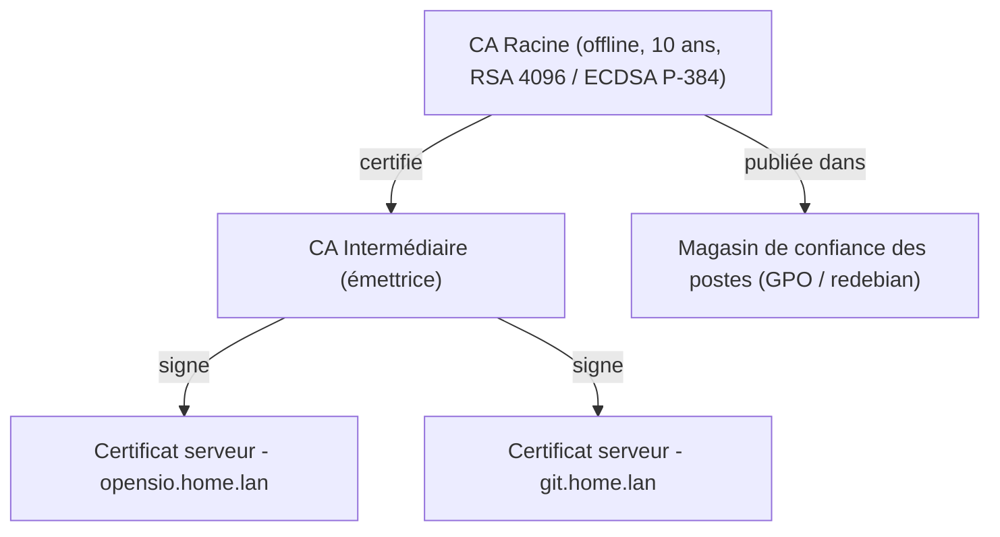
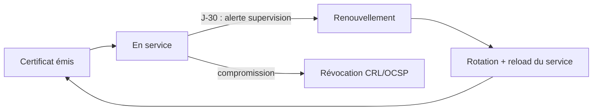

# Déploiement d'une PKI et Gestion des Certificats

En réseau interne, deux mondes coexistent : les certificats **publics** émis par des autorités publiques (Let's Encrypt, DigiCert) reconnus par tous les navigateurs, et la **PKI d'entreprise** — indispensable pour les services non exposés (`*.home.lan`, AD, RADIUS, VPN) car Let's Encrypt ne certifie pas les TLD privés. Cette leçon couvre les deux voies avec OpenSSL et ACME.

---

## 1. PKI d'entreprise : la hiérarchie à déployer



**Bonnes pratiques** : la CA racine reste **hors ligne** (clé privée sur support amovible verrouillé), la CA intermédiaire signe les certificats serveur (validité 1 à 3 ans maximum), la racine vit 10 à 20 ans.

---

## 2. Créer une CA racine avec OpenSSL

```bash
# 1. Clé privée de la CA racine (protection par phrase secrète)
openssl genrsa -aes256 -out ca-racine.key 4096

# 2. Certificat auto-signé de la CA (10 ans)
openssl req -x509 -new -sha256 -key ca-racine.key -days 3650 \
  -out ca-racine.crt \
  -subj "/C=FR/O=Entreprise/CN=Entreprise Root CA" \
  -addext "basicConstraints=critical,CA:TRUE" \
  -addext "keyUsage=critical,keyCertSign,cRLSign"

# 3. Vérification de la structure
openssl x509 -in ca-racine.pem -noout -subject -dates -ext basicConstraints
```

### Signer un certificat serveur SAN multi-domaines

```bash
# 1. Clé privée du serveur (à protéger : 600, jamais dans Git !)
openssl genrsa -out opensio.home.lan.key 2048

# 2. Requête de signature (CSR)
openssl req -new -key opensio.home.lan.key \
  -out opensio.home.lan.csr \
  -subj "/C=FR/L=Lyon/O=Entreprise/CN=opensio.home.lan"

# 3. Fichier d'extensions SAN (obligatoire pour les navigateurs)
cat > opensio-san.ext <<'EOF'
authorityKeyIdentifier=keyid,issuer
basicConstraints=CA:FALSE
keyUsage = digitalSignature, keyEncipherment
extendedKeyUsage = serverAuth
subjectAltName = @alt_names

[alt_names]
DNS.1 = opensio.home.lan
DNS.2 = www.home.lan
IP.1  = 10.10.20.10
EOF

# 4. Signature par la CA racine (x509)
openssl x509 -req -in opensio.home.lan.csr \
  -CA ca-racine.pem -CAkey ca-racine.key -CAcreateserial \
  -out opensio.home.lan.crt -days 825 -sha256 -extfile opensio-san.ext
```

### Déployer et vérifier

```bash
# Vérifier la chaîne, le SAN et la validité
openssl verify -CAfile ca-racine.pem opensio.home.lan.crt
openssl x509 -in opensio.home.lan.crt -noout -ext subjectAltName

# Contrôle à distance du certificat réellement servi
openssl s_client -connect opensio.home.lan:443 -servername opensio.home.lan </dev/null 2>/dev/null \
  | openssl x509 -noout -dates -subject
```

**Permissions** : clé privée CA en `0600` root, jamais dans un dépôt Git (le blueprint OpenSIO interdit les secrets versionnés — un .gitignore dédié protège le dossier `pki/`).

---

## 3. Automatiser avec ACME (Let's Encrypt / Certbot)

Le protocole **ACME** (*Automatic Certificate Management Environment*) automatise émission et renouvellement. Deux défis de validation :

- **HTTP-01** : un fichier témoin est déposé sur `http://<domaine>/.well-known/acme-challenge/` — exige que le domaine soit **public** et joignable ;
- **DNS-01** : un enregistrement TXT est publié dans la zone DNS — la seule option pour un domaine interne (`home.lan`) ou un wildcard `*.home.lan` (avec un fournisseur DNS compatible).

```bash
# Installation et émission avec rechargement Nginx
apt install certbot python3-certbot-nginx
certbot --nginx -d opensio.exemple.fr --redirect --agree-tos -m admin@exemple.fr

# Vérifier le timer de renouvellement automatique
systemctl list-timers | grep certbot
certbot renew --dry-run
```

> **Domaine interne `opensio.home.lan`** : Let's Encrypt ne peut pas valider un TLD privé. OpenSIO en production utilise Caddy avec sa **CA interne** dont la racine est distribuée aux postes — même mécanisme qu'une PKI d'entreprise (décision D-06 du blueprint).

## 4. Cycle de vie et gouvernance



1. **Inventaire** : tenir un registre (CN, émetteur, échéance, responsable) — un certificat oublié expire et devient incident ;
2. **Supervision** : alerter à J-30 (`openssl x509 -checkend 2592000`) ;
3. **Rotation automatique** : timer Certbot ou cron de renouvellement + reload Nginx ;
4. **Révocation** : procédure documentée en cas de compromission de clé ;
5. **Archivage des clés** : coffre-fort (chiffré), jamais en clair sur le serveur web.

---

## Points clés

1. **Racine hors ligne, intermédiaire émettrice, certificats courts** : la hiérarchie limite l'impact d'une compromission.
2. Le **SAN** et la chaîne complète sont les deux causes n°1 d'erreurs de déploiement.
3. **ACME/Certbot** automatise émission et renouvellement pour les domaines publics ; DNS-01 couvre les wildcards.
4. Clés privées : `0600`, hors Git, avec procédure de révocation et rotation planifiée.