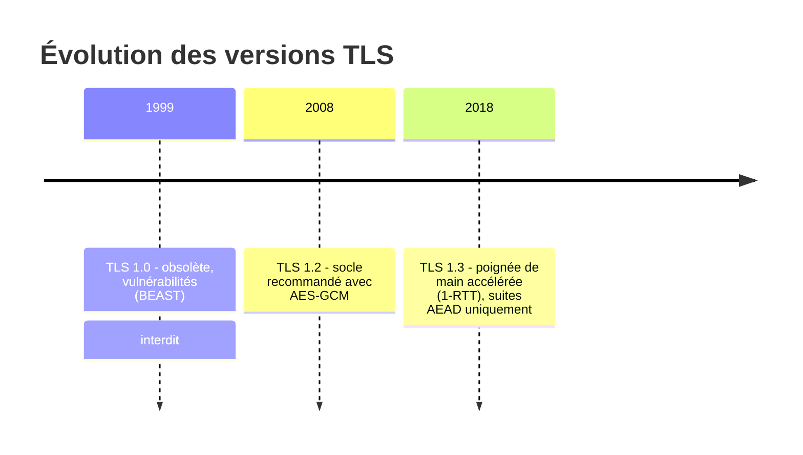

# Durcissement TLS et En-têtes de Sécurité HTTP

Un certificat valide ne suffit pas : un serveur qui accepte encore TLS 1.0, des suites de chiffrement faibles ou l'absence d'HSTS reste exploitable (protocol downgrade, MitM, clickjacking). Cette leçon définit la configuration de référence — celle qu'audite le module `securite-systemes-durcissement` et celle visée par OpenSIO en production (décision D-06).

---

## 1. Le protocole TLS : quoi désactiver, quoi garder



| Version | Statut 2026 | Recommandation |
|---|---|---|
| SSLv3, TLS 1.0, 1.1 | Rupture de la confidentialité (POODLE, downgrade) | **Interdits** (RGS, PCI-DSS) |
| TLS 1.2 | Autorisé | Avec suites AEAD uniquement (AES-GCM, ChaCha20) |
| TLS 1.3 | Recommandé | Plus rapide, PFS obligatoire, suites réduites |

> **Suite de chiffrement** = combinaison échange de clés (ECDHE) + chiffrement (AES-256-GCM) + intégrité (SHA-384). TLS 1.3 impose toutes éphémères : le *perfect forward secrecy* devient systématique — une clé privée compromise ne permet pas de déchiffrer les captures antérieures.

### Paramétrage durci côté serveur

```nginx
ssl_protocols        TLSv1.2 TLSv1.3;
ssl_ciphers          ECDHE-ECDSA-AES256-GCM-SHA384:ECDHE-RSA-AES256-GCM-SHA384:ECDHE-ECDSA-CHACHA20-POLY1305;
ssl_prefer_server_ciphers off;   # TLS 1.3 : suites AEAD toutes saines
ssl_session_timeout  1d;
ssl_session_cache    shared:TLS:10m;
ssl_session_tickets  off;        # anti-correlation à privilégier en interne
```

---

## 2. Les en-têtes de sécurité HTTP

| En-tête | Rôle | Valeur de référence |
|---|---|---|
| `Strict-Transport-Security` | Le navigateur refuse ensuite tout HTTP | `max-age=31536000; includeSubDomains` |
| `Content-Security-Policy` | Liste blanche des sources de contenu (anti-XSS) | `default-src 'self'; frame-ancestors 'none'` |
| `X-Content-Type-Options` | Interdit le sniffing MIME | `nosniff` |
| `X-Frame-Options` / `frame-ancestors` | Anti-clickjacking | `DENY` |
| `Referrer-Policy` | Limite la fuite d'URL en référent | `strict-origin-when-cross-origin` |
| `Permissions-Policy` | Restreint les API navigateur | `camera=(), microphone=(), geolocation=()` |

```nginx
add_header Strict-Transport-Security "max-age=31536000; includeSubDomains" always;
add_header X-Content-Type-Options "nosniff" always;
add_header X-Frame-Options "DENY" always;
add_header Referrer-Policy "strict-origin-when-cross-origin" always;
add_header Content-Security-Policy "default-src 'self'; object-src 'none'" always;
```

> **Piège `add_header`** : la directive ne s'hérite PAS dans les blocs `location` qui en définissent une — répéter les en-têtes dans chaque bloc concerné, ou centraliser via `include` (le script `check-theme-classes` d'OpenSIO ne l'audite pas, mais `nginx -T` permet de vérifier la config effective).

## 3. OCSP stapling et redirection HTTPS

```nginx
ssl_stapling on;
ssl_stapling_verify on;
resolver 10.10.20.1 valid=300s;    # DNS interne pour joindre le répondeur OCSP

server {
    listen 80;
    server_name opensio.home.lan;
    return 301 https://$host$request_uri;   # redirection systématique vers TLS
}
```

## 4. Auditer une configuration TLS

```bash
# 1. Protocoles et suites réellement négociés
openssl s_client -connect opensio.home.lan:443 -tls1_3 </dev/null 2>&1 | grep -E "Protocol|Cipher"
openssl s_client -connect opensio.home.lan:443 -tls1_1 </dev/null 2>&1 | grep -E "alert|failure"

# 2. En-têtes de sécurité servis
curl -sI https://opensio.home.lan | grep -iE "strict-transport|content-security|x-frame"
```

La grille de notation **SSL Labs** (A+ si HSTS, TLS 1.2+ seulement, suites fortes, chaîne complète) reste l'outil de référence externe — pour un domaine interne, on réplique ses critères avec `openssl` et `testssl.sh`.

---

## Points clés

1. **TLS 1.2 + 1.3 uniquement**, suites AEAD avec PFS (ECDHE), sessions tickets désactivés en interne.
2. **HSTS `always`** : sans le drapeau `always`, les en-têtes manquent sur les réponses d'erreur (301/4xx) générées par Nginx.
3. CSP et `X-Frame-Options` réduisent l'impact d'un XSS réussi — défense en profondeur, jamais un substitut au correctif.
4. Audit régulier : `openssl s_client`, `testssl.sh`, note SSL Labs — intégrer le contrôle à la supervision.