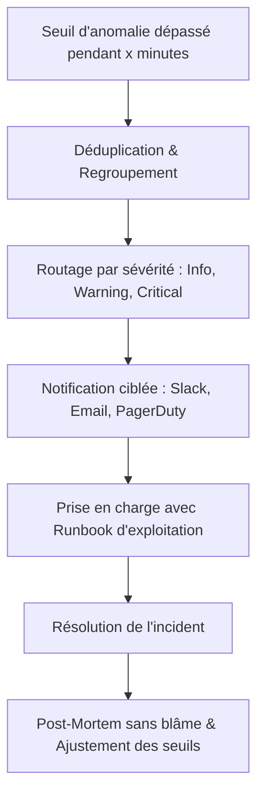
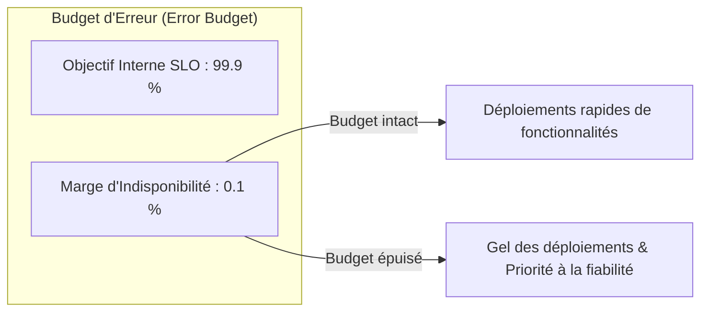

# Concepts de Supervision, Gestion des Alertes et Fiabilité des Services (SLI / SLO / SLA)

La **supervision** et l'**observabilité** constituent le système nerveux de toute infrastructure informatique d'entreprise. Elles permettent aux administrateurs de détecter immédiatement les dysfonctionnements, d'anticiper les saturations matérielles et de garantir la disponibilité des services numériques critiques.

---

## 1. De la Supervision Traditionnelle à l'Observabilité Moderne

```text
┌──────────────────────────────────────────────────────────────┐
│ 1. SUPERVISION CLASSIQUE (Boîte Noire / Black-Box)           │
│    - Vérifie l'état externe binaire : Serveur UP / DOWN ?    │
│    - Teste le ping ICMP, le port TCP 80, la réponse HTTP.    │
│    - Répond à la question : "Le service est-il en panne ?"   │
├──────────────────────────────────────────────────────────────┤
│ 2. OBSERVABILITÉ MODERNE (Boîte Blanche / White-Box)         │
│    - Analyse l'état interne : Métriques, Journaux et Traces. │
│    - Détecte les dégradations subtiles (latence, saturation).│
│    - Répond à la question : "Pourquoi le service est lent ?" │
└──────────────────────────────────────────────────────────────┘
```

---

## 2. Le Cycle de Vie d'une Alerte et la Fatigue des Alertes

Une alerte ne doit être émise que lorsqu'une **action humaine immédiate** est requise pour préserver l'activité.



### Le phénomène d'Alert Fatigue (Fatigue des alertes) :
Si des dizaines de fausses alertes ou d'alertes non urgentes (ex: disque à 82 % d'occupation) inondent les canaux de messagerie, les équipes finissent par ignorer les notifications, ce qui conduit inévitablement à manquer un incident critique majeur.

> [!TIP]
> **Règle d'or de l'alerting SRE** : Toute alerte critique qui réveille un ingénieur d'astreinte la nuit doit être associée à un **Runbook** documenté (procédure de diagnostic étape par étape) et doit impacter directement les utilisateurs finaux.

---

## 3. Cadre de Fiabilité SRE : SLI, SLO, SLA et Budget d'Erreur

Le modèle SRE (*Site Reliability Engineering*) standardise la mesure de la qualité de service :

| Concept | Définition | Exemple Concret |
|---|---|---|
| **SLI (_Service Level Indicator_)** | Métrique mesurable en temps réel évaluant la qualité du service | *Taux de requêtes HTTP réussies avec une latence < 250 ms* (actuellement : `99.93 %`) |
| **SLO (_Service Level Objective_)** | Objectif interne fixé par l'équipe technique pour piloter la qualité | *Objectif cible mensuel : `99.90 %`* |
| **SLA (_Service Level Agreement_)** | Contrat juridique engageant l'entreprise auprès de ses clients avec pénalités financières | *Engagement contractuel : `99.50 %`* |



Le **Budget d'erreur** ($100 \% - \text{SLO} = 0.1 \%$) formalise le compromis entre vitesse d'innovation et stabilité : tant que le budget n'est pas consommé, les développeurs peuvent déployer sereinement. En cas d'épuisement, tous les efforts se concentrent sur la fiabilisation de l'infrastructure.
