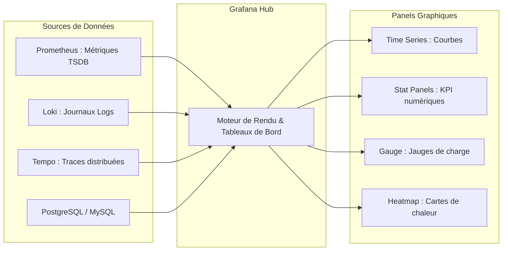

# Visualisation de Données, Dashboards Grafana et Méthodes USE / RED

**Grafana** est la plateforme open source de référence pour transformer des millions de données brutes issues de Prometheus, Loki ou bases SQL en tableaux de bord interactifs et décisionnels.

---

## 1. Architecture et Composants Clés de Grafana

Grafana centralise la visualisation sans stocker les métriques : il interroge à la volée les sources de données (*Data Sources*) configurées :

### Éléments avancés d'un Dashboard d'exploitation :
- **Variables dynamiques (`$instance`, `$env`)** : Permettent à l'administrateur de basculer d'un serveur ou d'un environnement à l'autre via une liste déroulante grâce à des requêtes du type `label_values(node_cpu_seconds_total, instance)`.
- **Annotations** : Superposent automatiquement des marqueurs verticaux sur les graphiques temporels pour signaler des événements externes majeurs (ex: déploiement CI/CD en production, bascule réseau, incident).

---

## 2. Méthodologies de Conception de Tableaux de Bord

Pour éviter les tableaux de bord surchargés et illisibles lors d'une crise opérationnelle, les équipes SRE s'appuient sur deux approches standardisées :

### A. La Méthode USE (Pour l'Infrastructure Matérielle & Systèmes)
Créée par Brendan Gregg, elle s'applique à chaque composant (CPU, RAM, Disque, Interfaces Réseau) :

| Pilier USE | Description | Exemple de Métrique Prometheus |
|---|---|---|
| **Utilization** | Pourcentage de temps pendant lequel la ressource est occupée | `node_cpu_seconds_total{mode!="idle"}` |
| **Saturation** | Degré auquel un travail supplémentaire attend dans une file | `node_load1` / nombre de cœurs CPU |
| **Errors** | Nombre total d'erreurs matérielles ou paquets rejetés | `node_network_receive_errs_total` |

### B. La Méthode RED (Pour les Services Applicatifs & Requêtes Web)
Popularisée par Tom Wilkie, elle cible les architectures orientées services et microservices :

| Pilier RED | Description | Exemple de Requête PromQL |
|---|---|---|
| **Rate** | Nombre de requêtes traitées par seconde | `sum(rate(http_requests_total[1m]))` |
| **Errors** | Nombre de requêtes ayant échoué par seconde (HTTP 5xx) | `sum(rate(http_requests_total{status=~"5.."}[1m]))` |
| **Duration** | Temps de traitement des requêtes (latence $p95$/$p99$) | `histogram_quantile(0.95, sum by (le) (rate(http_request_duration_seconds_bucket[5m])))` |
