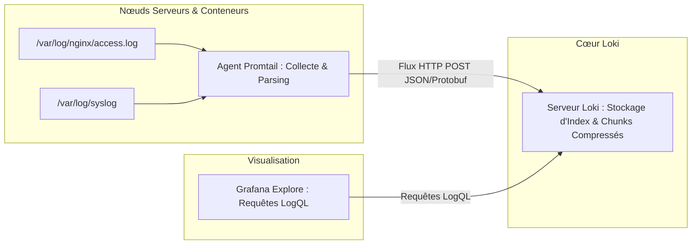

# Centralisation des Journaux d'Événements, Stack Grafana Loki et Langage LogQL

Face à des architectures modernes comptant des dizaines de conteneurs et de machines virtuelles, se connecter manuellement en SSH sur chaque serveur pour lire des fichiers `/var/log/` devient impossible. La **centralisation des logs** agrège l'ensemble des événements du système d'information dans un point d'accès unifié.

---

## 1. Comparatif Architectural : Elasticsearch (ELK) vs Grafana Loki

```text
┌──────────────────────────────────────────────────────────────┐
│ 1. STACK ELK (Elasticsearch / Logstash / Kibana)             │
│    - Approche : Indexation plein texte (Full-Text Inverted). │
│    - Conséquence : Index parfois plus volumineux que les     │
│      logs eux-mêmes. Forte empreinte RAM et coût élevé.      │
├──────────────────────────────────────────────────────────────┤
│ 2. STACK GRAFANA LOKI ("Like Prometheus, but for Logs")      │
│    - Approche : Indexe UNIQUEMENT les labels de métadonnées. │
│    - Corps du log : Compressé et stocké sur disque ou S3.    │
│    - Conséquence : Consommation mémoire et disque divisée    │
│      par 5 à 10, alignement parfait avec l'écosystème Grafana.│
└──────────────────────────────────────────────────────────────┘
```

---

## 2. Architecture de Collecte avec Promtail et Loki



### Exemple de configuration Promtail (`promtail-config.yml`) :
```yaml
server:
  http_listen_port: 9080
  grpc_listen_port: 0

positions:
  filename: /tmp/positions.yaml

clients:
  - url: http://loki:3100/loki/api/v1/push

scrape_configs:
  - job_name: nginx-access
    static_configs:
      - targets: [localhost]
        labels:
          job: nginx
          env: production
          __path__: /var/log/nginx/*access.log
    pipeline_stages:
      - json:
          expressions:
            status: status
            client_ip: remote_addr
            request_time: request_time
      - labels:
          status:
```

---

## 3. Le Langage de Requête LogQL

LogQL s'inspire directement de PromQL et se divise en deux catégories d'analyses :

### A. Requêtes de filtrage de flux de logs :
```logql
# 1. Sélectionner les logs Nginx de production contenant '404' ou '500'
{job="nginx", env="production"} |= "status=" |~ "50[0-9]"

# 2. Parsing JSON à la volée et filtrage logique sur champs structurés
{job="nginx"} | json | status >= 500 and request_time > 1.5
```

### B. Requêtes métriques dérivées des logs :
LogQL permet de transformer des flux de logs bruts en séries temporelles numériques exploitables dans Grafana :
```logql
# Calcul du débit d'erreurs 5xx par seconde par hôte depuis les logs
sum by (host) (rate({job="nginx"} |= "500"[5m]))
```
