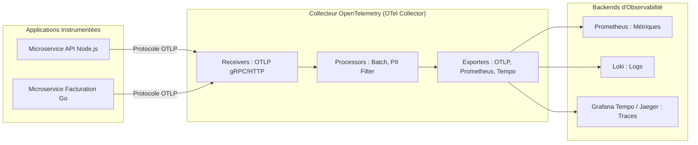

# Traces Distribuées, Standard OpenTelemetry (OTel) et Corrélation de l'Observabilité

Dans une architecture moderne en microservices, une seule action utilisateur (ex: valider une commande) peut déclencher une chaîne complexe d'appels à travers 5 ou 10 services distincts. Les **traces distribuées** permettent de suivre et chronométrer cette requête de bout en bout.

---

## 1. Concepts Fondamentaux : Trace, Span et Arbre d'Exécution

```text
Trace ID: 4bf92f3577b34da6a3ce929d0e0e4736 (Transaction Globale : 250ms)
│
├── [Front-End Web] HTTP POST /checkout (250ms) [Span 1 - Racine]
│   │
│   ├── [Order Service] Valider panier (40ms) [Span 2]
│   │
│   ├── [Payment API] Débit bancaire externe (150ms) [Span 3] ◄── GOULOT D'ÉTRANGLEMENT
│   │
│   └── [Inventory Service] Décrémenter stock (35ms) [Span 4]
│       └── [PostgreSQL] UPDATE stock SET qte = qte - 1 (12ms) [Span 5]
```

- **Trace** : Représente le cheminement complet d'une requête à travers l'ensemble des composants d'un système distribué. Elle est identifiée par un **`Trace ID`** unique.
- **Span** : Représente une opération individuelle réalisée par un service spécifique au cours de la trace (nom d'opération, heure de début, durée, statut et attributs clé-valeur comme `http.status_code: 200` ou `db.statement`).

---

## 2. Le Standard OpenTelemetry (OTel) et la Propagation de Contexte

**OpenTelemetry** (projet majeur de la Cloud Native Computing Foundation - CNCF) standardise la collecte des métriques, logs et traces sans dépendre d'un éditeur propriétaire :



### La Propagation de Contexte (W3C Trace Context) :
Pour qu'un service aval sache qu'il participe à une trace initiée par un service amont, les identifiants sont transmis dans les en-têtes HTTP selon la norme W3C :
```http
traceparent: 00-4bf92f3577b34da6a3ce929d0e0e4736-00f067aa0ba902b7-01
```

---

## 3. La Trinité de l'Observabilité Unifiée

La puissance maximale de l'observabilité réside dans la **corrélation bidirectionnelle** :

```text
┌─────────────────────────────────────────────────────────────┐
│ 1. DÉTECTION (Métrique Prometheus)                          │
│    -> Grafana affiche un pic de latence à 3.5s sur l'API.   │
├─────────────────────────────────────────────────────────────┤
│ 2. ISOLATION (Trace Tempo / OpenTelemetry)                  │
│    -> Un clic sur le pic ouvre la Trace exacte et révèle    │
│       que la Span "SELECT * FROM orders" a duré 3.2s.       │
├─────────────────────────────────────────────────────────────┤
│ 3. CAUSE PROFONDE (Logs Loki)                               │
│    -> La span contient le trace_id, permettant d'afficher   │
│       la ligne de log exacte : "Missing database index".    │
└─────────────────────────────────────────────────────────────┘
```
