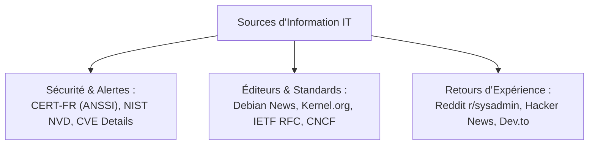

# Méthodologie de Veille Technologique Active, Curation et Traitement de l'Information IT

Dans les métiers de l'administration systèmes et réseaux, la **veille technologique** n'est pas une simple consultation occasionnelle d'actualités, mais une **démarche continue, organisée et stratégique** pour anticiper les vulnérabilités de sécurité, l'obsolescence matérielle/logicielle et l'émergence de nouveaux standards industriels.

---

## 1. Les 4 Étapes du Cycle de Veille Technologique

```text
┌─────────────────────────────────────────────────────────────┐
│              LE CYCLE DE LA VEILLE TECHNOLOGIQUE            │
├─────────────────────────────────────────────────────────────┤
│ 1. SOURCING      -> Sélection rigoureuse des sources fiables│
│ 2. COLLECTE      -> Agrégation automatisée (Flux RSS, Push) │
│ 3. ANALYSE & TRI -> Filtrage du bruit, lecture critique     │
│ 4. SYNTHÈSE      -> Rédaction de fiches d'impact et partage │
└─────────────────────────────────────────────────────────────┘
```

---

## 2. Typologie des Sources et Canaux de Collecte

Pour construire une veille équilibrée et éviter les chambres d'écho :



- **Mode Pull** : L'administrateur va chercher l'information manuellement sur un site (chronophage et irrégulier).
- **Mode Push** : L'information qualifiée arrive directement via un agrégateur de flux RSS (ex: *Feedly, FreshRSS*) ou une newsletter spécialisée.

---

## 3. Lutter contre l'Infobésité et Traiter l'Information

Face au déluge quotidien d'articles :
1. **Règle des 20 minutes par jour** : Définir un créneau fixe matinal pour écrémer les flux.
2. **Tri en entonnoir** :
   - *Titre & Résumé* $\rightarrow$ Sélection des articles pertinents.
   - *Lecture rapide* $\rightarrow$ Identification de la nouveauté technique.
   - *Lecture approfondie & Test* $\rightarrow$ Enregistrement dans la base de connaissances (ex: *Obsidian, Notion*) uniquement si l'impact est avéré.

---

## 4. Structure d'une Fiche de Synthèse Professionnelle

Une veille utile débouche sur une **fiche d'impact opérationnel** :

```markdown
# Synthèse Veille : Dépréciation de TLS 1.0/1.1 et Migration TLS 1.3

- **Date de publication** : 2026-08-27
- **Source** : CERT-FR (Avis de sécurité)
- **Résumé technique** : Les versions TLS 1.0 et 1.1 présentent des faiblesses cryptographiques majeures (failles BEAST, POODLE).
- **Impact sur le Système d'Information** : Nos serveurs web et passerelles VPN doivent désactiver ces protocoles pour maintenir la conformité bancaire PCI-DSS.
- **Préconisation d'action** : Mettre à jour les configurations Nginx/Apache via Ansible pour n'autoriser que TLS 1.2 et TLS 1.3 avec cipher suites sécurisées.
```
