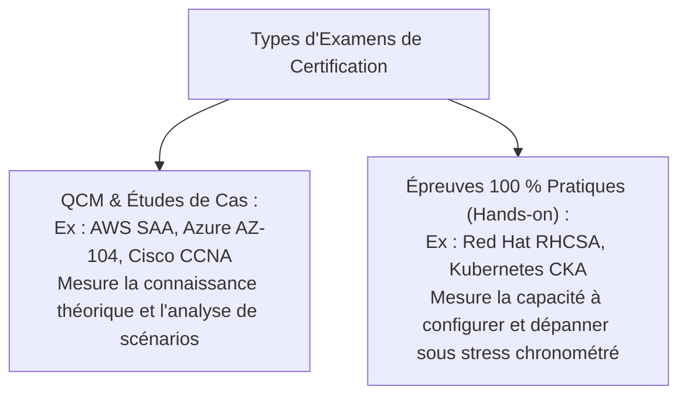

# Panorama des Certifications Professionnelles IT : Systèmes, Réseaux, Cloud, DevOps et Sécurité

Les certifications professionnelles délivrées par les éditeurs et organismes internationaux constituent un **accélérateur de carrière majeur** pour un titulaire de BTS SIO SISR, attestant de compétences techniques standardisées et immédiatement opérationnelles.

---

## 1. Pourquoi Passer une Certification IT ?

1. **Différenciation à l'embauche** : Sur un marché concurrentiel, un profil débutant certifié (ex: CCNA ou AZ-104) prouve son sérieux et son autonomie.
2. **Exigence des Entreprises de Services du Numérique (ESN)** : Les partenaires certifiés des grands éditeurs (Microsoft Gold Partner, AWS Partner Network) ont l'obligation contractuelle de maintenir un quota d'ingénieurs certifiés.
3. **Augmentation salariale** : Les profils certifiés bénéficient en moyenne d'une rémunération supérieure de 10 à 20 % dès leur premier poste.

---

## 2. Tableau Comparatif des Certifications de Référence

| Domaine | Certification | Organisme | Format d'examen | Niveau |
|---|---|---|---|---|
| **Réseaux** | **Cisco CCNA (200-301)** | Cisco Systems | QCM + Simlets | Associé |
| **Linux** | **LPIC-1 (101 & 102)** | LPI | QCM + Réponses courtes | Fondamental / Interm. |
| **Linux Entreprise** | **RHCSA (EX200)** | Red Hat | 100 % Lab Pratique sous RHEL | Professionnel |
| **Cloud Public** | **AWS Solutions Architect (SAA-C03)** | Amazon Web Services | QCM / Scénarios d'architecture | Associé |
| **Cloud Microsoft** | **Azure Administrator (AZ-104)** | Microsoft | QCM + Cas pratiques | Associé |
| **DevOps / IaC** | **Terraform Associate (003)** | HashiCorp | QCM | Associé |
| **Conteneurs** | **CKA (Kubernetes Admin)** | Linux Foundation / CNCF | 100 % Lab Pratique en terminal | Professionnel |
| **Sécurité** | **CompTIA Security+ (SY0-701)** | CompTIA | QCM + Simulations PBQs | Associé |

---

## 3. Formats d'Examen : QCM vs Examens Pratiques (Performance-Based)

---

## 4. Validité et Maintien des Titres

- La quasi-totalité des certifications est valable **3 ans**.
- Pour renouveler son titre, le candidat peut soit **repasser l'examen mis à jour**, soit **passer une certification de niveau supérieur** (qui renouvelle automatiquement les niveaux inférieurs), soit cumuler des **crédits de formation continue (CEU/CPE)**.
